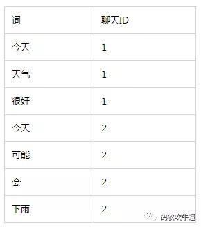
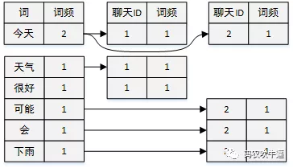

原文：https://mp.weixin.qq.com/s?__biz=MzI1ODY0NjAwMA==&mid=2247483725&idx=1&sn=3aec201e78b30c6cd7988dfbf4180126&chksm=ea044bd2dd73c2c450d6c4dec29a8e7fbfbc2e55f110955ae151516d845480b0be3146ad1c41&scene=21#wechat_redirect

这里也有一篇文章：
- [IM开发干货分享：网易云信IM客户端的聊天消息全文检索技术实践](http://www.52im.net/thread-3651-1-1.html)

# IM移动端怎么搜索本地聊天记录

IM软件客户端需要支持本地存储的聊天记录的搜索功能，对于这类非结构化数据（全文数据）一般有两种检索方法。

## 一、思路

1、顺序扫描法
比如要找内容包含某一个字符串的聊天记录，就是一条聊天记录一条聊天记录的看，对于每一条聊天记录，从头看到尾，如果聊天记录包含此字符串，则聊天记录为要找的条目，接着看下一跳记录，直到扫描完所有的聊天记录。数据量小时，这种方法直接、方便。但是对于大量的数据，这种方法`效率很低`。

2、全文检索
对非结构化数据顺序扫描很慢，但对结构化数据的搜索却相对较快。将非结构化数据中的一部分信息提取出来，重新组织，`使其变得有一定结构`，然后对此有一定结构的数据进行搜索，从而达到搜索相对较快的目的。

## 二、原理

假设有2条聊天记录，具体内容如下
（1）今天天气很好
（2）今天可能会下雨

### 分词

将两条聊天记录进行分词，得到以下词元。今天、天气、很好、可能、会、下雨。（分词是一个很复杂的问题，不在这里细讲。对于移动端的基本检索要求，也可以考虑一元分词，把聊天记录拆成一个一个的字）

### 索引
创建字典

合并相同词，形成倒排链表

### 检索
用户输入一个“天气”，立即可以通过上边的索引，检索到第1条聊天记录！
以上仅仅是最基本的原理，每个步骤都还有`很多细节需要处理`。参看《Lucene 3.0 原理与代码分析完整版》

## 三、具体怎么做

目前大量的移动端（android,ios）都使用sqlite作为数据库，sqlite中支持`fts表`（full-text search的简称，有fts3、fts4、fts5三个版本），根据需要选择相应的版本即可实现全文检索功能。