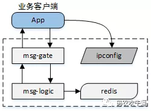
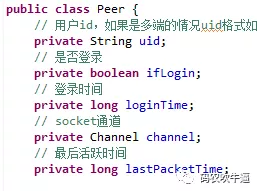
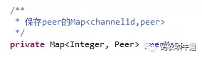
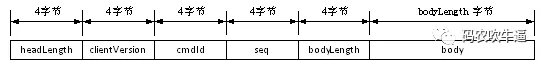

原文：https://mp.weixin.qq.com/s?__biz=MzI1ODY0NjAwMA==&mid=2247483714&idx=1&sn=8f12924038a8d7857c3c9a4fbff8bbac&chksm=ea044bdddd73c2cb16c500fc9077074435216330e8b9b41daaf19c18261249fef1280c9f0566&scene=21#wechat_redirect

# 一、IM系统基本结构

一个IM系统的基本结构如下图所示

1、msg-gate模块是接入层，核心功能是连接整流。维护与客户端的海量TCP长连接，将外界海量TCP长连接整流为少量与后端msg-logic的TCP长连接。

2、msg-logic模块是逻辑层，核心功能是处理消息投递逻辑。

3、redis负责缓存业务客户端的连接状态，连到哪一个msg-gate，连接状态是否正常。用于向用户推送消息时，提供消息路由。

4、ipconfig向client端提供msg-gate所在IP地址。

# 二、session维护方式及原因

1、session维护模块
整个系统中维护session总共有两个模块，msg-gate和redis。

2、两个地方维护session原因
`msg-gate是分布式部署`，每个节点连接有不同的客户端（client）。msg-gate接收client消息或者logic请求向client发消息，都需要验证client端状态是否正常，从`性能`的角度出发，msg-gate需要在本地维护一份session。

由于msg-gate,msg-logic是分布式部署，有若干节点。当clientA向clientB发送消息时，msg-logic需要一个地方可以检索clientB所连接的msg-gate位置（IP），因此需要一个`集中`（也可以hash多台机器）的位置存储session路由关系。

# 三、session存储的具体结构

## 1、msg-gate模块session结构

先给出msg-gate的session结构

msg-gate的session通过`channelid`（socketid）检索。接收client消息很容易理解，对应的socket会触发事件；如果logic请求发送消息，也需要提供channelid（Redis集中session路由部分会介绍）。

`session中uid（用户id）数据怎么得到呢？`
看一下client到msg-gate的协议

从性能的角度出发，msg-gate模块`只解析协议的消息头`（前20个字节），msg-gate模块不能通过协议直接得到用户信息。但是，每个连接上msg-gate的client都需要合法授权才能收发消息，通过这个步骤，msg-gate能将uid与channelid建立关联。

## 2、Redis中session结构

redis中的session主要使用对象为msg-logic，处理业务逻辑的模块，session基本结构为<uid,session>（<key,value>结构），其中session内容包括msg-gate地址、channelid等（msg-gate、chanelid也通过授权过程获得）。
以uid为key这个结构，非常符合msg-logic处理业务逻辑。

## 3、两处session间的转换关系

msg-gate调用msg-logic的接口，一律将`channelId转化为uid`；msg-logic调用msg-gate的接口，`将uid转化为channelid`。由于神奇的hash算法，转化过程的时间复杂度为常数1。

至此，IM系统各个模块均能高效定位某个客户端位置及状态。