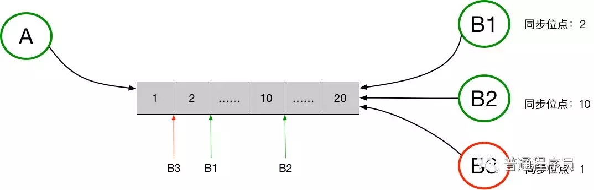

原文：https://mp.weixin.qq.com/s?__biz=MzI1ODY0NjAwMA==&mid=2247483859&idx=1&sn=51bdc587fd4a2ab6334e2ce7b82bf3f2&chksm=ea044b4cdd73c25ac7e97542f82cc248b807df613cb2e28cf2726482428bddf9a717b89fcf7d&scene=21#wechat_redirect

# TimeLine模型下确保消息有序不丢

通过《基于TimeLine模型的消息同步机制》一文，我们了解到Timeline模型有非常多的优点，也是钉钉采用的消息同步机制。实际工作中，我们也将该模型应用在了C端用户的消息场景中。实施过程中也遇到了一些问题，积累了一些经验。本文将介绍极端情况丢失消息的问题及解决办法。

## 一、Timeline概念

Timeline可以简单理解为是一个消息队列，某个用户所有的消息都存储在这个Timeline中，用户的各个端可以从这个队列中同步各自消息。 

图中的例子中，消息发送方是A，消息接收方是B，同时B存在多个接收端，分别是B1、B2和B3。A向B发送消息，消息需要同步到B的多个端，待同步的消息通过一个Timeline来进行交换。A向B发送的所有消息，都会保存在这个Timeline中，B的每个接收端都是独立的从这个Timeline中拉取消息。每个接收端同步完毕后，都会在本地记录下最新同步到的消息的msgid，即最新的一个位点，作为下次消息同步的起始位点。

## 二、丢失消息的原因

理论上讲，Timeline模型能够确保消息`不重不漏`。实际实施中，根据系统架构特点以及选用中间件的不同，极端情况下，可能出现丢消息。最主要的原因是某一时刻，`Timeline中的数据不连续或不完整`。

举个`例子`，如果用户有两条时间间隔非常近的消息msg1、msg2，对应的msgId分别为10，11。由于时间很相近，（分布式系统）某些情况下可能出现msg2先写入TimeLine，如果此时用户某个端正好执行Sync同步消息，将同步到最大msgId为11的msg2消息，造成msg1丢失（msg1此时还没有写入TimeLine）。

下图是IM系统的结构。Dispatcher负责生成msgId，通过Kafka传递给具体业务逻辑处理单元Processor（名称与图不完全一致），Processor将消息写入Redis/MongoDb。 

这个过程中有`三个环节`会造成顺序不一致

1、消息msgid在Dispatcher节点生成（采用类snowflake算法），由于不同节点时间可能存在误差，有可能造成msgid和时序不一致
2、Kafka有多个patition，不同patition不能保证消息顺序
3、Processor是多实例部署，多线程处理，也不能保证顺序

三、解决办法

1、`服务端严格有序`
应用神奇的hash算法，把属于同一用户的消息路由到相同的Dispatcher节点，相同的Kafka分区，相同的Processor线程即`可保证消息循序性`。但是对于`群消息`，极端情况下还是可能出现`时序问题`（当然要丢消息还需要客户端正好执行Sync同步，这个概率极低）

2、`客户端补偿`
服务端为Timeline中的每条消息都进行严格递增编号，叫做sequenceid。从1开始，2、3、4……加一递增。这样，客户端拉取到消息，能够通过sequenceid感知是否丢失消息。如果丢失消息，可以再次尝试拉取。

这里有个问题，这个严格编号服务我们利用了redis，万一redis数据丢失怎么办呢？个人收件箱Timeline中最新一条消息就是已有的最大编号，redis数据万一丢失了可以从这条消息中取得之前的最大编号。

通过这两个方法，能够确保消息可靠性。 