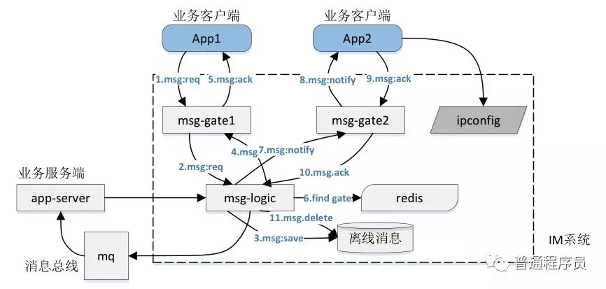
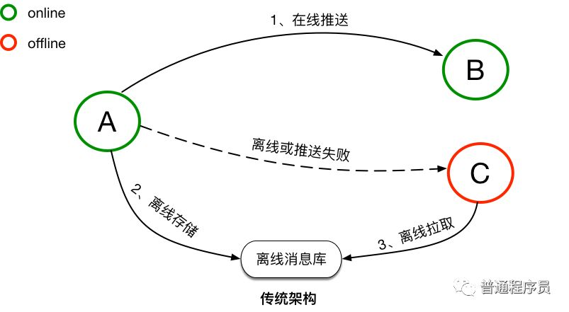
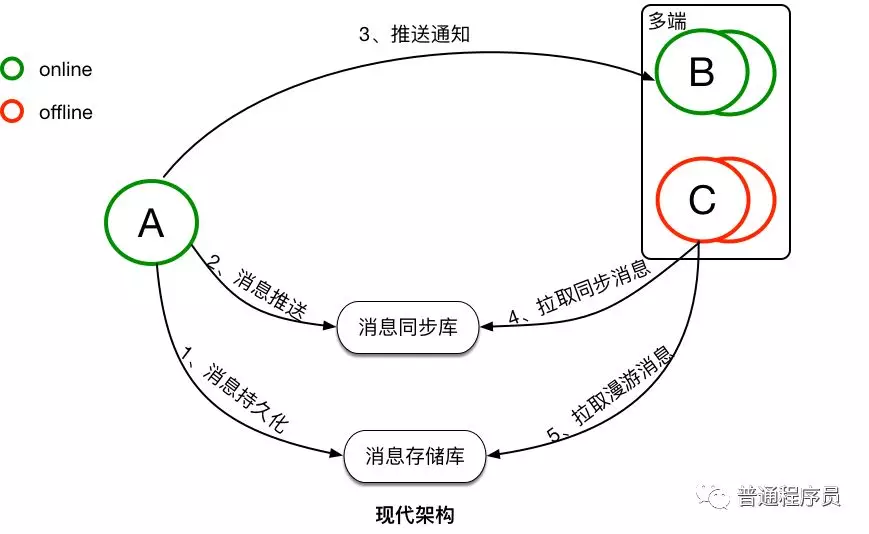

原文：https://mp.weixin.qq.com/s?__biz=MzI1ODY0NjAwMA==&mid=2247483854&idx=1&sn=f87ef6cac20032e1a97076cabc36a648&chksm=ea044b51dd73c24723d13c9265dd11dd30ae143dcb44b6b8777ae125478f0b6494e9de464624&scene=21#wechat_redirect

# 基于TimeLine模型的消息同步机制

我们当前的IM虽然进行了微服务化，但是核心的消息投递模式仍然采用下图描绘的方式，参看[《一个海量在线用户即时通讯系统（IM）的完整设计》](https://mp.weixin.qq.com/s?__biz=MzI1ODY0NjAwMA==&mid=2247483756&idx=1&sn=a8e3303bc573b1acaf9ef3862ef89bdd&chksm=ea044bf3dd73c2e5dcf2c10202c66d6143ec866205e9230f974fbc0b0be587926699230b6b18&scene=21#wechat_redirect)。

在这个方式下，消息同步的`基本思路和步骤`如下（序号不对应图中序号）
1、把消息存储到离线收件箱
2、向在线用户推送消息
3、在线用户返回收到消息的ack信息
4、服务端清除用户此条离线消息
对于离线用户，登录后直接拉取离线消息即可

这个消息同步方式有它`合理的地方`
1、流程比较直观
2、网络交互量较少（相对于后边的TimeLine模型而言）

但是这个方案存在更多`不足的地方`
1、我们有App和Web两个端，需要为每个端都写一份离线消息。由于离线消息是扩散写的，多写一份，服务端就多一份压力
2、消息ack回来之后，服务端需要把对应的消息从存储中删除，这个过程性能也是一个问题

这个消息模式在比较单一的IM应用场景下还是能够胜任的。但是随着消息场景越来越复杂，尤其是SDK推出以后，这个模式就`存在很多弊端`。SDK的应用可能存在很多个端，服务端不可能为每个端都写离线消息！

对于SDK，我们采用TimeLine模型来实现客户端和服务端的消息同步。

以下内容是`钉钉的做法`，比较了`传统架构`和`现代架构`。而我们现在的IM消息同步这块介于两者之间。 

`传统架构`下，消息是`先同步后存储`。对于在线的用户，消息会直接实时同步到在线的接收方，消息同步成功后，并不会进行持久化。而对于离线的用户或者消息无法实时同步成功时，消息会持久化到离线库，当接收方重新连接后，会从离线库拉取所有未读消息。当离线库中的消息成功同步到接收方后，消息会从离线库中删除。传统的消息系统，服务端的主要工作是维护发送方和接收方的连接状态，并提供在线消息同步和离线消息缓存的能力，保证消息一定能够从发送方传递到接收方。服务端不会对消息进行持久化，所以也无法支持消息漫游。

`现代架构`下，消息是`先存储后同步`。先存储后同步的好处是，如果接收方确认接收到了消息，那这条消息一定是已经在云端保存了。并且消息会有两个库来保存，一个是消息存储库，用于全量保存所有会话的消息，主要用于支持消息漫游。另一个是消息同步库，主要用于接收方的多端同步。消息从发送方发出后，经过服务端转发，服务端会先将消息保存到消息存储库，后保存到消息同步库。完成消息的持久化保存后，对于在线的接收方，会直接选择在线推送。但在线推送并不是一个必须路径，只是一个更优的消息传递路径。对于在线推送失败或者离线的接收方，会有另外一个统一的消息同步方式。接收方会主动的向服务端拉取所有未同步消息，但接收方何时来同步以及会在哪些端来同步消息对服务端来说是未知的，所以要求服务端必须保存所有需要同步到接收方的消息，这是消息同步库的主要作用。对于新的同步设备，会有消息漫游的需求，这是消息存储库的主要作用，在消息存储库中，可以拉取任意会话的全量历史消息。

以上是传统架构和现代架构的一个简单的对比，现代架构上整个消息的同步和存储流程，`并没有变复杂太多`，但是其能实现多端同步以及消息漫游。现代架构中最核心的就是两个消息库『消息同步库』和『消息存储库』，是消息同步和存储最核心的基础。

我们看看Timeline模型是怎么样的？

如图是Timeline模型的一个抽象表述，Timeline可以简单理解为是一个消息队列，但这个消息队列有如下特性：

- 每个消息拥有一个顺序ID（SeqId），在队列后面的消息的SeqId一定比前面的消息的SeqId大，也就是保证SeqId一定是增长的，但是`不要求严格递增`。
- 新的消息永远在尾部添加，保证`新的消息的SeqId永远比已经存在队列中的消息都大`。
- 可根据SeqId`随机定位`到具体的某条消息进行读取，也可以任意读取某个`给定范围`内的所有消息。
 
有了这些特性后，消息的同步可以拿Timeline来很简单的实现。图中的例子中，消息发送方是A，消息接收方是B，同时B存在多个接收端，分别是B1、B2和B3。A向B发送消息，消息需要同步到B的多个端，待同步的消息通过一个Timeline来进行交换。A向B发送的所有消息，都会保存在这个Timeline中，B的每个接收端都是独立的从这个Timeline中拉取消息。每个接收端同步完毕后，都会在本地记录下最新同步到的消息的SeqId，即最新的一个位点，作为下次消息同步的起始位点。`服务端不会保存各个端的同步状态`（我认为服务端也可以记录各端的同步点位），各个端均可以在任意时间从任意点开始拉取消息。

**看完TimeLine模型**，我存在过困扰。既有推送又有拉取，`客户端怎么确定同步点位究竟在哪里`呢？尤其是用户打开软件，拉取同步过程中有新消息到了怎么办？

这里要`感谢彬哥`（LinkedIn的大牛）提示，他说他们的消息都是拉取的。既然消息是拉取的，那推送的又是什么呢？

仔细看现代架构的图，第3步写的是“推送通知”。`推送的是`有新消息的`提示信息`，客户端收到这个通知就`拉取同步消息`，客户端和服务端各自维护这个端的同步点位（为了节省网络交互，客户端拉取同步消息后，不需要向服务端确认，因此客户端和服务端维护的同步点位不完全一致，但是不影响业务逻辑，这个细节后续单独写文章介绍）。由于只存在拉取消息，同步点位的维护就变得很简单了，客户端保存拉取到的最新消息的ID（SeqId）即可。

至此，支持多端的消息同步模型已经成型。

**那么这个方案还`有没有优化空间`呢？**

这个方式跟我们现在的方式相比`增加了网络交互次数`，有没有办法能够节省网络开销，有享受TimeLine模型对多端友好的支持呢？

看过一篇文章介绍微信`为每个用户的消息ID进行了严格递增编号`，也就是为每个用户的TimeLine模型的消息进行了严格递增的编号。既该用户第一条消息序号为1，第二条为2以此类推。

这样一个编号服务，开发成本还是比较高的，那微信为什么要做呢？我现在认为其中一个原因是为了`减少网络交互`。采用推通知，再拉取同步消息的方式，毕竟要多一次网络交互。如果消息严格编号，可以将传统的推消息和新的推通知的方式结合起来。`推往客户端的消息带有严格递增的消息ID`，客户端可以根据消息ID`计算出是否需要拉取同步消息`（如果推过来的消息ID只比客户端最大的消息ID大1，则没有必要拉取同步消息）。 

实施层面同样存在不少挑战，难点是如何将逻辑模型映射到物理模型或具体中间件，细节后续再介绍。