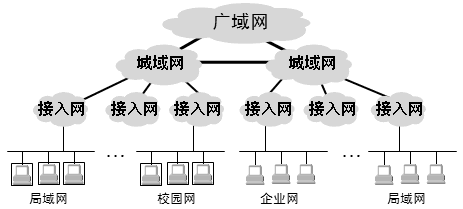
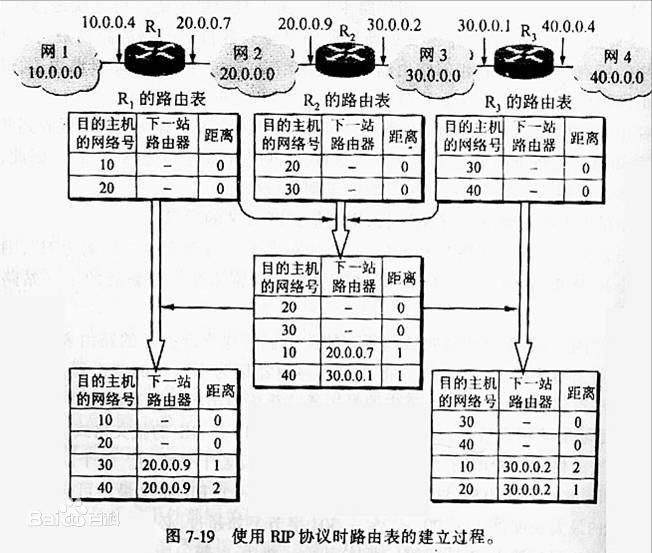
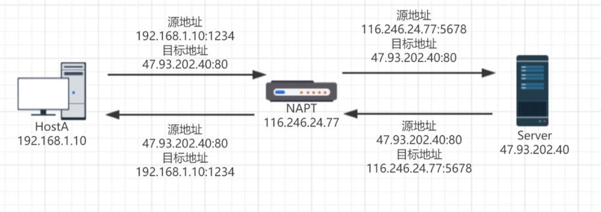
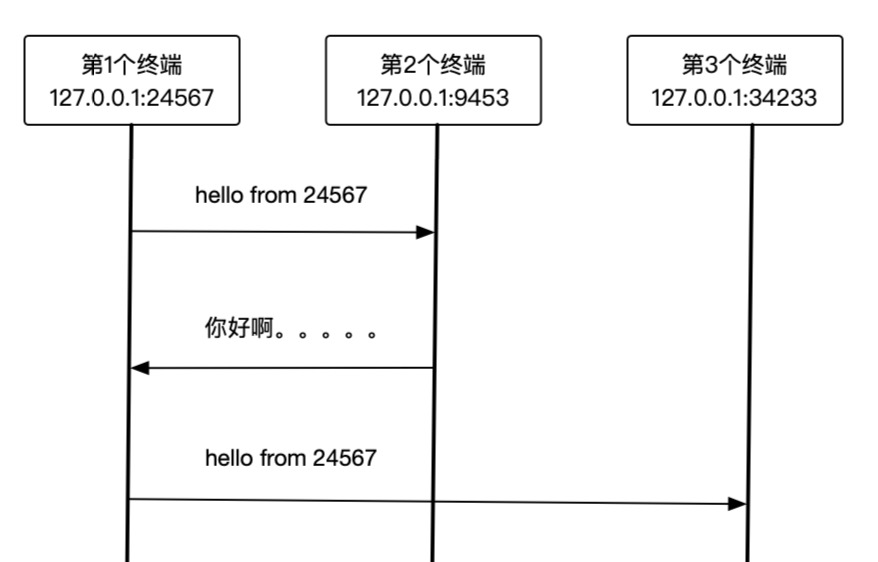

# 实现局域网P2P聊天

在上一章节，我们学习了Linux下Socket（TCP）的几个API（又称系统调用），本章节，我们来对它进行改造，通过使用`UDP`来实现一个可以1对1聊天（P2P）的小程序。如下图：


主要技术点：

- 理解P2P的概念
- UDP 的系统调用


首先，我们假设您具备一定的网络基础，了解局域网的概念，如果不了解，读者应该抽时间读一读《计算机网络-自顶向下方法》《网络是怎样连接的》《计算机网络》等书籍。

下面简单的回顾一下这些概念。

## 基础概念

### 局域网（LAN）

局域网的缩写是LAN，local area network，顾名思义，是个本地的网络，只能实现小范围短距离的网络通信。

我们的家庭网络是典型的局域网，电脑、手机、电视、智能音箱、智能插座都连在无线路由器上，可以互相通信。


通常他的特点是一个网络设备，常见的有：

1. 路由器


1. 交换器


通常，路由器和交换机搭配使用，你可以想象一下，一个教师，20多台台式电脑，没有无线网卡，只能接网线，路由器哪有那么多口插网线呢？所以，这个时候在路由器后面接一个交换机，就能解决网口不够的问题（现实中没有这么简单）。


参考：

- [“交换机”有什么作用？怎样使用？](https://baijiahao.baidu.com/s?id=1643976751201232651&wfr=spider&for=pc)
- [局域网,广域网,因特网之间的区别和联系 你都知道吗](https://zhuanlan.zhihu.com/p/313519984)

### 广域网（Wan）

简单点来讲，就是一个大的局域网，由很多台路由器，交换机以及专线宽带组成，跨地区、跨城市，甚至跨国家。



### 因特网（Internet）

也就是常说的互联网，全世界一个大的网络，把成千上万的路由器连接起来。


### 移动互联网

主要是各大运营商提供的2G，3G，4G，5G等移动网络，手机和一个基站的设备进行连接，基站和运营商的各大网络进行连接，从而接入到互联网中，就像是一有线网络一样。

为什么要提这个网络，如果我们写一个P2P的程序，通过iOS或者Android开发一个APP，然后后电脑上部署的程序通信，手机必须得连接WIFI（路由器），才能和我们的程序聊天，一旦你出门，手机自动变更为4G网络，你们不在一个局域网中，通信中断。


### 小结

介绍这么多，我们要弄明白一件事情，我们写的程序，只能运行在局域网中，为什么？没有路由，网络不通。

## P2P

P2P：peer to peer点对点，是一种双方直连的技术，不需要服务器中转。

拿QQ发送文件举例，你给你的好友发文件，QQ会把文件上传到服务器，然后对方从QQ服务器上下载，中间经过了服务器中转，是不是速度至少慢一半？但是QQ为什么要这么做呢？试想QQ把文件放在服务器上，你想在电脑上使用这个文件，是不是就很方便？

这种直连的技术，面临的一个问题就是：如何找到对方，并与之进行连接？这就需要用到 `NAT穿透技术`，核心原理是借助公网服务器，找到2个客户端的外网IP，然后传递给对方，双方拿外网IP建立连接，开始打洞。

当然，在同一个局域网中也就不存在这个问题。大家都在一个路由器下面，路由器维护了一个路由表，它当然知道IP:Port应该发送到那台电脑。



参考：

- [路由表](https://blog.csdn.net/weixin_41143631/article/details/88620654)

## NAT穿透

下内容来自：[新手区 记一次 P2P 通信的实践](https://testerhome.com/topics/11662)，有删减

说到 P2P 呢大家应该都听说过， 生活中其实很多应用都用到了这项技术，比如某些即时通信软件、某些需要实现多人联机的游戏都或多或少的会使用这项技术。

点对点通信最简单的实现就是两台计算机在知道对方 IP 地址的情况下，直接连接对方端口并发送数据。如果在局域网中这一条件非常容易达成，但在互联网中因为众所周知的 ipv4 地址短缺而 ipv6 迟迟不能普及等问题，每台计算机根本无法直接分配到一个外网 IP，没有明确的 IP 地址，两台计算机就无法直接进行点对点通信。

想要了解如何在互联网中实现 P2P，必须知道很多相关的知识点，下面我一点点讲解。

### 公网和内网地址

- 内网 IP 地址: 是指使用 A/B/C 类中的私有地址, 分配的 IP 地址在全球不惧有唯一性，也因此无法被其它外网主机直接访问。

- 公网 IP 地址: 是指具有全球唯一的 IP 地址，能够直接被其它主机访问的。

举例 ： 你在家使用电信、网通或者其他宽带服务时，你的个人 PC 所分配到的 IP 地址叫内网 IP 地址（一般为 192.168.x.x）。当你访问一个网站时，网站服务器看到你的来源 IP 并不是你内网 IP 地址，而是一个公网 IP 地址（由网络服务器商提供）。

那为什么会有 `公网 IP` 和 `内网 IP` 呢， 那就要引出下一个知识点了。

### NAPT

NAPT(Network Address Port Translation)，即网络端口地址转换。

> NAPT是NAT的进阶技术运用，这里暂时不展开NAT相关的资料了

随着网络的普及，IPv4 的局限性暴露出来。`公网 IP 地址成为一种稀缺的资源`，NAPT 实现了多台私有 IP 地址的计算机可以同时通过一个公网 IP 地址来访问 Internet 的功能。这在很大程度上暂时缓解了 IPv4 地址资源的紧张。

NAPT 负责将某些内网 IP 地址的计算机向外部网络发出的 TCP/UDP 数据包的源 IP 地址转换为 NAPT 自己的公网的 IP 地址，源端口转为 NAPT 自己的一个端口。目的 IP 地址和端口不变, 并将 IP 数据包发给路由器，最终到达外部的计算机。同时负责将外部的计算机返回的 IP 数据包的目的 IP 地址转换内网的 IP 地址，目的端口转为内网计算机的端口，源 IP 地址和源端口不变，并最终送达到内网中的计算机。



上面的例子是单次通信的例子，其实 NAPT 的处理逻辑远没有如图上画的那么简单。
NAPT 还分很多种类型，有些类型并不适合实现 P2P 通信，所以接下来就要降到 NAT 的类型知识点了。

### NAT 的四种类型

- Full Cone NAT（全锥 NAT）： 全锥 NAT 把所有来自相同内部 IP 地址和端口的请求映射到相同的外部 IP 地址和端口。任何一个外部主机均可通过该映射发送数据包到该内部主机

- Restricted Cone NAT（限制性锥 NAT）： 限制性锥 NAT 把所有来自相同内部 IP 地址和端口的请求映射到相同的外部 IP 地址和端口。但是, 和全锥 NAT 不同的是：只有当内部主机先给外部主机发送数据包, 该外部主机才能向该内部主机发送数据包

- Port Restricted Cone NAT（端口限制性锥 NAT）： 端口限制性锥 NAT 与限制性锥 NAT 类似, 只是多了端口号的限制, 即只有内部主机先向外部地址：端口号对发送数据包, 该外部主机才能使用特定的端口号向内部主机发送数据包。

- Symmetric NAT（对称 NAT）： 对称 NAT 与上述 3 种类型都不同, 不管是全锥 NAT ，限制性锥 NAT 还是端口限制性锥 NAT ，它们都属于锥 NAT（Cone NAT ）。当同一内部主机使用相同的端口与不同地址的外部主机进行通信时, 对称 NAT 会重新建立一个 Session ，为这个 Session 分配不同的端口号，或许还会改变 IP 地址。

对于实现 P2P 通信来说，各种 NAT 类型的实现难度依次为 **对称型 > 端口受限锥型 > 受限锥型 > 全锥型**，所以我们在实现 P2P 通信前还需要测试我们所处的 NAT 环境属于哪种类型。

### NAT 类型测试

前提条件: 有两个公网的 IP 地址（IP-1，IP-2），并在开启两个 UDP 端口监听 (IP-1,Port-1),(IP-2,Port-2)。

顺便提一下，做这个测试的时候需要两台带外网 IP 的服务器，我个人只有 1 台测试用的外网服务器，得想办法再搞一台。我从阿里云那申请了一台时间为一周的突发性实例，只用了 15 块，如果大家想自己测试的话 完全可以花 30 快租个两台机器进行测试。

现在我有两台服务器,并开启两个服务 (IP1:Port1 )和 (IP2:Port2 )

**第一步：检测客户端是否有能力进行 UDP 通信以及客户端是否位于 NAT 后？**
客户端建立 UDP socket 然后用这个 socket 向服务器 1 的 (IP1:Port1 )发送数据, 服务器 1 收到请求后往客户端发送客户端 NAT 的 IP 和 Port（为了防止 UDP 丢包，此过程最好重复几次）。如果客户端未收到服务器的响应，则说明客户端无法进行 UDP 通信，可能是防火墙或 NAT 阻止 UDP 通信，这样的客户端也就 不能 P2P 了（检测停止）。

**第二步：检测客户端 NAT 是否是 Full Cone NAT？**
客户端建立 UDP socket 然后用这个 socket 向服务器 1 的 (IP1:Port1 )发送数据,服务器 1 获得客户端 NAT 的 IP 和端口 ，让服务器 2 (IP2:Port2 ) 往用户的 NAT 端口发一个 UDP 数据包。（为了防止 UDP 丢包，此过程最好重复几次）。如果客户端无法接受到服务器 2 的回应，则说明客户端的 NAT 不是一个 Full Cone NAT，具体类型有待下一步检测 (继续)。如果能够接受到服务器 2 从(IP2:Port2 )返回的 UDP 包，则说明客户端是一个 Full Cone NAT，这样的客户端能够进行 UDP-P2P 通信（检测停止）。

**第三步：检测客户端 NAT 是否是 Symmetric NAT？**
客户端建立 UDP socket 然后用这个 socket 向服务器 1 的 (IP1:Port1 )发送数据,服务器 1 收到请求后往客户端发送客户端 NAT 的 IP 和 Port。 用同样的方法用一个 socket 向服务器 B 的(IP2:Port2 )发送数据包要求服务器返回客户端 NAT 的 IP 和 Port。
比 较上面两个过程从服务器返回的客户端NAT(IP:Port),如果两个过程返回的 (IP:Port) 有一项不同则说明客户端为 Symmetric NAT，这样的客户端无法进行 UDP-P2P 通信（检测停止）。否则是 Restricted Cone NAT，是否为 Port Restricted Cone NAT 有待检测 (继续)。

**第四步：检测客户端 NAT 是否是 Restricted Cone NAT 还是 Port Restricted Cone NAT？**
客户端建立 UDP socket 然后用这个 socket 向服务器 1 的(IP1:Port1 )发送数据，服务器 1 收到数据后，使用另一个 Port（IP1:PortOther）往客户端返回一个信息（为了防止 UDP 丢包，此过程最好重复几次）。如果客户端无法接受到服务器的回应，则说明客户端是一个 Port Restricted Cone NAT，如果能够收到服务器的响应则说明客户端是一个 Restricted Cone NAT。以上两种 NAT 都可以进行 UDP-P2P 通信。

客户端代码片段:

```c#
UdpClient udpClient = new UdpClient(new IPEndPoint(IPAddress.Any, 0));
IPEndPoint serverEP_A = new IPEndPoint(IPAddress.Parse("47.96.x.x"), 5020);
IPEndPoint serverEP_B = new IPEndPoint(IPAddress.Parse("47.96.x.x"), 5021);
byte[] sendbytes = Encoding.Unicode.GetBytes("test");
IPEndPoint remoteEP = new IPEndPoint(IPAddress.Any, 0);

//发送UDP信息到服务器A
udpClient.Send(sendbytes, sendbytes.Length, serverEP_A);

//接收服务器A返回信息,并打印NAT信息
var bytRecv1 = udpClient.Receive(ref remoteEP);
Console.WriteLine(Encoding.Unicode.GetString(bytRecv1));

//发送UDP信息到服务器B
udpClient.Send(sendbytes, sendbytes.Length, serverEP_B);
//接收服务器B返回信息,并打印NAT信息
var bytRecv2 = udpClient.Receive(ref remoteEP);
Console.WriteLine(Encoding.Unicode.GetString(bytRecv2));
```

服务端代码片段:

```c#
UdpClient udpServer = new UdpClient(5020);

Console.WriteLine("server is open on 5020");

IPEndPoint remoteEP = new IPEndPoint(IPAddress.Any, 0);
while (true)
{

    var bytRecv = udpServer.Receive(ref remoteEP);
    string message = Encoding.Unicode.GetString(bytRecv, 0, bytRecv.Length);
    //打印客户端发来的数据
    Console.WriteLine(string.Format("{0}[{1}]", remoteEP, message));
    //返回客户端NAT信息
    byte[] sendbytes = Encoding.Unicode.GetBytes("你的NAT信息 ：" + remoteEP.ToString());
    udpServer.Send(sendbytes, sendbytes.Length, remoteEP);

}
```

### UDP NAT 穿透

对于两台都隐藏在 NAT 后的 PC ,想要做 P2P 通信,第一步就是要做 NAT 穿透 (UDP 打洞).

`NAT 穿透 (UDP 打洞) : 在锥形 NAT 环境下,服务器不能直接发送信息给内网 PC,但是当内网 PC 往服务器发送了一次 UDP 包后,NAT 识别到这个 UDP 包的目标地址为服务器, NAT 服务为 服务器->内网 PC 这个流程打开了一条通道, 这时候服务器再往这个 NAT 地址发送 UDP 包,NAT 会帮忙转发到内网的 PC 上,这个过程叫做 NAT 穿透 (UDP 打洞).`

我们可以结合之前的 NAT 流程图再看下这个过程:


那想要进行客户端对客户端的 P2P 应该怎么做呢?

1. 客户端 1 发送 UDP 包 到 服务器,服务器记录 客户端 1 的外网地址和端口(IP1:Port1),客户端 2 发送 UDP 包 到 服务器,服务器记录 客户端 2 的外网地址和端口(IP2:Port2)
2. 服务器 往客户端 1 发送客户端 2 的外网 IP 和端口号(IP2:Port2), 往客户端 2 发送客户端 1 的外网 IP 和端口号(IP1:Port1)
3. 客户端 1 往客户端 2 (IP2:Port2) 发起一次 UDP 通信,客户端 1 的 NAT 服务为 客户端 2-> 客户端 1 打开了一个通道
4. 客户端 1 往客户端 1 (IP1:Port1) 发起一次 UDP 通信,客户端 2 的 NAT 服务为 客户端 1-> 客户端 2 打开了一个通道

经过上面 4 步, 客户端 1 和 2 就真正建立了 P2P 的连接 可以愉快的 进行 P2P 通信了.

Github 源码地址：https://github.com/sunshine4me/P2PDiscover

### 更多

关于NAT，这篇文章也讲的很好，贴到这里：[P2P，UDP和TCP穿透NAT](https://blog.csdn.net/u012377333/article/details/42424545)


## UDP

P2P的技术实现，可以使用TCP，也可以使用UDP，一般而言，TCP因为是面向连接的，增加了很多可靠性，故性能上没有UDP好，这也是为什么，以前一些如飞鸽、飞秋的局域网聊天工具，都是使用UDP来传输大文件。

关于TCP和UDP的区别，可以看这里：[TCP和UDP的区别和优缺点](https://blog.csdn.net/xiaobangkuaipao/article/details/76793702)

UDP的API使用流程如下：


更多关于UDP的系统调用，参考《Linux-UNIX系统编程手册（上、下册）》第57.3一节。


## 使用UDP实现P2P聊天

为什么我们要使用UDP协议来实现一对一聊天呢？

主要有以下几个原因：

- 我们是局域网，局域网一般比较稳定，丢包、网络波动等问题出现概率较小，使用TCP有点多余
- 为了使Demo代码简洁，因为UDP相比TCP的系统调用少，不需要维护Socket连接，便于我们学习
- ……

### 流程设计

流程图如下，因为我们不仅要能接收对方的消息，也要能发，所以我们需要开辟一个线程，来不停的接收来别人发过来的消息。


### 代码实现

具体代码在：[../code/chapter2/2-project-udp-chat](../code/chapter2/2-project-udp-chat)

```c++
#include <iostream>

#include <sys/socket.h> // bind,recvfrom,close
#include <netinet/in.h> // sockaddr_in
#include <arpa/inet.h>  // htons
#include <unistd.h>    // close

#include <atomic> // 原子操作
#include <thread> // std thread

#include <vector>

const std::string kListenIp = "0.0.0.0";

std::atomic_bool g_recv_thread_run_(true); // thread run flag
int g_listen_fd = 0;

/** @fn init_server_socket
  * @brief 初始化socket并且绑定IP
  * @param [in]listen_ip: IP
  * @param [in]port: 端口
  * @param [out]out_fd: socket句柄
  * @return 是否成功
  */
bool init_server_socket(const std::string &listen_ip, uint16_t port, int &out_fd) {
    // 1. 创建Socket
    out_fd = ::socket(AF_INET, SOCK_DGRAM, 0); // create socket
    if (out_fd == -1) {
        std::cout << "create socket error:" << errno << std::endl;
        return false;
    }

    // 2. 绑定IP地址
    struct sockaddr_in address{};
    address.sin_family = AF_INET; // 使用IPv4协议
    address.sin_port = htons(port); // 设置接收方端口号，转换成大端
    address.sin_addr.s_addr = inet_addr(listen_ip.c_str()); //设置接收方IP

    int ret = bind(out_fd, (struct sockaddr *) &address, sizeof(address));
    if (ret < 0) {
        std::cout << "bind fail:" << errno << std::endl;
        ::close(out_fd);
        return false;
    }
    std::cout << "udp server listen on " << listen_ip << ":" << port << std::endl;

    return true;
}

/** @fn recv_thread_proc
  * @brief 接收数据线程
  * @param [in]listen_fd: 监听socket句柄
  * @return
  */
void recv_thread_proc(int listen_fd) {
    // 3. 不停的接收来自于远端的数据
    while (g_recv_thread_run_) {
        struct sockaddr_in remote_addr = {0}; // 对方的IP和端口
        socklen_t addr_len = sizeof(remote_addr); // socklen_t 是mac上的结构体，如果Linux编译不过，请换成int

        const int kRecvBufferLen = 1024; // 1 KB
        char buffer[kRecvBufferLen] = {0};              // 接收缓冲区
        int recv_len = ::recvfrom(listen_fd, buffer, kRecvBufferLen, 0, (struct sockaddr *) &remote_addr, &addr_len);
        if (recv_len == -1) {
            if (errno == EBADF) { // close the fd
            } else {
                std::cout << "unknown error:" << errno << std::endl;
            }
            break;
        }

        // 4. 打印
        std::cout << "来自" << inet_ntoa(remote_addr.sin_addr) << ":" << remote_addr.sin_port << " "
                  << std::string(buffer) << std::endl;
    }
    std::cout << "recv thread exit." << std::endl;
}

/** @fn clean
  * @brief 退出清理
  * @param [in]listen_fd: 监听fd
  * @return void
  */
void clean(int listen_fd) {
    // 标记，线程不继续运行
    g_recv_thread_run_ = false;

    // 最后，退出前关闭socket文件具柄，线程recvfrom会返回，进而退出
    ::close(listen_fd);
}

/** @fn split
  * @brief 分割字符串
  * @param [in]s: 字符串
  * @param [in]tokens: 结果
  * @param [in]delimiters: 分割符
  * @return
  */
void split(const std::string &s, std::vector<std::string> &tokens, const std::string &delimiters = "") {
    std::string::size_type lastPos = s.find_first_not_of(delimiters, 0);
    std::string::size_type pos = s.find_first_of(delimiters, lastPos);
    while (std::string::npos != pos || std::string::npos != lastPos) {
        tokens.emplace_back(s.substr(lastPos, pos - lastPos)); // C++11
        lastPos = s.find_first_not_of(delimiters, pos);
        pos = s.find_first_of(delimiters, lastPos);
    }
}

/** @fn sigint
  * @brief 获取SIGINT信号
  * @return void
  */
void sigint(int value) {
    std::cout << "SIGINT, program exit" << std::endl;
    clean(g_listen_fd);
    exit(0);
}

int main() {
    signal(SIGINT, sigint); // 捕获ctrl+c信号

    ::srand(time(nullptr)); // 随机数种子
    int random_port = rand() % UINT16_MAX + 3000; // 随机获取1个端口号

    std::cout << "your port is: " << random_port << std::endl;

    // 初始化接收socket
    if (!init_server_socket(kListenIp, random_port, g_listen_fd)) {
        return 0;
    }

    // 启动一个线程，不停接收消息
    std::thread t(recv_thread_proc, g_listen_fd);
    t.detach();

    // 主线程接收用户输入
    while (true) {
        char input[200] = {};
        std::cout << "请输入要发送的内容，格式为 [IP] [Port] [文本内容]，以空格隔开，回车结束，输入exit，退出程序" << std::endl;
        std::cin.getline(input, sizeof(input), '\n');

        std::string input_str(input);
        if (input_str == "exit") {
            break;
        }

        // 格式校验
        std::vector<std::string> arr = {};
        split(input, arr, " ");
        if (arr.size() < 2) {
            std::cout << "错误的格式" << std::endl;
            continue;
        }

        // 解析端口
        int remote_port = atoi(arr[1].c_str());
        if (remote_port <= 0 || remote_port >= UINT16_MAX) {
            std::cout << "错误的端口" << std::endl;
            continue;
        }

        // IP
        struct sockaddr_in dest_addr = {0};
        dest_addr.sin_family = AF_INET;
        dest_addr.sin_port = htons(remote_port);
        dest_addr.sin_addr.s_addr = inet_addr(arr[0].c_str());

        // 从第3位开始，都是要发送的内容，因为内容有可能有空格，所以要特殊处理以下
        std::string text = input_str.substr(arr[0].length() + arr[1].length() + 2, input_str.length());
        int ret = ::sendto(g_listen_fd, text.c_str(), text.length(), 0, (struct sockaddr *) &dest_addr,
                           sizeof(dest_addr));
        if (ret == -1) {
            std::cout << "sendto error: " << errno << std::endl;
            break;
        } else {
            std::cout << "already send" << std::endl; // 为什么不能打印success send？udp并不能保证我们的消息对方一定能收到
        }
    }

    clean(g_listen_fd); // 释放所有资源
    std::cout << "exit ..." << std::endl;
    return 0;
}
```

### 运行

此时，运行我们的程序，按照 `[IP] [Port] [文本内容]`的格式可以给任意IP的人发送信息。

第一个终端：

```bash
$ ./udp_chat 
your port is: 24567
udp server listen on 0.0.0.0:24567
请输入要发送的内容，格式为 [IP] [Port] [文本内容]，以空格隔开，回车结束，输入exit，退出程序
127.0.0.1 9453 hello from 24567 # 给 9453 发一条消息
already send
请输入要发送的内容，格式为 [IP] [Port] [文本内容]，以空格隔开，回车结束，输入exit，退出程序
来自127.0.0.1:9453 你好啊。。。。。# 收到来自于端口9453的消息
127.0.0.1 34233 hello from 24567 # 给 34233 发一条消息
already send
请输入要发送的内容，格式为 [IP] [Port] [文本内容]，以空格隔开，回车结束，输入exit，退出程序
```

第二个终端：

```bash
your port is: 9453
udp server listen on 0.0.0.0:9453
请输入要发送的内容，格式为 [IP] [Port] [文本内容]，以空格隔开，回车结束，输入exit，退出程序
来自127.0.0.1:24567 hello from 24567        # 收到来自于24567的消息
127.0.0.1 24567 你好啊。。。。。              # 给 24567端口 回一条消息
already send
请输入要发送的内容，格式为 [IP] [Port] [文本内容]，以空格隔开，回车结束，输入exit，退出程序
```

第三个终端：

```bash
your port is: 34233
udp server listen on 0.0.0.0:9453
请输入要发送的内容，格式为 [IP] [Port] [文本内容]，以空格隔开，回车结束，输入exit，退出程序
来自127.0.0.1:24567 hello from 24567     # 收到来自于24567的消息 
```

是不是有点乱，看一下下面这个图：



### 问题

#### 格式问题

上面的格式有点乱，我们可以做一个优化，把

```bash
std::cout << "请输入要发送的内容，格式为 [IP] [Port] [文本内容]，以空格隔开，回车结束，输入exit，退出程序" << std::endl;
```

这一行打印一次，去掉 `std::cout << "already send" << std::endl;` 的打印，就会清爽很多。

除了这个问题之外，还有什么问题？

#### 如何确认对方收到了我们的消息？

UDP不像TCP，无法给我们反馈，对方是否收到了消息。你可以重新启动程序，向任意IP发送：

```c++
// dest_addr 指向一个不存在的IP，ret也返回了>0的值，代表成功
int ret = ::sendto(g_listen_fd, text.c_str(), text.length(), 0, (struct sockaddr *) &dest_addr,sizeof(dest_addr));
if (ret == -1) {
   // ...
}
```

此时，你发现，按照预期，ret不应该大于0，否则你怎么知道发送成功还是失败了呢？

这就是和TCP最大的区别，在UDP中，它只管发，不管对方是否收到。

那这个时候，你可能会想，我换成TCP不就行了吗？

但是，你有没有想过，TCP也不能100%保障对方就一定收到了消息，可能因为丢包、延迟或者对方程序崩溃，机器断电等不可抗力。

那怎么办？

这个时候，我们要在应用层实现确认机制，当A给B发一个消息时，B收到后，要主动给A回复：我收到了。具体见下一章。
