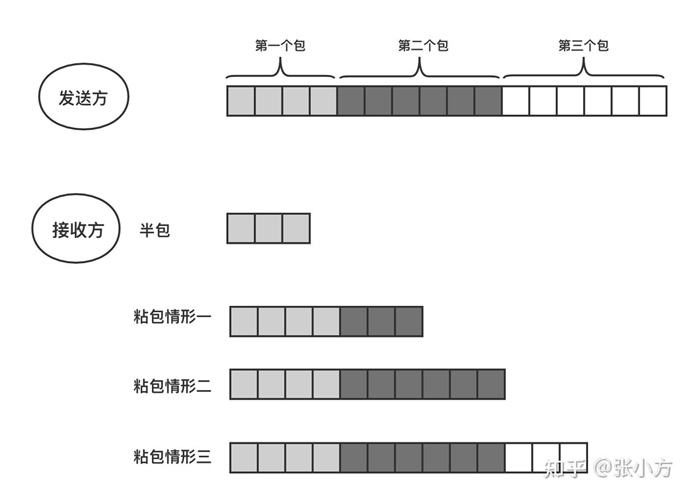
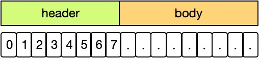
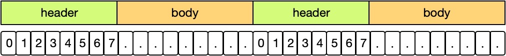
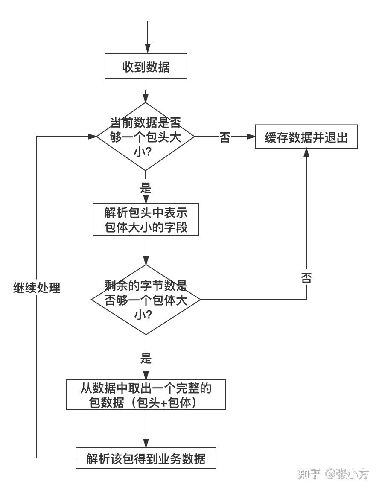

# 实现局域网P2P聊天：高级功能，自定义协议和心跳包

## 回顾

在上一章中，我们抛出了一个问题：**如何确认对方收到了我们的消息？**

要解决这个问题，需要我们`在应用层面引入确认机制`。这句话是什么意思呢，所谓应用层面，是指使用UDP发送数据包，我们需要做出区分，那个数据包是代表文本消息，那个数据包是代表确认消息。

这其实也就是自定义协议了。

## 协议

在介绍自定义协议之前，我们先来看看，什么是协议。

在汉语词典中，对于协议的解释是：

> *协议是*指两个或两个以上实体为了开展某项活动，经过协商后双方达成的一致意见

通俗点说：`协议就是约定`，双方按照某个标准或者说约定来解释一件事物。在计算机中，主要有2个方面：

- 数据包的格式：发送时按照什么格式组装数据包，收到一个数据包按照什么格式来解析
- 交互流程：我给你发送一个请求，你是否要回复，怎么回复，回复几次等等

> 思考，为什么有那么多RFC文档，比如http 1.1 [RFC2616](https://www.rfc-editor.org/rfc/rfc2616.txt)，http 2.0的 [RFC7540](https://www.rfc-editor.org/rfc/rfc7540.txt)、[RFC7541](https://www.rfc-editor.org/rfc/rfc7541.txt)

比如电视剧里面对暗号的场景：“天王盖地虎，小鸡炖蘑菇"，这算不算一种约定或者说协议，只有当对方回答正确了，才能确认是自己人，然后进行下一步。

那么对于计算机而言呢？协议要解决的问题是，对于一串二进制而言，我们如何解析这一串010101？

### 标准协议

#### TCP协议

[配图来源](https://www.cnblogs.com/andy9468/p/10096606.html)


TCP/IP协议中，规定了前14个字节是帧头、20个字节是IP头。

当网卡收到一个数据包时，只需要按照这个格式解析前34个字节，就能从IP头里面解析出源IP和目标IP，这就是协议。

#### HTTP协议

另外一个著名的协议是HTTP协议，HTTP是文本协议，HTTP协议中规定了头部和数据部需要使用"\r\n\r\n"隔开，服务端收到时，只需要按照"\r\n\r\n"分割内容，就能区分数据包那一部分是头，那一部分是数据。

请求协议格式举例：

```bash
POST /index.php　HTTP/1.1 #请求行
Host: localhost
User-Agent: Mozilla/5.0 (Windows NT 5.1; rv:10.0.2) Gecko/20100101 Firefox/10.0.2 # 请求头
Accept: text/html,application/xhtml+xml,application/xml;q=0.9,/;q=0.8
Accept-Language: zh-cn,zh;q=0.5
Accept-Encoding: gzip, deflate
Connection: keep-alive
Referer:http://localhost/
Content-Length：25   # 数据部分长度，用来处理TCP粘包
Content-Type：application/x-www-form-urlencoded
           # 空行，实际上是\r\n\r\n
username=aa&password=1234 # 请求数据
```

响应格式举例：

```bash
HTTP/1.1 200 OK # 状态行
Date: Thu, 29 Nov 2018 12:56:53 GMT 
Server: Apache
Last-Modified: Thu, 29 Nov 2018 12:56:53 GMT
ETag: "51142bc1-7449-479b075b2891b"
Accept-Ranges: bytes
Content-Length: 29769    # 数据部长度
Content-Type: text/html  # 数据部内容，还有json/application格式，text/html说明是html页面
           # 空行，实际上是\r\n\r\n
<!DOCTYPE html>    # 响应数据
<html>
   .......  
</html>
```


### 自定义协议

被业界认可的，就是标准协议（比如HTTP，TCP，他们都有RFC文档可供查阅），反之，则是自定义协议（又称私有协议）。他们不被认可的，或者故意不公开，来保护安全。

比如著名的QQ、MSN等等即时通信工具，都是使用的私有协议。据说QQ是基于UDP实现的，但是你不知道他们的数据包格式是啥，包含哪些请求。

[配图来源](https://www.cnblogs.com/andy9468/p/10096606.html)


自定义协议是在应用层实现的，就像HTTP协议一样都是应用层协议，你可以定义一个新的协议，HTTP使用文本，你可以使用二进制，或者使用结构体，这个取决于你。

### 自定义协议的优劣

优势：

- 相比标准协议，因为数据格式和交互流程不公开，所以更安全。
- 具有更高的灵活性，可以随意定制修改。
- 带宽更小，性能更高。微信之所以能在2G下工作，就是得益于其自定义协议和压缩算法。众所周知，HTTP最大的劣势就是没有压缩，及其占用带宽。

劣势：

- 没有兼容性，无法和别人的产品工作。只有你自己知道要怎么接入你的服务器，所以别人没法接进来，结果就是：你只能自己玩。
- 复杂。要实现诸多细节，肯定复杂。
- 工作量大。自己造轮子，哪有那么容易。


采用私有协议还是标准协议，取决于具体的场景，在即时通信这个领域下，出于安全性、低带宽等角度考虑，通常都会使用自定义协议的方式。

## 自定义协议实现

我们先看一下私有协议如何使用，以及如何定义。

### 头部和数据部

虽然我们的例子是基于UDP的，但是在实际开发中，从实现难度和效果层面衡量，我们都推荐使用TCP作为传输层协议，这里只是为了让大家方便理解。

#### 粘包问题

在实际的网络环境中，不管是TCP还是UDP，都可能遇到粘包问题，以TCP举例，可能的原因如下：

- 从数据发送的过程中，经过那些步骤来看：应用层首先要将自己的数据通过套接字发送，首先要调用一个write方法：（将应用进程缓冲区中的数据拷贝到套接口发送缓冲区SO_SNDBUF，有一个大小的限制），如果应用进程缓冲区的一条消息的字节的大小超过了发送缓冲区的大小，就有可能产生粘包问题，因为消息已经被分割了，有可能一部分已经被发送出去了，对方已经接受了，但是另外一部分可能刚放入套接口发送缓冲区里准备进一步发送，就直接导致接受的后一部分，直接导致了粘包问题的出现。
- TCP是基于字节流的，只维护发送出去多少，确认了多少，并没有维护消息与消息之间的边界，因而极有可能导致粘包问题。（应该在应用层维护一个消息边界，通常使用TLV方式实现，下文有介绍）
- 链路层所发送的数据有一个最大传输单元（MTU）的限制（以太网的MTU是1500bytes），如果我们所传输的信息超过了限制，那么会在IP层进行分组，或者分片，这也可能导致消息的粘包问题的产生。
- TCP本身的算法导致，比如流量控制，拥塞控制算法等，也可能导致粘包
- 网络延迟，导致收到了半包

>  [配图来源](https://www.zhihu.com/question/20210025/answer/1982654161)



通常解决方法有如下3种方式：

- **固定包长的数据包**：每个协议包的长度都是固定的。举个例子，例如我们可以规定每个协议包的大小是 64 个字节，每次收满 64 个字节，就取出来解析（如果不够，就先存起来）。
- **在包尾加结束标志**：在字节流中遇到特殊的符号时就认为到一个包的末尾了。例如，我们熟悉的 FTP协议，发邮件的 SMTP 协议，一个命令或者一段数据后面加上"\r\n"（即所谓的 **CRLF**）表示一个包的结束。对端收到后，每遇到一个”\r\n“就把之前的数据当做一个数据包。
- **包头+包体的方式**：采用包头加包体长度的方法，一般情况下，包头是定长的，假如包头是4个字节，可以先接受包头的4个字节，包头中携带一个字段，描述包体的长度，然后继续进行接收。

这3中方式中，固定包长以及加特殊符号的方式我们很少会这样使用，因为：

- 第一种：浪费带宽，试想我们如何定义这个长度？让用户只能发送10个汉字还是32个汉字？
- 第二种：选什么特殊符号好？如果用户发送的消息里面包含了\r\b，软件不是会出现BUG了？明明只发了一段话，结果你切割一下，变成了2句话。

所以，`私有协议中主要使用第三种方式：包头+包体`，但是为了加深大家的理解，我们来看几个例子。

#### 定长数据包

我们以P2P聊天为例，现在我们需要知道对方是否真正收到了我方发送的消息，我们可以定义一个结构体：

```c++
// 消息类型，C++11，限定作用域
enum class MsgType {
    kMsgData=1, // 代表这是消息内容
    kMsgAck,  // 代表这是确认
};

/** @fn
  * @brief
  * @param [in]aa:
  * @return
  */
struct Message {
    int32_t type;   // see MsgType
    char data[200]; // 对于不定长的字符串，我们只能规定一个长度
};
```

这个数据包长度为204


前4个字节是type，后200个字节是数据。

因为是定长结构，所以假设A给B发送了Hello的文字，那么将浪费200-5=195个字节。


这就是最大的问题。

#### 包头+包体

包头是固定长度，比如8个字节，16个字节。包头中有一个字段，记录了数据部的长度。

```c++
struct Header {
    int len;     // 包体长度
    int cmd;     // 信令
};

// 代表一个完整的包
struct Packet {
    Header header;  // 包头
    char body[];    // 包体，c99柔性数组，必须是最后一个字段，不占内存空间
};
```

Packet在内存中的结构如下：



遇到粘包的时候，我们只要尝试读取头部，然后判断socket缓冲区余下的长度是否和超过或等于头部的长度，来决定是否处理。



处理流程如下（[来自](https://www.zhihu.com/question/20210025/answer/1982654161)）：




### TLV格式

TLV是一种可变的格式，适合变长的数据包，意为：

- Tag：该字段是关于标签和编码格式的信息
- Lenght长度：该字段是定义数值的长度
- Value值：表示实际的数值。

Tag和Length的长度固定，一般那是2、4个字节（unsigned short 或 unsigned long ,具体用哪种编码和解析统一就行了，本文就取unsigned long类型）；Value的长度由Length指定；

我个人认为TLV是一种思想，就像大数据中元数据的概念，对数据进行描述，可以做很多事情。

那么它到底有什么用呢？最出名的要数protobuf，我们待会说，先看一个问题。

**试想一个场景：随着产品迭代，突然有一天你发现需要加字段**

这是原来的结构体：

```c++
struct Message {
    int32_t type;       // see MsgType
    char data[32];      // 对于不定长的字符串，我们只能规定一个长度
};
```

你是这样解析的：

```c++
int type = uitl::ReadInt32(buffer,len); // 先读取4个字节
buffer+=4; // 偏移
char data[32]={};
::memcpy(data, buffer, sizeof(32));  // 再读区余下32个字节
```

为了代码美观，你不小心加到了这里：

```c++
struct Message {
    int32_t type;       // see MsgType
    int32_t to_user;    // 这里，增加了1个字段，占用4个字节
    char data[32];      // 对于不定长的字符串，我们只能规定一个长度
};
```

于是你通知大家一顿改，原来解析的时候，读取data数据，只需要偏移4个字节，现在要偏移8个字节了，平白增加了很多工作量。

但是这不是最恐怖的，这个功能上线后，由于你没有考虑到老版本客户端的兼容问题，于是老客户端一收到新的消息就爆炸了（2边的解析对不上，格式改变了）。

这个时候TLV就能派上用场了，我们看看protobuf是怎么使用TLV解决兼容问题的。

[配图来源](https://www.jianshu.com/p/73c9ed3a4877)


Protobuf将每个基本的数据类型都通过TLV表示（L可以省略，于是变成TV类型）：

```bash
WireType          Encoding     Length(Bytes)   Method             Type
       0            Varint              1~10      T-V   int32 int64 uint32 uint64
       1            Varint              1~10      T-V   int32 int64 uint32 uint64
       2  Length Delimited            Length    T-L-V   string bytes embeded repeated

       5    32-Bits     4-Bytes          TV      fixed32,sfixed32,float
```

[配图来源](https://gohalo.me/post/protobuf-protocol-serialize-introduce.html)


假设，一开始我们的proto定义如下（以protobuf2为例）：

```protobuf
message person {
	// wire type = 0，field_number =1
	required int32     id = 1;           // required表示：这个字段必不可少
	// wire type = 2，field_number =2
	optional string    name = 2;         // optional表示：这个字段可为空
}
```

后续又增加了一个age字段：

```protobuf
message person {
	required int32     id = 1;           
	optional string    name = 2;       
	optional int32     age = 3;          // 我们增加了一个字段，标记为可空的
}
```

因为我们标记了age是optional可选的，字段顺序是3，故原来客户端解析的代码将不受影响，皆大欢喜。

### Protobuf

看官方文档：

- [Language Guide (proto3)](https://developers.google.com/protocol-buffers/docs/proto3)
- [Protocol Buffer Basics: C++](https://developers.google.com/protocol-buffers/docs/cpptutorial)


或者这篇文章（这是protobuf2的）:

- [Protobuf入门一：在linux下编译使用protobuf](https://blog.csdn.net/asmartkiller/article/details/89454276)


原理请参考：

- [深入 ProtoBuf - 编码](https://www.jianshu.com/p/73c9ed3a4877)
- [Protobuf 序列化详解](https://gohalo.me/post/protobuf-protocol-serialize-introduce.html)


#### 编译protobuf和protocol

#### 定义proto文件
#### 生成C++文件

#### 配置CMake工程，引入


## 代码实现

### V2版本：自定义结构方式

我们以P2P聊天为例，现在我们需要知道对方是否真正收到了我方发送的消息，我们可以定义一个结构体：

```c++
// 消息类型，C++11，限定作用域
enum class MsgType {
    kMsgData=1, // 代表这是消息内容
    kMsgAck,  // 代表这是确认
};

/** @fn
  * @brief
  * @param [in]aa:
  * @return
  */
struct Message {
    int type;       // see MsgType
    char data[200]; // 对于不定长的字符串，我们只能规定一个长度
};
```

发送时，把type设置为kMsgData即可：

```c++
Message data{};
data.type = static_cast<int>(MsgType::kMsgData); // 设置类型
assert(text.length() < sizeof(data.data));
::memcpy(data.data, text.c_str(), text.length());

int ret = ::sendto(fd, &data, sizeof(data), 0, (struct sockaddr *) &dest_addr, sizeof(dest_addr));
```

收到对方消息时，通过sendto，再发送一个type=kMsgAck的消息，说明我方已经收到：

```c++
void UdpServer::onHandle(const char *buffer, int len, struct sockaddr_in &remote_addr) {
    Message message{};

    ::memcpy(&message.type, buffer, sizeof(int32_t));
    buffer += sizeof(int32_t); // 注意偏移

    assert(len <= sizeof(message));
    ::memcpy(message.data, buffer, len);

    if (static_cast<MsgType>(message.type) == MsgType::kMsgData) {
      // 4. 收到消息
      std::cout << "来自" << end_point << " " << std::string(message.data) << std::endl;

      // 给对方回复收到
      Message ack{};
      ack.type = static_cast<int32_t>(MsgType::kMsgAck);

      int ret = ::sendto(listenFd(), &ack, sizeof(ack), 0, (struct sockaddr *) &remote_addr,
                         sizeof(remote_addr));
      if (ret == -1) {
        std::cout << "sendto error: " << errno << std::endl;
      }
    } else if (static_cast<MsgType>(message.type) == MsgType::kMsgAck) {
      std::cout << "来自" << end_point << " " << " 收到对方的确认回复" << std::endl;
    } else {
      std::cout << "来自" << end_point << " " << " Unknown message type:" << message.type << std::endl;
    }
}
```

完整代码在：[../code/chapter2/3-project-udp-chat-v2](../code/chapter2/3-project-udp-chat-v2)

### V3版本：自定义结构体+TLV

### V4版本：TLV+Protobuf

## 参考

- [怎么解决TCP网络传输「粘包」问题？](https://www.zhihu.com/question/20210025/answer/1982654161)
- [tcp粘包问题（经典分析）](https://blog.csdn.net/msdnwolaile/article/details/50769708)
- [第1章 1.10计算机网络概述--OSI参考模型和TCP_IP协议](https://www.cnblogs.com/andy9468/p/10096606.html)
- [Type–length–value](https://en.wikipedia.org/wiki/Type%E2%80%93length%E2%80%93value)
- [TLV简介](https://www.cnblogs.com/tml839720759/archive/2014/07/13/3841820.html)
- [Protobuf 序列化详解](https://gohalo.me/post/protobuf-protocol-serialize-introduce.html)
- [深入 ProtoBuf - 编码](https://www.jianshu.com/p/73c9ed3a4877)
