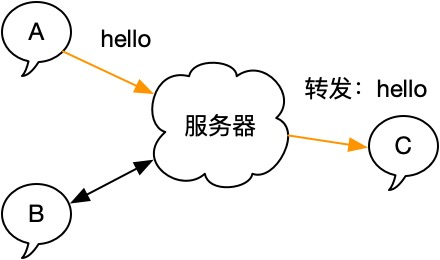

# C/S架构介绍：如何可以不用知道对方ip和对方聊天？

在上一节中，我们解决了因为UDP的特性（只管发，不管对方是否收到）导致的问题：我们并不知道对方，是否收到了我们发送的文本。同时，我们初步掌握了局域网P2P聊天的实现方式。

在上一节的最后，我们简单介绍了一下P2P模式的局限：

- 无法实现用户在线状态
- 无法实现离线消息

除此之外，还有一些使用不方便的地方：每次都需要输入对方IP，不太方便。

## 目标

所以，本章的目标是调整我们的架构，改成C/S（客户端-服务器）模式，所有的用户都与一个中间角色通信，这个中间角色（中介）来决定把消息投递给谁：



## 路由问题

### 源：是谁发来的消息

这里面有一个问题，对于服务器而言，他无法知道那个客户端是A、B或者C，所以，需要客户端主动告诉它。在实际的软件中，这个过程是通过登录完成的。大概流程如下：

- 用户打开软件（暂且叫它客户端），通过登录界面输入账号和密码，然后点击登录。
- 客户端向后方服务器发起一个请求，携带了账号和密码。
- 服务器收到客户端的请求后，查询数据库，校验用户名和密码。
- 校验成功，则查询用户的ID，返回校验结果和用户的ID给客户端。
- 客户端进入主界面。
- 下一次请求，`客户端带上自己的用户ID`，这样服务器就知道是哪个客户端发过来的消息。


源的问题解决了，以前我只知道谁哪个IP给服务器发送消息，现在由客户端携带用户ID后，我同时知道了：

- 发送消息的客户端IP和端口
- 发送消息的客户端用户ID

### 目标：发给谁，我怎么找到对方？

那么，服务器怎么知道，这个消息要发送给谁呢？

我们可以维护一个用户ID和IP端口的字典，`每当一个用户登录时，就添加一条记录`，`用户注销时，删除一条记录`。

> 思考，如果用户没有发送注销，直接退出了，这条记录永远删除不掉，岂不是就泄漏了？这就是需要引入心跳保活机制了，后续介绍。

| 用户ID | 用户IP             |
| ------ | ------------------ |
| 100    | 192.168.1.100:5421 |
| 200    | 192.168.1.133:8044 |
| 1003   | 192.168.1.137:3332 |

然后在聊天消息包中增加一个to的字段，指定这个消息是发给哪个用户ID的：

```c++
// 聊天消息封装
struct Message {
   int32_t from_user_id;      // 来自那个用户ID
   int32_t to_user_id;        // 发给那个用户ID
   std::string text;          // 文本内容
};
```

### 时序图

我们用时序图来表示这整个过程：


- 步骤1-4：A先发起一个登录，此时Server查询用户ID返回给A
- 步骤5-8：B和A的流程一致。此时Server知道了A和B的IP和ID，因为它维护了一张字典。
- 步骤9-12：此时A和B都不知道有哪些用户登录了，所以需要主动发起一个请求，来查询一下都有哪些用户在线，从而得到对方的ID。
- 步骤13：此时，A知道B的用户ID是100，自己的ID是50。他给B发送一条文本，需要携带自己的ID，对方的ID和文本内容。
- 步骤14：服务器给A回复一个ACK，表示我已经收到你发的消息。
- 步骤15-16：然后，根据收到的消息里面的to字段，查找B的IP和端口，然后通过udp转发给对方
- 步骤17：B收到一条文本，同样B需要先给Server回复一个ACK，告诉Server我已经收到了消息
- 步骤18：然后，通过from字段知道原来是A给我发送了一条消息，进行打印

通过上面步骤的分析，我们现在需要对我们的协议进行升级，我们一起来看一下。

## 协议升级

这里解释一下：

- 请求和响应：`一来一回`。这是一对，发送了一个请求，接收者必须给一个响应结果，不然就代表出现了异常。通常是客户端发给服务器（或者服务器内部进程之间）。
- 通知：`有去无回`。表示发送者不关心回复，接收者无需回复。

目前总计有如下命令类型：

```c++
// 注意：enum class MsgType => CmdID，更符和其用途
enum class CmdID {
    kMsgData = 0x100, // 代表这是消息内容
    kMsgAck = 0x101,  // 代表这是确认

    kLoginReq = 0x200,   // 登录请求
    kLoginResp = 0x201,  // 登录响应
    
    kLoginOut = 0x202,   // 注销通知，无需回复

    kQueryUserListReq = 0x300,  // 查询用户列表请求
    kQueryUserListResp = 0x301, // 查询用户列表响应
};
```

### 登录请求和登录结果

```c++
// 登录请求
struct LoginReq {
  // cmd=0x200
  char user_name[32];
  char user_pwd[32];
};

// 登录响应
struct LoginRes {
  // cmd=0x201
  int32_t user_id;
};
```

### 注销通知

```c++
// 注销通知
struct LoginOut {
  // cmd=0x202
  int32_t user_id;
};
```

### 查询在线用户列表请求和响应

```c++
struct UserInfo {
  int32_t user_id;
};

// 用户列表请求
struct UserListReq {
  // cmd=0x300
  int32_t user_id;
};

// 用户列表响应
struct UserListRes {
  // cmd=0x300
  int32_t list_count; // 列表个数
  char user_id[];     // 字节长度：sizeof(UserListReq)*list_count，需要自己手动解析
};
```

### 消息和ACK

```c++
// 聊天消息
struct Message {
   int32_t from_user_id;      // 来自那个用户ID
   int32_t to_user_id;        // 发给那个用户ID
   std::string text;          // 文本内容
};

// 聊天消息ACK
struct MessageAck {
  int32_t from_user_id; // 来自那个用户ID
  int32_t to_user_id;   // 发给那个用户ID
};
```

## 总结

感兴趣的读者可以自行实现，这里考虑到复杂度的问题，我们在本章节跳过不讲，在后续章节中会有具体的代码实现。

这里已经建好了工程结构：[../code/chapter2/5-project-udp-multi](../code/chapter2/5-project-udp-multi)
