[TOC]

# 最全开源IM总结

## 引言

近些年开源IM百花齐放，特别是国内呈现喷涌趋势，只不过有些项目只提供了客户端或者服务端，但是仍然具有学习价值。

本章是根据作者平时的关注收藏整理而成，

## 国内

本节主要介绍提供完整解决方案的开源IM（包含服务端和客户端），修改之后能进行商用的。

### TeamTalk

  
github: [https://github.com/meili/TeamTalk](https://github.com/meili/TeamTalk)
服务端: c++
客户端: windows,android,ios,mac,web管理后台
简介: 
> TeamTalk是一款蘑菇街开源的企业内部即时通讯软件，目前支持pc、安卓、IOS、Mac和web多个终端。
> 该项目适合学习和入门，客户端BUG很多，服务端比较稳定。
> 我维护的分支（有详细的服务端编译部署文档）：
> [https://github.com/xmcy0011/TeamTalk](https://github.com/xmcy0011/TeamTalk)

图片：
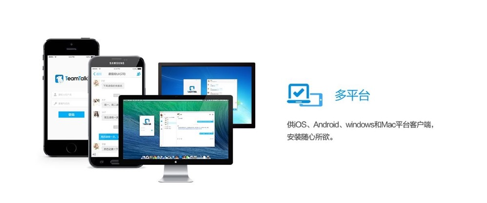
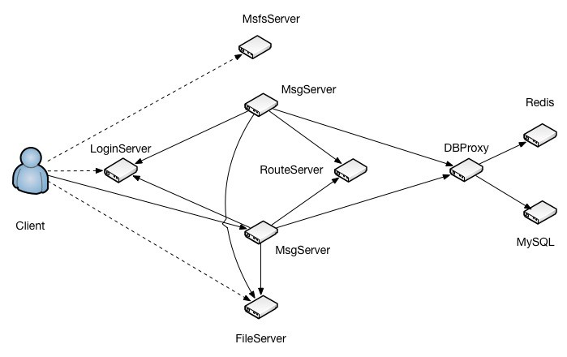

更多信息可以参考：[OSChaina](https://www.oschina.net/p/teamtalk)

标签：**学习Linux C++服务端开发** | **企业内部沟通工具** | **丰富的终端支持** | **十万级IM服务端架构** | **BUG多** | 蘑菇街 | 5年前

### WildfireChat

github: [https://github.com/wildfirechat/server](https://github.com/wildfirechat/server)
服务端: java
客户端: Electron(windows/mac/linux),android,ios,web
简介: 
> 非常活跃的开源IM解决方案，社区版免费，专业版收费（号称支持百万并发和集群部署）。
> 优点：客户端支持全面，功能成熟完整BUG少。和微信的实现非常接近，底层也是使用的微信跨平台通信库Mars，在弱网（2.5G，E信号）下理论上拥有和微信一样优秀的表现。
> 缺点：社区版服务端性能不好（嵌入式数据库H2、不支持集群等），只适合学习和试用。

图片：
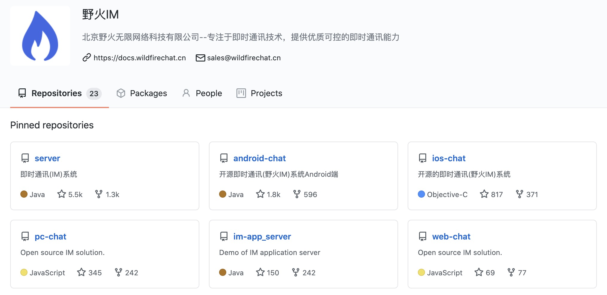
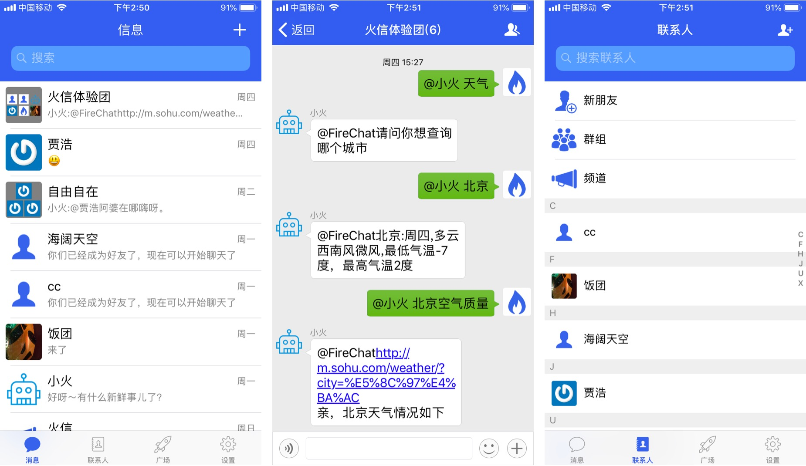

标签：**成熟** | **集群版收费** | **丰富的客户端** | **专业** | **活跃** | 贴近微信 | 界面美观

## 国外

本节列举一下国外的开源IM，因为操作方式和微信/QQ不太一样，所以比较适合研究使用。

### RocketChat

github: [https://github.com/RocketChat/Rocket.Chat](https://github.com/RocketChat/Rocket.Chat)
简介: 
> 如果是果粉，mac,iphone都可以直接在app store下载，强烈建议使用体验一下，确实和其他所有IM不太一样。

语言: JavaScript
图片: 
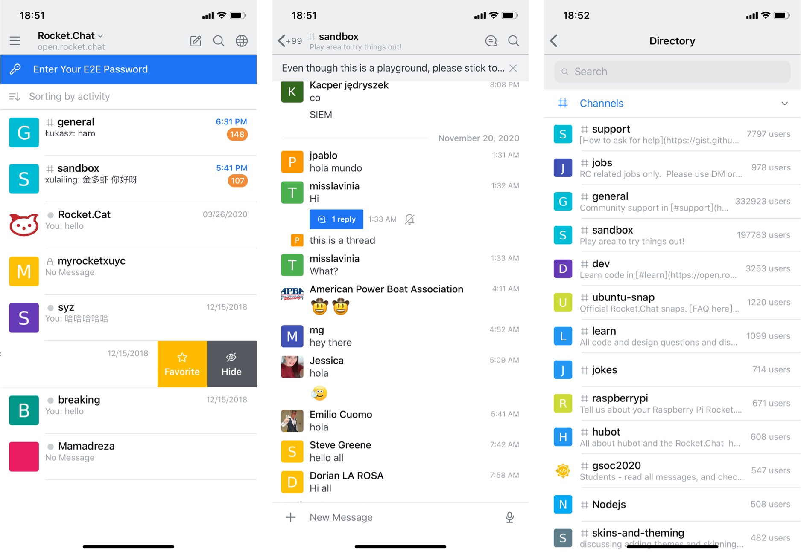

### Telegram

github: [https://github.com/DrKLO/Telegram](https://github.com/DrKLO/Telegram)
简介: 
> 也可以在app store下载，非常强调安全（加密、全部开源、无后端），如果需要深入研究IM的安全，这个开源项目非常推荐。
> 国外用的比较多，就是因为没有服务端，数据和隐私有保障。
> PS：本人没有编译部署过。

语言: c++,java
图片: 
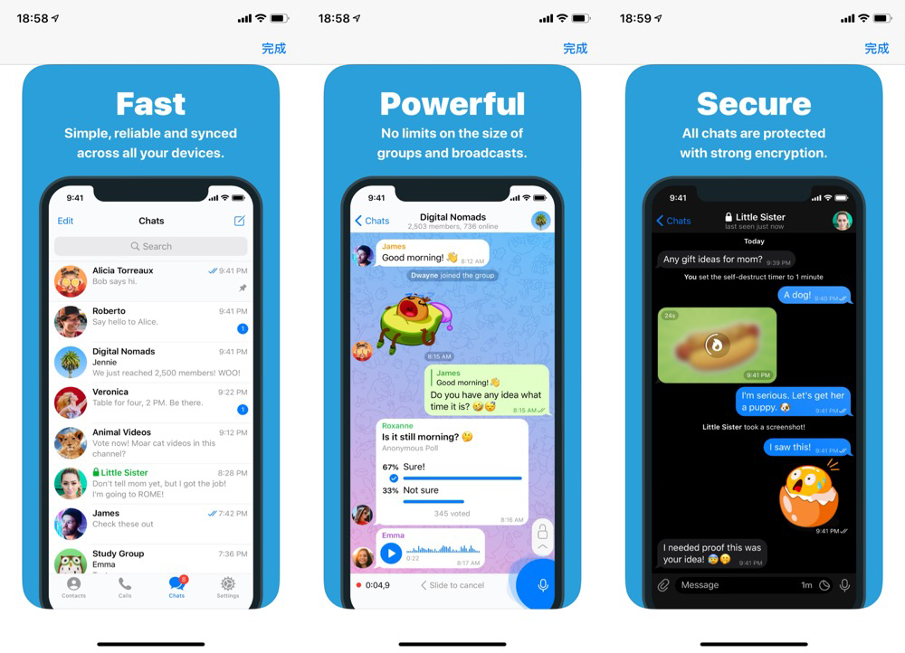

### DeltaChat

github: [https://github.com/deltachat/deltachat-android](https://github.com/deltachat/deltachat-android)
简介: 
> 也没有服务端，只要知道对方的邮箱地址，即可聊天。原理是通过邮件对内容加解密实现通信。可惜比telegram晚出，不然也会火的。
> PS：本人部署过，但是因为发一条消息就会有一封邮件，体验不太好。有时还会丢消息，实时性也无法保障，但是可以尝鲜，打开思路。

语言: java,rust,swift
图片: 
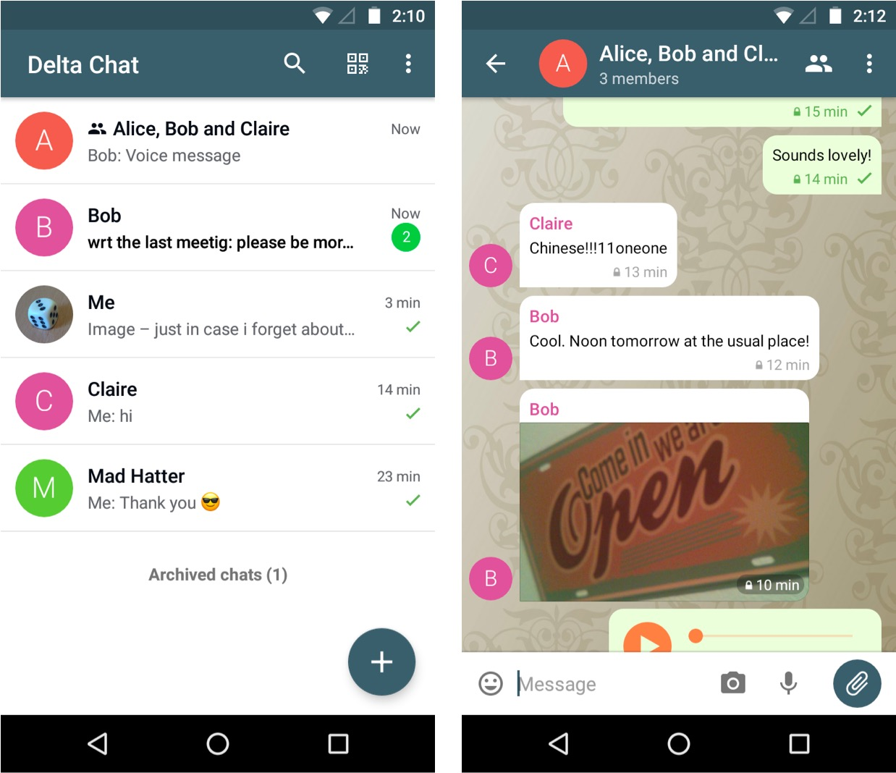

## 未深入研究

### MobileIMSDK(java)

github: [https://github.com/JackJiang2011/MobileIMSDK](https://github.com/JackJiang2011/MobileIMSDK)
简介: 
> 著名http://www.52im.net/站长作品，有丰富的文档和学习资源。并且也包含免费版和收费精编注释版。
> 只不过要花钱购买源码，可能更适合企业吧。

图片：

更多信息可以参考：[即时通讯网](http://www.52im.net/)

### flamingo(c++)

github: https://github.com/balloonwj/flamingo
简介: 
> 整体操作上类似QQ，服务端使用C++编写，同时提供windows客户端和安卓客户端。

语言: c++
图片: 

### GoBelieveIO(go)

github: [https://github.com/GoBelieveIO/im_service](https://github.com/GoBelieveIO/im_service)
简介: 
> 服务端使用Go实现，客户端比较简陋（19年，现在不知道发展成什么样子了）

语言: go
图片: 略

## 服务端

### Terry-Mao/goim

github: [https://github.com/Terry-Mao/goim](https://github.com/Terry-Mao/goim)
简介: 
> bilibili技术总监作品，百万级并发聊天室服务端，主要用来研究高并发的服务端架构。

语言: go
架构: 

### Terry-Ye/im

github: [https://github.com/Terry-Ye/im](https://github.com/Terry-Ye/im)
简介: 
> 上面goim的架构不好理解，通过这个项目可以很好的理解百万级别IM并发的服务端架构设计。

语言: go
架构:
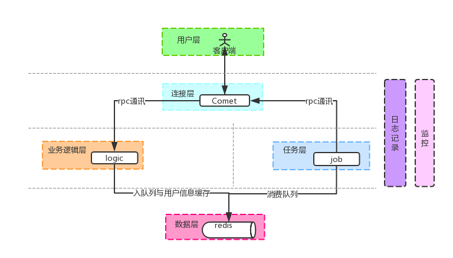 

### cim

github: [https://github.com/crossoverJie/cim](https://github.com/crossoverJie/cim)
简介: 
> 比较有意思，命令行交互的IM。官方介绍：cim(cross IM) 适用于开发者的分布式即时通讯系统

语言: java
架构: 
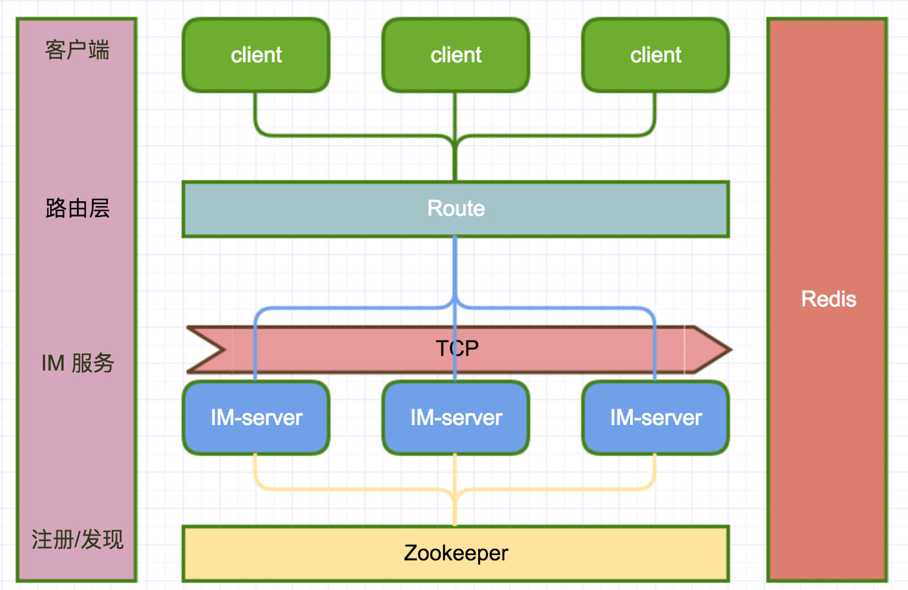

### gim

github: [https://github.com/alberliu/gim](https://github.com/alberliu/gim)
简介: 
> 有比较多的一些交互流程和一些基础技术名词的说明和解释，比较适合用来学习go如何开发im服务。

语言: go
交互图:
 

### OIMChat

star: 1.4K
gitee: [https://gitee.com/oimchat/oim-fx](https://gitee.com/oimchat/oim-fx) 
简介: 
> 桌面版客户端主要采用JavaFX开发，支持跨平台Windows、Mac、Linux等主流系统使用。服务端也是java，界面上类似QQ。

语言: java,javafx
图片: 
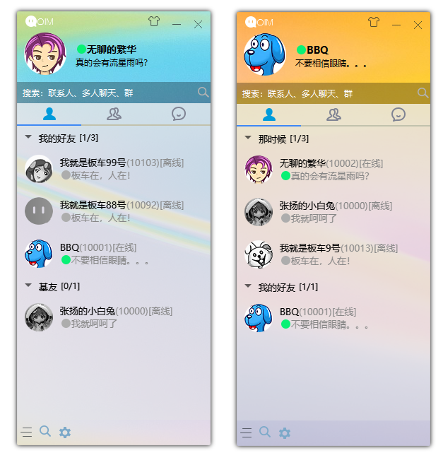

### J-IM

star: 5.9K
gitee: [https://gitee.com/xchao/j-im](https://gitee.com/xchao/j-im)
简介: 
> 服务端使用java开发，号称单机可支持几十万至百万人同时在线。客户端是网页版，功能比较齐全。
1、高性能(单机可支持几十万至百万人同时在线)
2、轻量、可扩展性极强
3、支持集群多机部署
4、支持SSL/TLS加密传输
5、消息格式极其简洁(JSON)
6、一端口支持可插拔多种协议(Socket自定义IM协议、Websocket、Http),各协议可分别独立部署。
7、内置消息持久化(离线、历史、漫游)，保证消息可靠性，高性能存储
8、各种丰富的API接口。
9、零成本部署，一键启动。

语言: java
图片: 
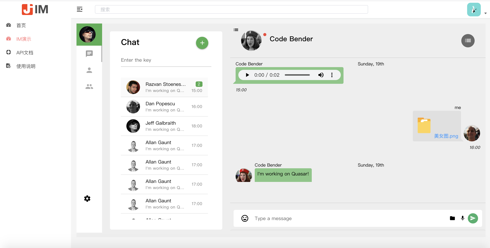

## APP

### TSWeChat

github: [https://github.com/hilen/TSWeChat](https://github.com/hilen/TSWeChat)
简介: 
> swift版高度还原微信的开源项目，仅包含客户端代码，使用mock展示效果。

语言: swift
图片: 

### motianhuo/wechat

github: [https://github.com/motianhuo/wechat](https://github.com/motianhuo/wechat)
简介: 
> 也是高仿微信的安卓客户端项目。

语言: java
图片: 

### gsdios/GSD_WeiXin

github: https://github.com/gsdios/GSD_WeiXin
简介: 
> 同样高仿微信。

语言: object-c
图片: 

PS：更建议看wildfirechat里面的实现，虽然稍微复杂一些。但是别人有后端，更适合实战和找工作吧。[https://github.com/wildfirechat/ios-chat](https://github.com/wildfirechat/ios-chat)