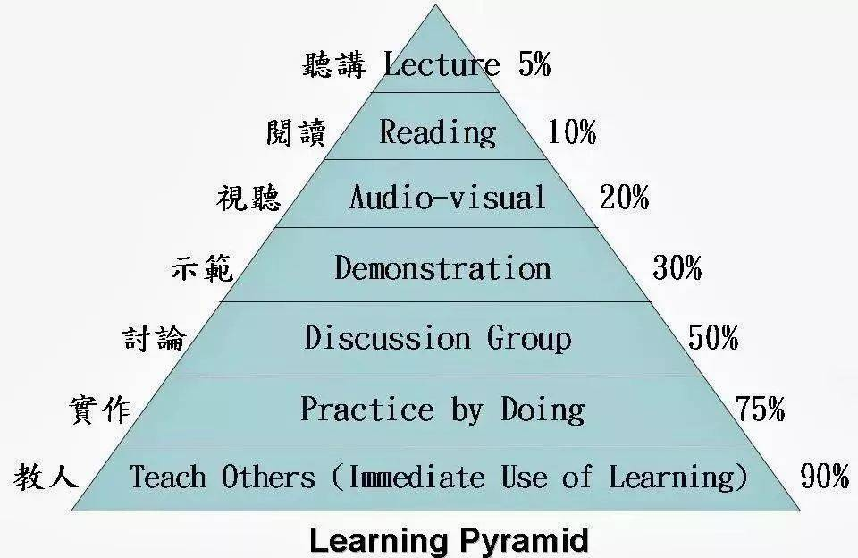

# 学习路线图

## 我的经历

不是所有人都对IM感兴趣，甚至当做事业或者找这方面的工作。

如今这个时代，人工智能、大数据、物联网、VR/AR、5G等等新技术层出不穷，我为什么还要学这玩意？

还记得，一年前入职的这家公司的HR说过的一句话：
> IM都是上个时代的技术了，现在很难招到这方面的人。

那么，偶然看到这些文章的你为什么要研究IM呢？

还记得大学时代，学习网络编程。拿QQ来练手，用C#写的WinForm客户端和Console服务端，能够实现在局域网内一对一聊天。界面效果也还不错，在网上搜索到了一个仿QQ好友列表的控件，开心的不得了。给人别用的时候，虽然莫名其妙的就会弹出一个错误框，但当时感觉自己好像有点牛逼。

工作后，进入了一家创业公司做安防软件一呆就是6年。期间也是从windows应用开发，到C++SDK开发到底层，然后带项目负责产品带团队等等，技术的深度和广度等等都有所提高。但是始终有一个遗憾：什么时候能把我们的流媒体服务器重构，不在卡顿，比别人效果好呢？

从这家公司离职后，有一次偶然的机会，能够把这个遗憾弥补回来。但是经历半年的合伙创业后，又多了一个遗憾：我什么时候有能拿得出手的作品？流媒体服务器？IM？

于是，跳槽到了一家电商公司，当时的心情就像写三体的刘慈欣（之前是山西一家水电站的软件工程师，现在是中国科幻界的里程碑）：
> 工作只是糊口，初心和热爱的东西才是值得我们默默的努力和付出的。
> 10年后，回顾过往，会心一笑，终究是留下了些什么，没有白活，真好。

## 学习方式

### 学习金字塔

  

**学习金字塔**：

> 学习金字塔是美国缅因州的国家训练实验室研究成果，它用数字形式形象显示了：采用不同的学习方式，学习者在两周以后还能记住内容（平均学习保持率）的多少。它是一种现代学习方式的理论。最早它是由美国学者、著名的学习专家爱德加·戴尔1946年首先发现并提出的。
>
>    在塔尖，第一种学习方式——“听讲”，也就是老师在上面说，学生在下面听，这种我们最熟悉最常用的方式，学习效果却是最低的，两周以后学习的内容只能留下5％。
>
> 　　第二种，通过“阅读”方式学到的内容，可以保留10％。
>
> 　　第三种，用“声音、图片”的方式学习，可以达到20％。
>
> 　　第四种，是“示范”，采用这种学习方式，可以记住30％。
>
> 　　第五种，“小组讨论”，可以记住50％的内容。
>
> 　　第六种，“做中学”或“实际演练”，可以达到75％。
>
> 　　最后一种在金字塔基座位置的学习方式，是“教别人”或者“马上应用”，可以记住90％的学习内容。
>
> 　　爱德加·戴尔提出，学习效果在30%以下的几种传统方式，都是个人学习或被动学习；而学习效果在50％以上的，都是团队学习、主动学习和参与式学习。

先说 **五觉学习法**（实际上没有这个理论，我瞎起的名字） ：

- 听觉：耳朵，比如听课，在APP上听音频学习等。我在地铁上有时候带耳机只单纯使用听觉学习，但是我发现效果确实很差。环境嘈杂，眼睛又不受约束，集中不了注意力，要么走神，要么就是听了后面的忘记前面的。
- 视觉：眼睛，比如阅读各类实体书籍、博客、电子书等。我们也常常配合触觉（手）来做一些笔记，加深印象，也方便后面的复习。这是我们大部分人主要的学习方式，但是很不幸的，按照学习金字塔原理，
- 嗅觉：鼻子，除非是学习做菜，否则其他的技能学习中我很少用到。
- 触觉：手，看书划重点，抄书，写代码，打字等都属于这类。
- 味觉：嘴巴，可以尝味道，也可以说话，通常我们更多的是把自己的理解讲给别人听，形成沟通。

说这个有什么用？我们要充分调动我们的

- 耳朵（听讲）：学习资源是音频形式，。
- 阅读（眼睛+手）：也就是看书学习，同时我们可能会画线记点笔记，这可能是我们的主要的学习方式之一，但是按照学习金字塔原理，
- 视听（眼睛+耳朵）：看视频

可能大家都听过 **五官学习法** 或者 **学习金字塔原理**。简单点来讲，就是不同的学习方式（不同的感官）有不同的效果。

有的人看书可能打瞌睡，那可以看视频呀；还记得上学的时候，老师一边讲课，我们一边记笔记吧？这个时候需要用到手，通常作了比较会相比于纯粹的听老师讲课效果要好一些，这也就像我们敲代码了，都是通过触觉加深印象。

比如我们在坐地铁上班，带个耳机听APP上的音频学习，通常因为眼睛可以看其他地方（美女/帅哥），注意力会收到影响，所以自然而然效果也较差；

阅读书籍（眼睛）和看视频（眼睛+耳朵）学习效果也不一样，

看书阅读的时候，我们用眼睛；

看视频，则同时刺激我们的眼睛和耳朵。

### 源码

### 调试

### 多画时序图