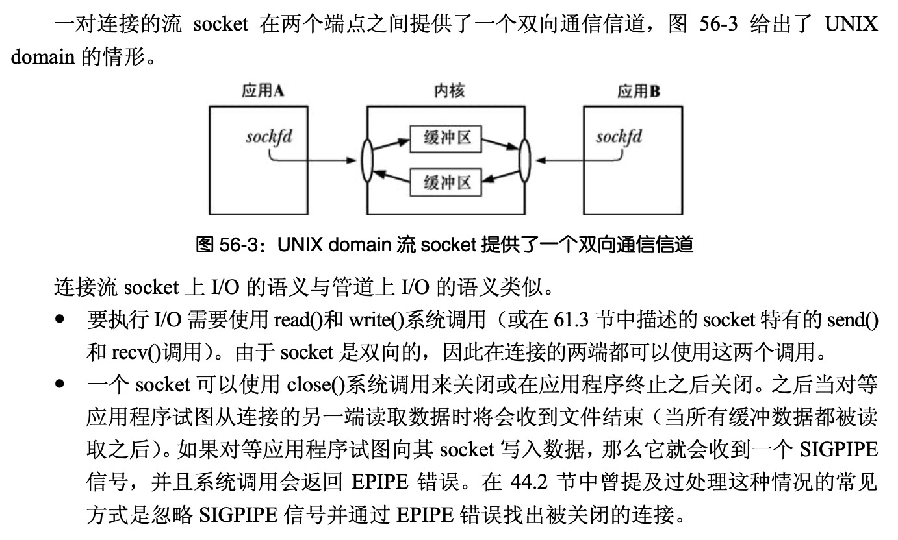
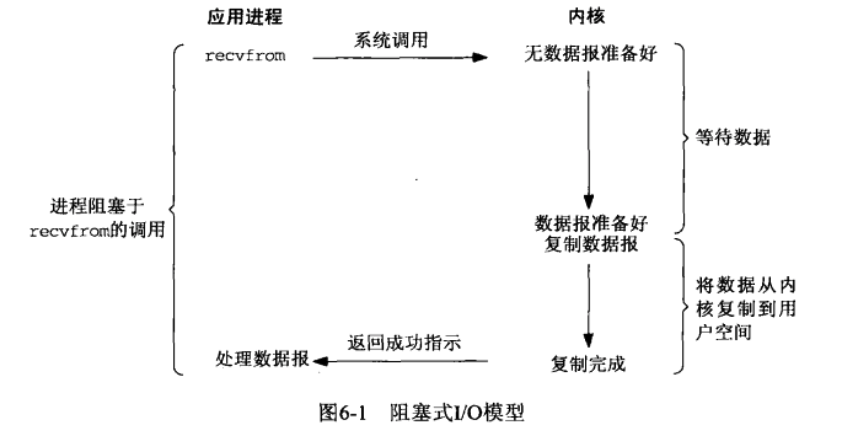
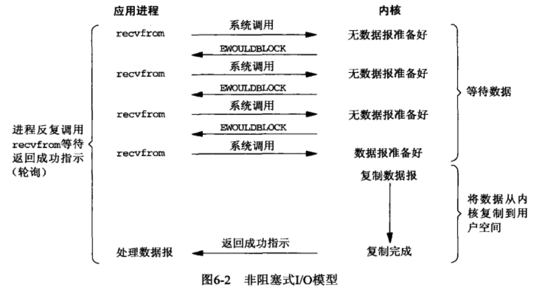
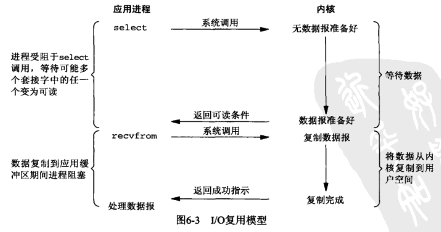
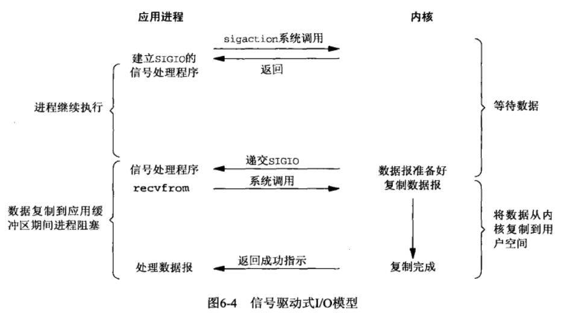
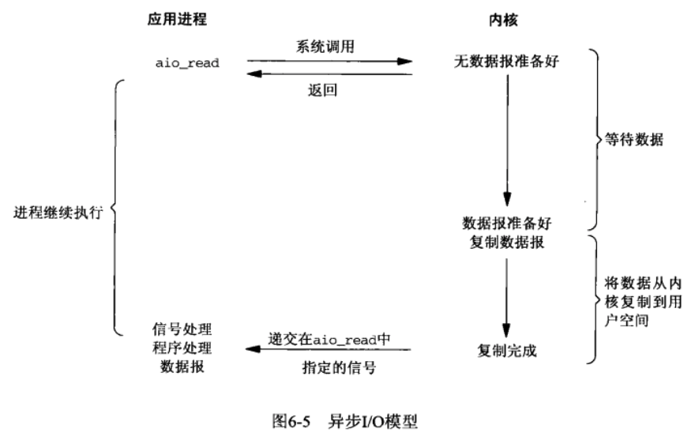
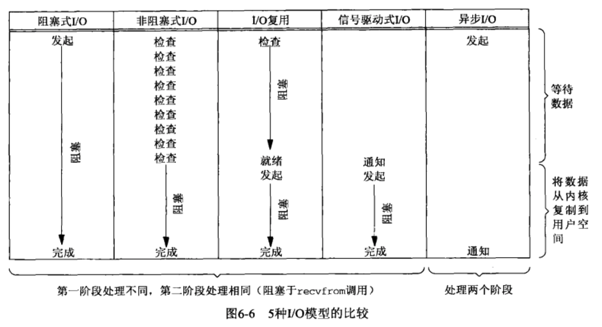

# 如何管理大量TCP连接

本章的目标是介绍如何管理大量的TCP连接（UDP要用好真不简单，功力有限，抛开不谈），思路如下：

- 先说挑战，从几个经典问题看起。
- 再说理论，看Linux操作系统几种经典的I/O模型是如何解决这些问题的
- 然后说下代码实现
- 最后会深入探讨下万、十万和百万级别连接管理的架构

## 经典问题：C10K和C10M

### 引言

我印象中小学（2003年）时代一个月才有1次的计算机打字课（进去还要换拖鞋，也是很奇怪），是用的大头机和windows98系统：


到初中年代（2008），县城里的网吧也还有许多电脑是这种大头机（辐射非常大，玩一会头晕眼花），然后慢慢的才有液晶显示器，直到大学才有自己的第一款笔记本（2010）。

也是从2010年后，自己各种折腾电脑，重装系统，到自己工作，才开始关注CPU，i3、i5和i7，甚至最近2020年新款的mac pro的i9处理器，从单核到双核到4核8线程等等。

计算机飞速发展，现在一台普通的笔记本甚至智能手机都能媲美20世纪的服务器了。【PK图，后续添加】

大学时代，我在i3配置的笔记本上用C#实现了一个windows tcp server，一开始只能支持几百个连接（客户端启动和退出一频繁，服务就崩溃），然后使用了IOCP的技术，实现了几千个连接的支持（受限于笔记本）。直到工作，任意找一台台式机，用Linux写一个epoll服务端，就可以实现上万的连接支持，所以现在C10K（单机支持10*1000个连接）已经不在是问题了。

### C10K

简单来说，C10K就是指单机如何支持1万个（10*1000）连接，主要是在互联网的早期，Web服务器在硬件有限的情况下，如何能支持更高的并发（众所周知HTTP协议是基于TCP之上的，所以需要建立连接）。

虽然目前服务器性能越来越高，但是如果方法不对（Linux下如果使用select I/O复用模型，则默认最大只能支持1024个连接，更多就需要修改内核并重新编译了），也是做不到1万个连接的支持的。

左耳朵耗子大叔的专栏里面有提到，提出这个问题的人叫丹·凯格尔（Dan Kegel），目前在 Google 任职。可以阅读一下这篇文章了解下这个问题：[The C10K problem](http://www.kegel.com/c10k.html)([翻译版](https://www.oschina.net/translate/c10k))

这个问题的本质，引用左耳朵耗子大叔的话来解释：

> C10K 问题本质上是操作系统处理大并发请求的问题。对于 Web 时代的操作系统而言，客户端过来的大量的并发请求，需要创建相应的服务进程或线程。这些进程或线程多了，导致数据拷贝频繁（缓存 I/O、内核将数据拷贝到用户进程空间、阻塞）， 进程 / 线程上下文切换消耗大，从而导致资源被耗尽而崩溃。这就是 C10K 问题的本质。
>
> 了解这个问题，并了解操作系统是如何通过多路复用的技术来解决这个问题的，有助于你了解各种 I/O 和异步模型，这对于你未来的编程和架构能力是相当重要的。

### C10M

更近一步，单机如何支持千万级（10\*1000*1000）连接可以看一下这篇文章：[The Secret To 10 Million Concurrent Connections -The Kernel Is The Problem, Not The Solution](http://highscalability.com/blog/2013/5/13/the-secret-to-10-million-concurrent-connections-the-kernel-i.html)

## 理论基础

### Linux下的IO模型

#### CMAN

```bash
$ wget https://src.fedoraproject.org/repo/pkgs/man-pages-zh-CN/manpages-zh-1.5.1.tar.gz/13275fd039de8788b15151c896150bc4/manpages-zh-1.5.1.tar.gz    # 下载
$ tar zxf manpages-zh-1.5.1.tar.gz -C /usr/src
$ cd /usr/src/manpages-zh-1.5.1/
$ ./configure --disable-zhtw  --prefix=/usr/local/zhman && make && make install
$ echo "alias cman='man -M /usr/local/zhman/share/man/zh_CN' " >>.bash_profile
$ source .bash_profile 
$ cman ls                   # 中文版使用cman，测试一下
```

#### 什么是I/O

首先什么是I/O？

I/O(input/output)，即输入输出设备，现实中键盘和鼠标是输入设备，显示器是输出设备，在《深入理解计算机系统》第一章1.7.4节中，有说到：**文件是对I/O设备的抽象表示，文件就是字节序列，仅此而已。每个I/O设备，包括磁盘、键盘、显示器，甚至网络，都可以看成文件**。

所以，不难理解在Linux的API中，为什么发送TCP数据包可以调用write()，接收数据包可以调用read()了，在《Linux-UNIX系统编程手册》中第56.5.4节流socket I/O中有描述：



《Netty权威指南 第2版》1.1.1节也有描述：

> Linux的内核将所有外部设备都看作一个文件来操作，对一个文件的读写操作会调用内核提供的系统命令，返回一个file descriptor（fd，文件描述符）。而对一个socket的读写也会有相应的描述符，称为socketfd（socket描述符），描述符就是一个数字，它指向内核中的一个结构体（文件路径，数据去等一些属性）

所以，为什么c++有如下接收数据的代码（第一个参数socket_fd就是socket描述符，它的创建过程这里省略了）：

```c++
while(true){
	// ...
	// 调用read等待网络数据的到来，期间一直阻塞
	size_t len = read(socket_fd, buffer, kMaxBufferLen);
	// 调用write把要发送的数据写入到socket缓冲区，等待发送
	write(socket_fd, buffer, len);
	// ...
}
```


既然网络也被抽象为文件，那么如何使读写（收发）比较快，拥有很高的性能就很关键了，《UNIX网络编程卷1》第6.2节 I/O模型里面介绍了5种模型，我们来一起看看。

#### 5种I/O模型

- 阻塞式I/O
- 非阻塞式I/O
- I/O复用（select和poll）
- 信号驱动式I/O（SIGIO）
- 异步I/O（POSIX的aio_系列函数）

对于Linux C++，后面2种不常用，主要看前3种即可。对于Java，NIO类库封装了所以异步I/O的细节，也只要了解一下操作系统支持异步I/O即可。

##### 阻塞式I/O



最常用最基本的I/O模型，缺省情况下，所有的文件操作都是阻塞的。以UDP为例，在进程空间中调用recvfrom（接收数据），其系统调用直到数据包到达，且被复制到应用进程的缓冲区中或者发送错误时才返回，在此期间一直会等待。进程在从调用recvfrom开始，到它返回的整段时间内都是被阻塞的，因此被称为阻塞I/O模型。

recvfrom的API原型如下：

```c++
/**
 * receive a message from a socket
 * @param s: socket描述符
 * @param buf: UDP数据报缓存区（包含所接收的数据）
 * @param len: 缓冲区长度
 * @param flags: 调用操作方式（一般设置为0）
 * @param from: 指向发送数据的客户端地址信息的结构体（sockaddr_in需类型转换）
 * @param from_len: 指针，指向from结构体长度值
 * @return These calls return the number of bytes received, or -1 if an error occurred
 */
int recvfrom(int socket, void *buf, int len, unsigned int flags,
             struct sockaddr *from, int *from_len);
```

##### 非阻塞式I/O



和阻塞式I/O模型的区别，就是调用recvfrom后立即返回，通过返回值判断是否有数据（EWOULDBLOCK错误代表没有数据）。所以一般搭配sleep使用，但是如何确定轮询检查的间隔，看应用场景。

##### I/O复用模型



这个模型是我们这一章的重点（后面会详细介绍），主要以Linux提供的select/poll/epoll来实现。

- select/poll：进程通过将一个或多个fd传递给select或poll系统调用，阻塞在select操作上，这样select/poll可以帮我们侦测多个fd是否处于就绪状态。select/poll是顺序扫描fd是否就绪，而且支持的fd数量有限（默认1024个，f d受限，也即意味着默认情况下最大只能支持1024个连接），因此它的使用受到了一些制约。

- epoll：使用基于事件驱动的方式代替顺序扫描，因此性能更高。当有fd就绪时，立即进行回调处理。

它的原称是**I/O multiplexing**（有时候“I/O复用”这个翻译，会让人有点疑惑，复用在那里？为什么叫做I/O复用？），即：多路网络连接复用一个io线程的意思，虽然不是很精确，但是能让我们明白为什么叫复用。

再引用来自于 [[知乎：IO 多路复用是什么意思？罗志宇的回答](https://www.zhihu.com/question/32163005)] 一图：


>  **I/O multiplexing 这里面的 multiplexing 指的其实是在单个线程通过记录跟踪每一个Sock(I/O流)的状态(对应空管塔里面的Fight progress strip槽)来同时管理多个I/O流**. 发明它的原因，是尽量多的提高服务器的吞吐能力。
>
> 在同一个线程里面， 通过拨开关的方式，来同时传输多个I/O流， (学过EE的人现在可以站出来义正严辞说这个叫“时分复用”了）。
>
> *什么，你还没有搞懂“一个请求到来了，nginx使用epoll接收请求的过程是怎样的”， 多看看这个图就了解了。提醒下，ngnix会有很多链接进来， epoll会把他们都监视起来，然后像拨开关一样，谁有数据就拨向谁，然后调用相应的代码处理。*

IO复用形成原因具体可以参考这里 [IO复用](https://www.cnblogs.com/nr-zhang/p/10483011.html)：

> 如果一个I/O流进来，我们就开启一个进程处理这个I/O流。那么假设现在有一百万个I/O流进来，那我们就需要开启一百万个进程一一对应处理这些I/O流（——这就是传统意义下的多进程并发处理）。思考一下，一百万个进程，你的CPU占有率会多高，这个实现方式及其的不合理。所以人们提出了I/O多路复用这个模型，一个线程，通过记录I/O流的状态来同时管理多个I/O，可以提高服务器的吞吐能力

##### 信号驱动式I/O（不常用）



信号驱动式I/O是指预先告知内核，使得当某个描述符上发生某事时，内核使用信号通知相关进程。如上图，先开启套接接口信号驱动I/O功能，并通过系统调用sigaction执行一个信号处理函数（此系统调用立即返回，进程继续工作，他是非阻塞的）。当数据准备就绪时，就为该进程生产一个SIGIO信号，通过信号回调通知应用程序调用recvfrom来读取数据，并通知主循环函数处理数据。

##### 异步I/O模型（不常用）



异步I/O：告知内核启动某个操作，并让内核在整个操作完成后（包括将数据从内核复制到用户自己的缓冲区）通知我们。这种模型与信号驱动模型的主要区别是：信号驱动I/O由内核通知我们何时可以开始一个I/O操作，而异步I/O模型由内核通知我们I/O操作何时已经完成。

##### 5种模型对比



### 高性能实现：I/O复用

其实最重要的就是这一节吧，实现大量TCP的连接的答案就是epoll技术（Windows下是IOCP技术），但是并不是每种场合下epoll都适用：

- 比如epoll是linux特有的，windows有iocp（完成端口）的技术，所以如果是windows服务器，就不适合
- epoll适合连接数多，但是都不活跃的场景，比如IM（用户虽然在线，但并不是时时刻刻都在发消息）、消息推送等。select/poll适合对吞吐量要求高，连接数少（千级别）的场景，比如音视频传输（每一秒都在传输大量的数据）、文件传输等，当然对于这些对速度有要求的实时传输业务，可能更好的选择是UDP协议。


TODO...

#### 三种I/O复用模型

##### select

##### poll

##### epoll


#### 2种设计模式

##### reactor(unix)
##### preactor(windows)

### 延伸阅读
#### 关于共享内存
#### 关于用户态TCP
#### windows下的I/O复用：IOCP

## 实现

### 数据模型
#### connect, user模型

### C++实现
### Go实现
### Java实现

## 改进

### 万级别的架构：单机

### 十万级别的架构：多机

### 百万级别的架构：集群

### 万到百万的挑战

#### 三高：高性能、高可用、高并发

#### 高可用技术

#### 高并发技术

- 并发编程
- 协程
- 无锁编程
- 缓存技术
- ……

#### 连接"桶"

#### 分布式集群技术