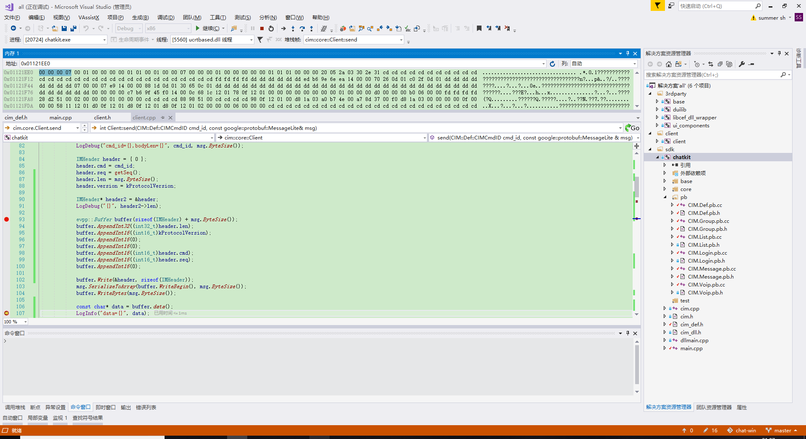
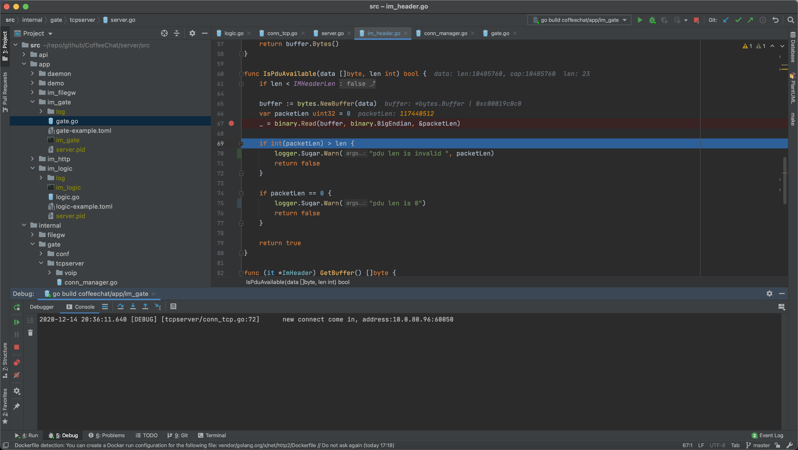
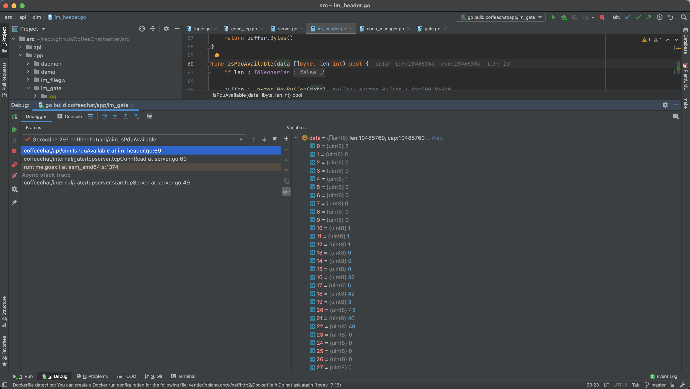
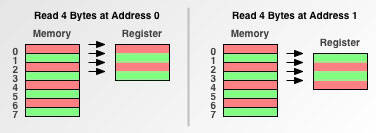
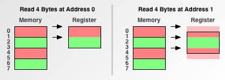
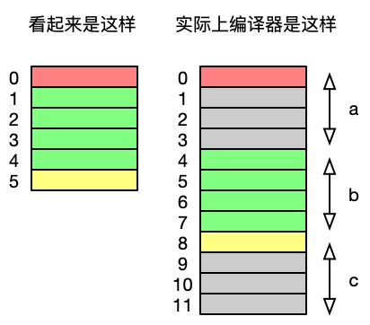
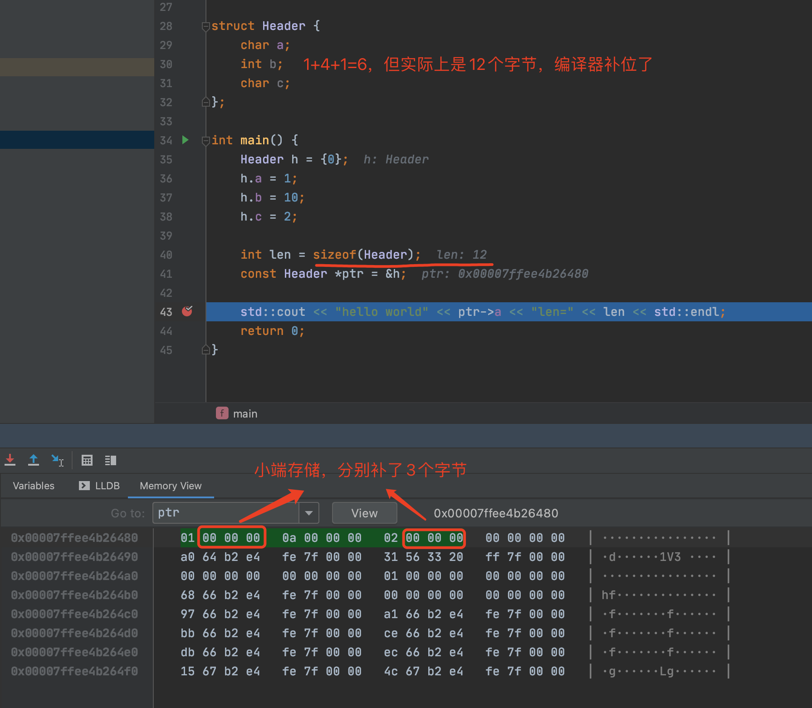
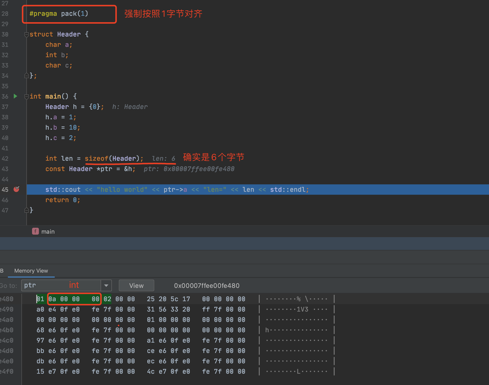

[TOC]

# 大小端

## 什么是大小端？

> 在不同的计算机体系结构中，对于数据（比特、字节、字等)的存储和传输机制有所不同；目前在各种体系结构的计算机中，主要采用的字节存储机制主要有两种：大端(Big-endian)和小端(Little-endian)。
> 字节序，又称端序，尾序，英文：Endianness。在计算机科学领域中，字节序是指存放多字节数据的字节（byte）的顺序，典型的情况是**整数在内存中的存放方式（小端）**和**网络传输的传输顺序（大端）**。Endianness有时候也可以用指位序（bit）。
>
> 原文：http://smilejay.com/2012/01/big-endian_little-endian/

- 小端（Little-Endian）：**常见的操作系统都是小端存储**，各种编程语言在内存中也是小端存储的，比如C/C++。特点是：数据的高字节在低地址中，而数据的低字节在高地址中。即地址由小向大增加，而数据从高位往低位放。
- 大端（Big-Endian）：**网络字节序就是大端存储**。特点是：数据的高字节在高地址中，低字节在低地址中


## 在哪些场景下会遇到大小端问题？

### C/C++的网络编程中

下面来看一个更具体的例子（我们只需要记住，**整数在常见的x86 cpu的架构中是按小端存储的**，C/C++发送到网络的时候需要转换成大端）。

vs 2017中，我们看一下uint32_t（无符号整数32位4字节）在内存中是什么样的：


这一串：**07 00 00 00**，所以是小端模式。

如果转换成大端呢？



变成了：**00 00 00 07**。

前后2张图有什么不同？前者是直接打印uint32_t的内存地址，后者是通过evpp的Buffer类的AppendInt32函数，间接调用 **htonl** 把unsigned long类型从主机序（x86 cpu下是小端）转成网络字节序（大端）。

evpp（C++跨平台网络库）中2个转换函数细节如下：
```c++
namespace evpp {
class EVPP_EXPORT Buffer {
public:
    // ...

    // 往缓冲区中追加一个有符号32位整数
    void AppendInt32(int32_t x) {
        int32_t be32 = htonl(x); // htonl，转换成网络字节序（大端）后再写入内存
        Write(&be32, sizeof be32);
    }
	
    // ...

    // 取的时候，调用ntohl再从大端转换回来
    int32_t PeekInt32() const {
        assert(length() >= sizeof(int32_t));
        int32_t be32 = 0;
        ::memcpy(&be32, data(), sizeof be32);
        return ntohl(be32);
    }
```

PS：
C/C++中有如下四个常用的转换函数，这四个函数在小端系统中生效，大端系统由于和网络字节序相同，所以无需转换。
htons —— 把unsigned short类型从主机序转成网络字节序
ntohs —— 把unsigned short类型从网络字节序转成主机序
htonl —— 把unsigned long类型从主机序转成网络字节序
ntohl —— 把unsigned long类型从网络字节序转成主机序
使用以上函数时，需要包含相应的头文件，如下：
```c++
#if defined(linux) || defined(__linux__)
	#include <netinet/in.h>
#endif
 
#ifdef WIN32
	#include <WINSOCK2.H>
#endif
```

### Go中的大小端

上面说了：**一般常见的操作系统都是小端，而网络字节序则是大端**。一般基于TCP的传输的应用层协议都会采用TLV格式，即头部固定字节存放长度和消息类型等，比如：
```go
type ImHeader struct {
	Length    uint32 // the whole pdu length
	Version   uint16 // pdu version number
	Flag      uint16 // not used
	ServiceId uint16 //
	CommandId uint16 //
	SeqNum    uint16 // 包序号
	Reversed  uint16 // 保留

	pbMessage proto.Message // 消息体
}
```
像上面的头部，固定16字节。头4字节存放长度。假设我的服务端是用**go**开发的，按照大端解析，会造成什么后果？



第 **67行** 按照大端解析，本来客户端发送了 **数字7（代表数据部的长度是7）**，这边 **66行** 解析出来，自然就不对了，变成了117440512。所以后面也就没有办法正确的去取数据部的数据了，只能判断为坏包。

再来看一下内存：


我们看到开头：07 00 00 00，**确实是小端**，正确的大端应该是：00 00 00 07。

### Java中的大小端

引用：
> JAVA中所有的**二进制文件都是按大端存储**，这种存储方式也被称为network order。即在所有的平台上，如Mac、 PC、 UNIX等等运行JAVA，都不用考虑大小端的问题。麻烦的是不同语言开发的程序进行数据交换，如笔者最近的项目，二进制文件是由C生成的，通过redis 消息通道以Json格式发过来，而C语言默认是小端模式，就涉及到大小端转换。有些平台（如Mac、IBM 390）内置用的大端模式，其它一些平台内置用的小端模式 (如Intel)。JAVA帮你屏蔽了各平台字节顺序的差异。

所以，java一般情况下不需要处理大小端问题，除非需要和其他语言如C/C++通信。

## 结论

- 大端：网络字节序，Java。
- 小端：一般常见的操作系统都是小端，C/C++中也是小端存储，Go可以指定大小端。

Java中虚拟机屏蔽了大小端问题，如果是Java之间通信则无需考虑。

参考资料：
- [C/C++知识点：解析大小端及其判断](https://www.douban.com/group/topic/126236141/)
- [大端、小端的区别(BIG-ENDIAN OR LITTLE-ENDIAN)](http://smilejay.com/2012/01/big-endian_little-endian/)
- [主机字节序与网络字节序](http://smilejay.com/2013/03/host-and-network-byte-order/)
- [Java 大小端转换（基于ByteBuffer）](https://cloud.tencent.com/developer/article/1710175?from=information.detail.java%20%E9%BB%98%E8%AE%A4%E5%A4%A7%E5%B0%8F%E7%AB%AF)
- [Little-Endian and Big-Endian in Java](https://howtodoinjava.com/java/basics/little-endian-big-endian/)

# 字节对齐

## 什么是字节对齐？

引用百度百科里面的一句话：
> 现代计算机中内存空间都是按照byte划分的，从理论上讲似乎对任何类型的变量的访问可以从任何地址开始，但实际情况是在访问特定类型变量的时候经常在特 定的内存地址访问，这就需要各种类型数据按照一定的规则在空间上排列，而不是顺序的一个接一个的排放，这就是对齐

下面再来看2个概念，加深理解。

### 内存访问粒度

#### 定义

通常在C/C++程序员眼中，char*普遍存在的意思是“一块内存”，甚至Java也具有byte[]表示原始内存的类型。真的有这么简单吗？

程序员眼中的内存：  


CPU眼中的内存：


计算机的处理器并不是以单个字节读取和写入内存。而是以2、4、8、16甚至32字节的块访问内存（为了提升性能）。我们将**处理器访问内存的大小**称为**内存访问粒度**。

所以，这就有1个问题，假设我定义了一个结构体，大小为5会怎么办（除不尽2）？先看完一下对齐基础，下一节：结构体对齐中会有解答。

#### 对齐基础

##### 单字节内存访问粒度

这个符合一般程序员对内存工作方式的模型的认知：从地址0读取与从地址1读取没啥区别。现在看看在具有两个字节粒度的处理器上会发生什么，例如原始的68000；

##### 双字节内存访问粒度

从地址0读取时，具有2个字节粒度的处理器所占用的内存访问次数是具有1个字节粒度的处理器的一半。因为每个内存访问都需要固定的开销，所以最小化访问次数确实可以提高性能。

但是，请注意从地址1读取时会发生什么。由于该地址未均匀地落在处理器的内存访问边界上，因此处理器还有很多工作要做。这样的地址称为**不对齐地址**（所以#pragma pack指令会让程序变慢？）。因为地址1是未对齐的，所以具有两字节粒度的处理器必须执行额外的内存访问，从而**减慢了操作速度**。

最后，检查在具有四字节内存访问粒度的处理器上会发生什么，例如68030或PowerPC®601；

##### 四字节内存访问粒度

具有四字节粒度的处理器可以一次读取就从对齐的地址中提取四个字节。另请注意，从未对齐的地址读取将使访问计数加倍。

正是因为处理器的内存访问不是按照我们理解的1个字节1个字节的读取，所以，编译器势必会为我们做一些事情从而优化性能。接下来，我们看一下结构体对齐，了解编译器在背后做的一些工作。

### 结构对齐

这一次，我拿macbook pro 2017来实验。

一个无辜的结构体：
```c++
struct Header {
    char a; // 1个字节
    int b;  // 4个字节
    char c; // 1个字节
};
```

此结构的大小（以字节为单位）是多少？直观上看应该是1 + 4 + 1等于6，真的是吗？我们看一下它在内存中的布局：


右图是macos中，clang编译器的内存布局，我们发现，真正的大小并不是6个字节，而是按照结构体中最大的值（int=4字节）对齐，即3*4=12。然后冗余。我们利用clion来调试（变量上悬浮->右击->Show in Memory View）确定一下：


确实是这样，那会造成2个问题：
- 内存变大浪费，有6个字节没用上
- 误导，很可能在网络传输时，双方理解不一致导致解析的结果不一样。

那怎么办？
1. **【推荐做法】** 调整字段顺序，对小于**结构体最大的值**的字段，进行手动补位，避免编译器自动补位，造成潜在问题。
```c++
struct Header {
    int b;  // 4字节，放在最前面
    char a; // 1个字节
    char c; // 1个字节，还没满4*2的倍数=8，怎么办？
    int16_t reserved;// 我来显示定义一个保留位，占2字节
};
```
2. 强制编译器按照1字节对齐
```c++
#pragma pack(1)
```


## 为什么要考虑字节对齐

[引用](https://developer.ibm.com/technologies/systems/articles/pa-dalign/)：
> 如果您不了解并解决软件中的对齐问题，则以下情况的严重程度从高到低都是可能的：
>
> - 您的软件运行速度会变慢。
> - 您的应用程序将锁定。
> - 您的操作系统将崩溃。
> - 您的软件将以静默方式失败，从而产生不正确的结果。

简单点说，错误的对齐方式会造成内存浪费，性能降低，甚至是解析错误造成崩溃。

## 结论
验证的：
1. 结构体或者类的自身对齐值：其成员中自身对齐值最大的那个值。
2. 指定对齐值：#pragma pack (value)时的指定对齐值value。

未验证的：
1. 数据类型自身的对齐值：
　　对于char型数据，其自身对齐值为1，对于short型为2，对于int,float类型，其自身对齐值为4，对于double型，其自身对齐值为8，单位字节。
2. 数据成员、结构体和类的有效对齐值：自身对齐值和指定对齐值中小的那个值。

正确的做法，示例1：
```c++
struct Header {
	int b;  // 4个字节
	char a; // 1个字节
	char c; // 1个字节
	int16_t reserved; // 2个字节，对齐
};
```

示例2（所以，在我们自定义协议时，特别是业务头中的各个字段类型可不能随便设定，而是要根据最大的值的整数倍放置）：
```go
type ImHeader struct {
	Length    uint32 // the whole pdu length
	Version   uint16 // pdu version number
	Flag      uint16 // not used
	ServiceId uint16 //
	CommandId uint16 //
	SeqNum    uint16 // 包序号
	Reversed  uint16 // 保留

	pbMessage proto.Message // 消息体
}
```


参考资料：  
- [百度百科：字节对齐](https://baike.baidu.com/item/%E5%AD%97%E8%8A%82%E5%AF%B9%E9%BD%90)
- [ibm: Data alignment: Straighten up and fly right](https://developer.ibm.com/technologies/systems/articles/pa-dalign/)
- [geeksforgeeks: Data Structure alignment](https://www.geeksforgeeks.org/data-structure-alignment/)
- [wikipedia: Data structure alignment](https://en.wikipedia.org/wiki/Data_structure_alignment)