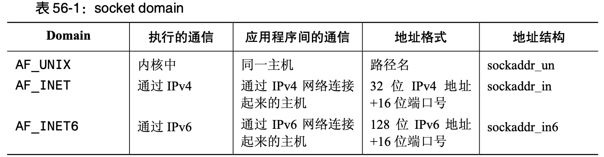

# I/O 多路复用和 Socket API

## Socket 基础

> PS：本节大部分内容来自《Linux-UNIX 系统编程手册（上、下册）》

### 关键系统调用

关键的 socket 系统调用包括以下几种：

- socket()系统调用创建一个新 socket。
- bind()系统调用将一个 socket 绑定到一个地址上。通常，服务器需要使用这个调用来将其 socket 绑定到一个众所周知的地址上使得客户端能够定位到该 socket 上。
- listen()系统调用允许一个流 socket 接受来自其他 socket 的接入连接。
- accept()系统调用在一个监听流 socket 上接受来自一个对等应用程序的连接，并可选地返回对等 socket 的地址。
- connect()系统调用建立与另一个 socket 之间的连接。

socket I/O 可以使用传统的 **read()** 和 **write()** 系统调用或使用一组 socket 特有的系统调用(如 **send()** 、**recv()**、**sendto**()以及**recvfrom()**)来完成。在默认情况下，这些系统调用在 I/O 操作无 法被立即完成时会阻塞。通过使用  **fcntl() F_SETFL** 操作(5.3 节)来启用 **O_NONBLOCK** 打开文件状态标记可以执行非阻塞 I/O。

### 创建一个 socket: socket()
socket()系统调用创建一个新 socket。
```cpp
#include <sys/socket.h>

int socket(int domain, int type, int protocol);// Returns 0 on success,or -1 on error
```

domain 参数指定了 socket 的通信 domain，通常为 **PF_INET** 。type 参数指定了socket 类型。这个参数通常在 创建流 socket 时会被指定为 **SOCK_STREAM**，而在创建数据报socket 时会被指定为 SOCK_DGRAM。protocol 参数在本书描述的 socket 类型中总会被指定为 **0**。

例子：
```cpp
#include <sys/socket.h> // socket,bind,listen,accept
#include <netinet/in.h> // ipv4: PF_INET,sockaddr_in ,v6:PF_INET6,sockaddr_in6

// PF_INET：ipv4，PF_INET6
// SOCK_STREAM：tcp
int listenFd = ::socket(PF_INET, SOCK_STREAM, 0); // protocol通常为0
if (listenFd == -1) {
    std::cout << "create socket error:" << errno << std::endl;
    return 0;
}
```

### 将 socket 绑定到地址: bind()
bind()系统调用将一个 socket 绑定到一个地址上。
```cpp
#include <sys/socket.h>

int bind(int socket, const struct sockaddr *address, socklen_t address_len);// Returns 0 on success,or -1 on error
```

sockfd 参数是在上一个 socket()调用中获得的文件描述符。addr 参数是一个指针，它指向了一个 指定该 socket 绑定到的地址的结构。传入这个参数的结构的类型取决于 socket domain。addrlen 参数 指定了地址结构的大小。addrlen 参数使用的 socklen_t 数据类型在 SUSv3 被规定为一个整数类型。

一般来讲，会将一个服务器的 socket 绑定到一个众所周知的地址——即一个固定的与服务器进行通信的客户端应用程序提前就知道的地址。

> 这里“众所周知”的意思有2个层面：在局域网中，只要和客户端在同一网段下，使用本机IP即可。如果是在互联网，则需要使用公网IP，一般由各大宽带公司提供。现如今流行的各种云主机，一般对外暴露的也是公网IP，只需要创建公网端口和本机端口的映射即可被客户端连接通讯。
阿里云服务器如何打开端口映射？https://blog.csdn.net/mll999888/article/details/72772698

例子：
```cpp
#include <sys/socket.h>
#include <arpa/inet.h> // inet_addr

struct sockaddr_in addr{};
addr.sin_family = AF_INET;
addr.sin_port = htons(8088); // 转成网络大端序
addr.sin_addr.s_addr = inet_addr("127.0.0.1"); // #include <arpa/inet.h> // inet_addr

int ret = ::bind(listenFd, (sockaddr *) &addr, sizeof(addr));
if (ret == -1) {
    std::cout << "bind socket error:" << errno << std::endl;
    return 0;
}
```

### 通用 socket 地址结构:struct sockaddr
传入 bind()的 addr 和 addrlen 参数比较复杂，有必要对其做进一步解释。  



从上图中可以看出每种socket domain都使用了不同的地址格式，他们都具有公共的部分，名为sockaddr，其定义如下：
```cpp
struct sockaddr {
   sa_family_t     sa_family;      /* address family （AF_* constant）*/
   char            sa_data[14];    /* Socket addr value (actually larger) */
};
```

但在实际的TCP编程中（IPV4），我们使用 **sockaddr_in** 存储IP地址和端口信息，他的定义如下：
```cpp
// <netinet/in.h>
struct sockaddr_in {
   __uint8_t       sin_len;
   sa_family_t     sin_family;
   in_port_t       sin_port;
   struct  in_addr sin_addr;
   char            sin_zero[8];
};
```

### 流Socket
流 socket 的运作与电话系统类似。
1. socket()系统调用将会创建一个 socket，这等价于安装一个电话。为使两个应用程序能 够通信，每个应用程序都必须要创建一个 socket。
2. 通过一个流 socket 通信类似于一个电话呼叫。一个应用程序在进行通信之前必须要将 其 socket 连接到另一个应用程序的 socket 上。两个 socket 的连接过程如下:
- 一个应用程序调用 bind()以将 socket 绑定到一个众所周知的地址上，然后调用 listen()通知内核它接受接入连接的意愿。这一步类似于已经有了一个为众人所知 的电话号码并确保打开了电话，这样人们就可以打进电话了。
- 其他应用程序通过调用connect()建立连接，同时指定需连接的socket的地址。这 类似于拨某人的电话号码。
- 调用listen()的应用程序使用accept()接受连接。这类似于在电话响起时拿起电话。如果在 对等应用程序调用 connect()之前执行了 accept()，那么 accept()就会阻塞(“等待电话”)。 
3. 一旦建立了一个连接之后就可以在应用程序之间(类似于两路电话会话)进行双向数据传输直到其中一个使用 close()关闭连接为止。通信是通过传统的 read()和 write()系统调用或通过一些提供了额外功能的 socket 特定的系统调用(如 send()和 recv())来完成的。

下图演示了如何在流 socket 上使用这些系统调用。  
  

主动和被动Socket：**流 socket 通常可以分为主动和被动两种**：
- 在默认情况下，使用socket()创建的socket是主动的。一个主动的socket可用在connect() 调用中来建立一个到一个被动 socket 的连接。这种行为被称为执行一个主动的打开。  
- 一个被动 socket(也被称为监听 socket)是一个通过调用 listen()以被标记成允许接入连接的 socket。接受一个接入连接通常被称为执行一个被动的打开。

在大多数使用流 socket 的应用程序中，服务器会执行被动式打开，而客户端会执行主动式打开。

#### 监听接入连接:listen()

listen()系统调用将文件描述符 sockfd 引用的流 socket 标记为被动。这个 socket 后面会被用来接受来自其他(主动的)socket 的连接。

```cpp
#include <sys/socket.h>

int listen(int socket, int backlog); // Returns 0 on success,or -1 on error
```

> 注意：无法在一个已连接的 socket(即已经成功执行 connect()的 socket 或由 accept()调用返回的 socket)上执行 listen()。

要理解 backlog 参数的用途首先需要注意到客户端可能会在服务器调用 accept()之前调用 connect()。这种情况是有可能会发生的，如服务器可能正忙于处理其他客户端。这将会产生一个未决的连接：


内核必须要记录所有未决的连接请求的相关信息，这样后续的 accept()就能够处理这些请求 了。backlog 参数允许限制这种未决连接的数量。在这个限制之内的连接请求会立即成功，之外的连接请求就 会阻塞直到一个未决的连接被接受(通过 accept())，并从未决连接队列删除为止。在 Linux 上，这个常量的值被定义成了 **#define SOMAXCONN 128** （Ubuntu上是4096,mac上是128）。但从内核 2.4.25 起，Linux 允许在运行时通过 Linux 特有的/proc/sys/net/core/somaxconn 文件来调整这个限制

### 实战
#### TCP优化参数
一览：
```cpp
setSoLinger(false, 0);// 不延迟关闭，减少TIME_WAIT套接字的数量
setReuseAddr(true);   // 重用IP地址
setNonblock(true);    // 使用非阻塞I/O，即read()\write()时不阻塞
setIntOption(SO_KEEPALIVE, 1);
setIntOption(SO_SNDBUF, 640000);
setIntOption(SO_RCVBUF, 640000);
setTcpNoDelay(true);
```

#### SO_LINGER详解

SO_LINGER：用来设置延迟关闭的时间，等待套接字发送缓冲区中的数据发送完成。
来自：[https://www.cnblogs.com/jingzhishen/p/5543627.html](https://www.cnblogs.com/jingzhishen/p/5543627.html)（TCP协议中的SO_LINGER选项）：
没有设置该选项时，在调用close()后，在发送完FIN后会立即进行一些清理工作并返回。如果设置了SO_LINGER选项，并且等待时间为正值，则在清理之前会等待一段时间。

以调用close()主动关闭为例，在发送完FIN包后，会进入FIN_WAIT_1状态。如果没有延迟关闭（即设置SO_LINGER选项），在调用tcp_send_fin()发送FIN后会立即调用sock_orphan()将sock结构从进程上下文中分离。分离后，用户层进程不会再接收到套接字的读写事件，也不知道套接字发送缓冲区中的数据是否被对端接收。如果设置了SO_LINGER选项，并且等待时间为大于0的值，会等待套接字的状态从FIN_WAIT_1迁移到FIN_WAIT_2状态。

我们知道套接字进入FIN_WAIT_2状态是在发送的FIN包被确认后，而FIN包肯定是在发送缓冲区中的最后一个字节，所以FIN包的确认就表明发送缓冲区中的数据已经全部被接收。当然，如果等待超过SO_LINGER选项设置的时间后，还是没有收到FIN的确认，则继续进行正常的清理工作，Linux下也没有返回错误。

从这里看来，SO_LINGER选项的作用是等待发送缓冲区中的数据发送完成，但是并不保证发送缓冲区中的数据一定被对端接收（对端宕机或线路问题），只是说会等待一段时间让这个过程完成。如果在等待的这段时间里接收到了带数据的包，还是会给对端发送RST包，并且会reset掉套接字，因为此时已经关闭了接收通道。

在使用这个选项来延迟关闭连接的时候有两个地方需要注意：
1. **进程会睡眠**，直到状态不为FIN_WAIT_1、CLOSING、LAST_ACK（也就是接收到对FIN的ACK包），或者等待超时
2. **在等待的过程中如果接收到带数据的包还是会发送RST包**
3. **消耗更多的额外资源**。TCP协议是一个通用的传输层协议，不关心上层具体的业务，如果要延迟关闭连接，最好是结合自己的业务和场景自己来管理，不要依赖这个选项。nginx的延迟关闭就是自己来管理的，觉得要比直接使用SO_LINGER选项好一些，并且不会导致进程阻塞。 ngxin在发送错误信息后，会等待一段时间，让用户把所有的数据都发送完。超过等待时间后，会直接关闭连接。通过lingering_close，nginx可以保持更好的客户端兼容性，避免客户端被reset掉。
4. **SO_LINGER还有一个作用就是用来减少TIME_WAIT套接字的数量**。在设置SO_LINGER选项时，指定等待时间为0，此时调用主动关闭时不会发送FIN来结束连接，而是直接将连接设置为CLOSE状态，清除套接字中的发送和接收缓冲区，直接对对端发送RST包。

#### PF_INET 和 AF_INET

可以参考：http://blog.sina.com.cn/s/blog_6ac245850100yz2b.html

其实本质上没有区别，PF_INET更多应用在socket的创建上，**::socket(PF_INET,SOCK_STREAM,0)** 。而AF_INET在地址的赋值上， **pAddr->sin_family = AF_INET;**，可能由于这2个宏的值都是2，才容易搞混淆吧。