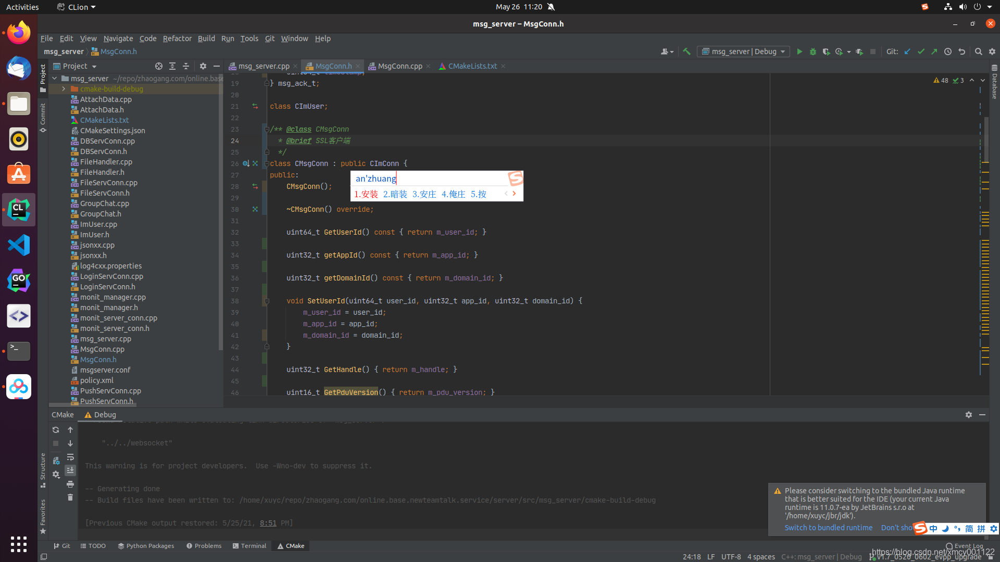
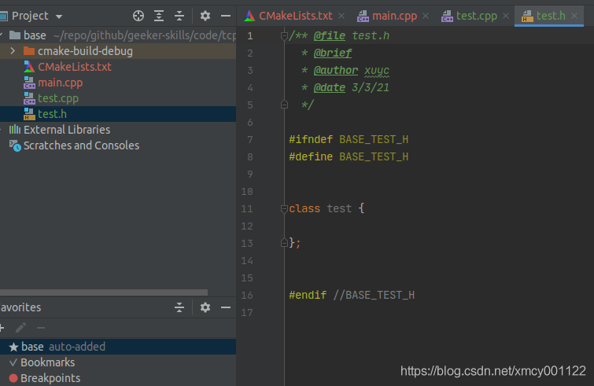
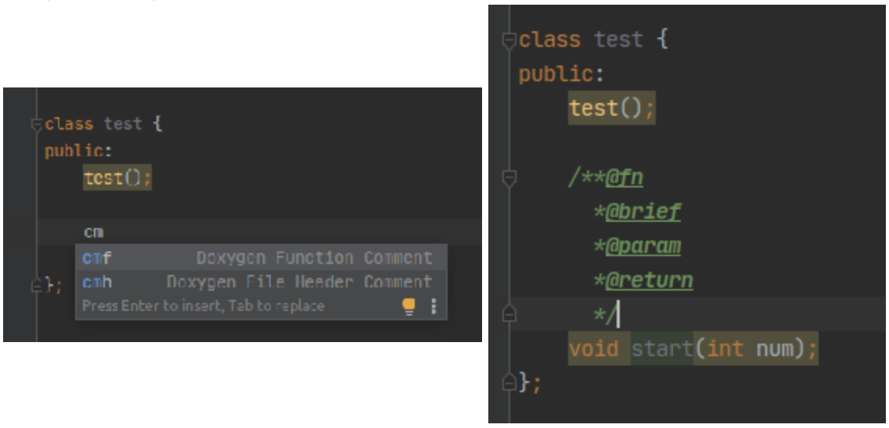
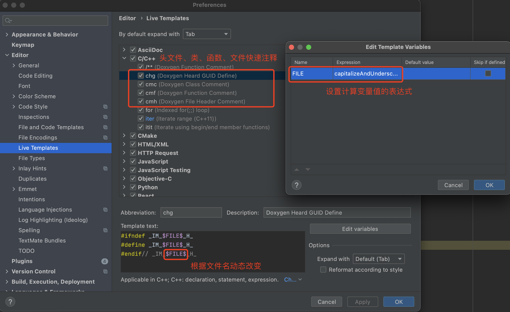
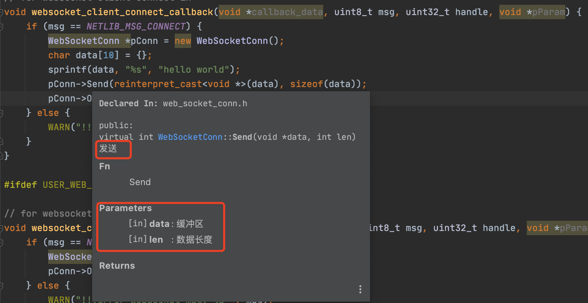
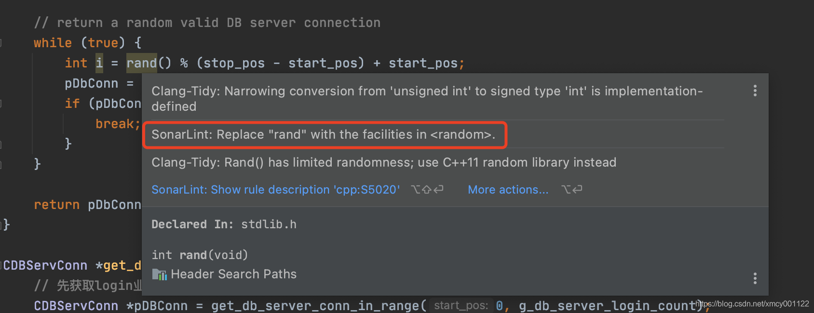
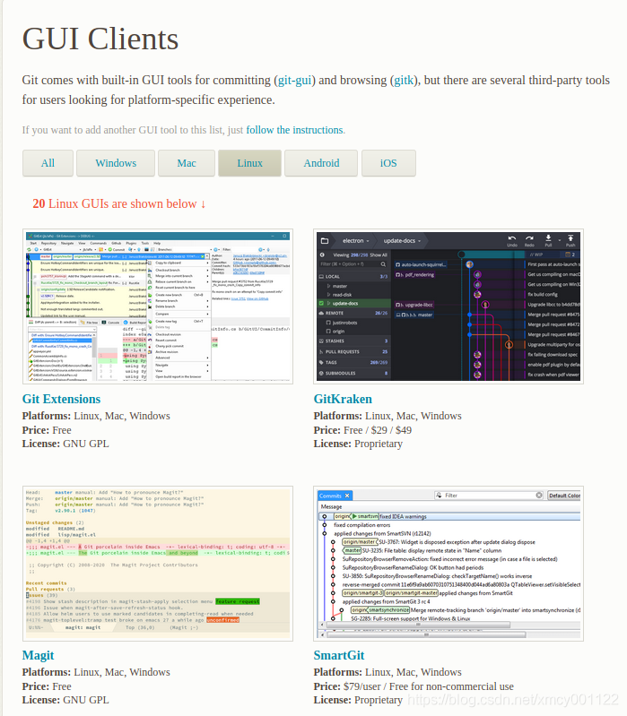
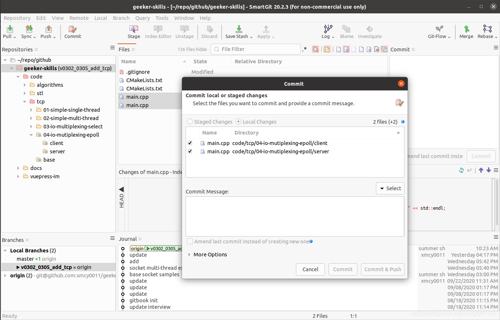

# LinuxC++开发环境推荐

## 引言

笔者从2013年使用vs2010开发windows客户端程序，到现在专注于Linux后端开发，期间经历过各种找不到一款Linux下趁手的C++ IDE的阵痛。那个时候，公司里的同事使用C语言写程序，有在windows下通过notepad++开发，远程上传到linux编译的；也有使用带GUI的CentOS6系统，安装eclipse开发的；甚至还有人在Ubuntu下通过vim写代码调试的，各种各样的都有。

2017年左右，我开始接触Linux，一开始也是使用vim进行简单的编辑，直到后面出现了VS Code和VS 2017，VS Code本身就是跨平台的，可以很方便的安装在Ubuntu或者CentOS下面。VS 2017开始支持Linux C++ Cmake项目和远程编译调试，那个时候我主要使用这2款IDE。

2019年购入了MacBook Pro，刚好同年换工作，了解到GO语言跨平台和互联网时代的C语音的特性。于是自学之。中间接触并掌握了GoLand，这款IDE给我留下了很深的印象，让我学习go语言少走了很多弯路，它强大的智能提示功能，全面的调试（断点、逐步、实时变量）功能，以及主题切换和界面美观等要素，让我有一种终于遇到一款称心如意的工具一样。

后续了解到  [JetBrains](https://baike.baidu.com/item/JetBrains/7502758) 这家国外公司，是一家专门做各种跨平台的IDE的公司，著名的Android Studio的引擎好像就是基于它们开源框架（IntelliJ IDEA）开发的。除此之外，还有：IDEA（Java）、PyCharm（Python）、WebStorm（前端）、和Clion（C++）等等。于是，在非Windows系统上，我都适用JetBrains全家桶IDE开发：

	- GoLand：开发go语言程序
	- Clion：开发Linux C++程序
	- PyCharm：用来写Python脚本
	- Intellij IDEA：开发Java Web程序。

到目前为止（2021年），我的工作环境主要是Mac+Ubuntu，Linux C++后端的日常开发我主要使用Clion+CMake完成，我用了快2年时间，从Clion2019到Clion2021，感受了飞速的升级，用的也越来越习惯，原来在mac上的性能问题也得到改善，不在卡顿。

至此，我郑重的向各位推荐这款编辑器。如果你也是一个多语言爱好者（Java/Go/C++），那么，你值得尝试！

## Ubuntu20

考虑到Mac电脑昂贵，上手门槛较高，对于想尝试的朋友们，我推荐使用Ubuntu来体验，它们的区别只是编译器不一样而已，但是Clion为我们屏蔽了这种差异，可以放心使用。所以下文使用 `Ubuntu 20` 来演示Clion的安装和一些配置技巧。

>  PS: Ubuntu下使用gcc/g++编译器，而macos上则使用clang编译器，在代码的静态检查和编译错误等这一块，我个人更喜欢clang编译器。但是没关系，现在有了Sonar插件，各个平台上都能体验啦！

### 安装

官网下载镜像比较慢，可以使用网易的源下载。

20.04版本：

- 点进去根据你的电脑版本下载iso后缀那个：http://mirrors.aliyun.com/ubuntu-releases/20.04/，我们需要下载桌面版，名字类似ubuntu-20.04.2.0-desktop-amd64.iso。
- 其他版本：http://mirrors.aliyun.com/ubuntu-releases/

此时，可以使用VMWare WorkStation 或者 Virtrual Box等虚拟机来安装Ubuntu系统，具体安装方法可以参考这篇文章：[Ubuntu 20.04 LTS 桌面版详细安装指南](https://www.sysgeek.cn/install-ubuntu-20-04-lts-desktop/)

### SSH启用

打开ssh，这样可以使用scp传输文件。

```bash
$ sudo apt install openssh-server
$ sudo /etc/init.d/ssh start # 打开
$ #sudo /etc/init.d/ssh stop  # 停止 这个暂时不用 打开SSH进行下面操作即可
```

用法：

```bash
$ scp /home/a.conf xuyc@10.0.80.90:/home/xuyc/Documents/
```

输入密码后，就可以在Mac、Ubuntu和Linux快速传输文件了。

## Clion

### 安装

我们可以直接在Ubuntu Software搜索Clion，然后安装即可，非常方便。

安装完之后，可以免费试用30天。当然，我们还需要进行一些设置。

### 中文输入法问题

Ubuntu20下推荐使用搜狗输入法，先去 官网 下载，按照 官方的教程 进行安装即可。

在Clion、Goland等IDE下，会发现输入法在屏幕左下角，解决方法如下：

下载JetbrainsRunTime，CSDN、 百度网盘（密码: 8miu）
解压下载的文件，得到JDK文件夹
IDE安装Choose Runtime插件
IDE里按 CTRL+SHIFT+A，输入choose runtime，选择jbr的路径，点击install，IDE自动重启，安装完毕
最后，效果如下：



### clion字体大小不等

调整一下字体大小，通过一下2块来完成：

- 项目视图：File -> Settings -> Appearance & Behavlor -> Appearance -> Use custom font -> 14
- 文本编辑器：File -> Settings -> Editor -> Font -> Size -> 14


### 代码模板配置

#### 默认文件头

（[参考1:File template variables](https://www.jetbrains.com/help/clion/file-template-variables.html),[参考2：Live template variables](https://www.jetbrains.com/help/clion/template-variables.html)）

创建类文件的头更改：File -> Settings -> Editor -> File and Code Templates -> Includes -> C File Header，替换如下内容：

```c++
#if ($HEADER_COMMENTS)
/** @file ${NAME}.h
  * @brief 
  * @author $USER_NAME
  * @date ${DATE}
  */
#if ($ORGANIZATION_NAME && $ORGANIZATION_NAME != "")
// Copyright (c) $YEAR ${ORGANIZATION_NAME}#if (!$ORGANIZATION_NAME.endsWith(".")).#end All rights reserved.
#end
//
#end
```

此时，通过New->C++ Class创建的文件会自动带入作者名称。



### 自定义代码

除此之外，Clion还有一个很强大的Live Template功能，我们可以自定义代码段，输入快捷键快速插入。比如常用的C++11 的for range，一些函数的doxgen风格的注释，头文件防止重复包含等唯一声明。

下面，我们以增加Doxygen注释风格为例演示：

- 函数注释：File -> Settings -> Editor -> Live Templates -> C/C++ -> + -> 输入cmf,Doxygen Function Comment和如下内容 -> Define -> C/C++ -> Apply

```c++
/**@fn 
  *@brief
  *@param 
  *@return
  */
```

然后，我们在Clion里面任意位置输入cmf，即可快速插入函数注释：



同样还可以使用内置变量，实现添加时间、文件名、GUID等动态内容的添加。



附录：

- cmc：类头注释

  ```c++
  /** @class $file$  // $file$：选择fileNameWithoutExtension()
    * @brief
    */
  ```

- chg：唯一定义

  ```c++
  #ifndef _IM_$FILE$_H_ // $FILE$：选择capitalizeAndUnderscore(fileNameWithoutExtension())
  #define _IM_$FILE$_H_
  #endif// _IM_$FILE$_H_
  ```

- cmh：文件头作者声明

  ```c++
  /** @file $file$            // fileName()
    * @brief $file_base$      // fileNameWithoutExtension()
    * @author xmcy0011@sina.com
    * @date $date$            // date()
    */
  ```

  

生成的效果如下：

```c++
/** @file WebSocketConn.h
  * @brief WebSocket服务器实现
  * @author yingchun.xu
  * @date 2019/6/5
  */

#ifndef _WEBSOCKETCONN_6EDDC0E4_1638_4C40_8278_A9E6CD6CB604_
#define _WEBSOCKETCONN_6EDDC0E4_1638_4C40_8278_A9E6CD6CB604_

/** @class CWebSocketConn
	* @brief WebSocket连接监听和消息处理
	*/
class WebSocketConn : public CMsgConn
{
public:
	WebSocketConn() : CMsgConn(), websocket_inited_(false), socket_type_(WEBSOCKET) {}
	virtual void OnRead();
	/** @fn Send
	  * @brief 发送
	  * @param [in]data: 缓冲区
	  * @param [in]len: 数据长度
	  * @return
	  */
	virtual int Send(void* data, int len);

private:
	bool websocket_inited_;
	int  socket_type_;
};
#endif//_WEBSOCKETCONN_6EDDC0E4_1638_4C40_8278_A9E6CD6CB604_
```

此时，我们也能像Java那样，鼠标悬浮在Send函数上，给出具体的参数说明。



### 插件推荐

#### SonarLint

可以对代码进行静态检测，SonarQube出品。



## GoLand

去 [官网](https://www.jetbrains.com/go/) 下载安装即可，推荐官方视频入门[GET STARTED WITH GOLAND](https://www.jetbrains.com/go/learn/)，主要包括如下内容：

- GET STARTED WITH GOLAND
- Getting Started with GoLand 2/3: UI and Projects
- Getting Started with GoLand 3/3: Run Projects, Tests, and Benchmarks
- Getting Started with GoLand 1/3: Setup

## VS Code

VS Code去官网下载，Ubuntu Software中安装的好像无法输入中文，如果已安装了，中文输入法问题见下面：

- [解决Ubuntu环境下VSCode无法输入中文](https://blog.csdn.net/szm1234/article/details/110819676)

## 基础编译环境和库

```bash
$ sudo apt install gcc g++ cmake git vim  # gcc/g++ , cmake ,git ,vim
$ sudo apt-get install openssl libssl-dev # openssl
$ sudo apt install libcurl4-openssl-dev   # libcurl
$ sudo apt install liblog4cxx-dev         	# log4cxx
$ sudo apt install libgoogle-perftools-dev 	# tcmalloc
```

## Git客户端

访问官网 https://git-scm.com/ ，点击[Linux Guis](https://git-scm.com/download/gui/linux) 选一个即可，用界面操作，可以减少失误率和提高效率。



## 推荐SmartGit

如果习惯了使用SourceTree，就很难入手GitKraken，即使它的界面看起来很华丽。
在这里推荐一款Ubuntu下的Git客户端。官网https://www.syntevo.com/smartgit/



左侧是仓库，右侧是工作区域，要提交改动，需要按住Ctrl+鼠标选择相关文件，然后点击“commit…”，此时输入描述后，点击Commit&Push就推送到远程仓库了。

如果要忽略一个文件夹，则需要在左侧文件树选中一个文件夹，然后单击选择“ignore…”后，再选择“.gitignore in repository root directory”即可。


## 参考

- [Ubuntu20下Pycharm20中文无法输入问题（无效）](https://blog.csdn.net/song696969/article/details/108910588)
- [Ubuntu20.04 Clion/Pycharm/IDEA 输入中文+光标跟随解决方案](https://blog.csdn.net/T_T233333333/article/details/115278843)

