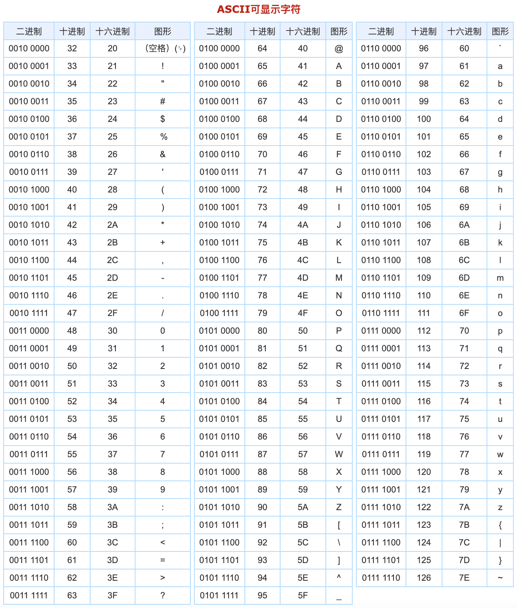

# 敏感词算法和实现

很早之前就打算做这一块，刚好最近有时间研究一下。网上一般都能找到很多资料，这里简单说一下我的理解吧。

>  PS：手机号匹配使用正则表达式，不属于敏感词范畴，请注意。

为了屏蔽一些黄牛推销广告，类似QQ、微信、手机号、……等等，我们希望都能替换为*号。这里为了简单起见，以微信举例（并不是歧视），我们会遇到以下几种情况：

- 中文
  - `简体字`：微信
  - 繁体字：微信
  - 火星文（变形或者谐音）：嶶信、威信
- 中间带特殊符号
  - `半角特殊符号`（ASCII以内） ：*&! #@(){}[] 等等，如微 信，微&&信，微_信
  - 全角（ASCII以外）：中文的标点符号，一些emotion表情等，如微——信，微😊信。
- `首字母缩写`：
  - 半角：如VX、WX。
  - 全角：ｖｘ、Ｗｘ。
- ……

变化和组合确实太多了，所以我们在实现的时候需要有所取舍。如果我们要过滤`简体字、半角特殊符号和首字母缩写`这三种情况的敏感词，那要怎么处理呢？

## 字符串查找KMP

如果不考虑性能，直接使用string自带的contians()函数，有多少个敏感词做多少次的contains检测即可。但是如果要过滤的文本有几千字，敏感词有上万个，这个方案肯定是不合适的。

看一下trie树是如何解决这个问题的。

## Trie树

Trie树，即`字典树`或`前缀树`，是一种树形结构。广泛应用于`统计和排序大量的字符串`（但不仅限于字符串），所以`经常被搜索引擎系统用于文本词频统计`。它的优点是`最大限度地减少无谓的字符串比较，查询效率比较高`。

Trie的核心思想是`空间换时间，利用字符串的公共前缀来降低查询时间的开销以达到提高效率的目的`。


### Trie树的基本性质

1. 根节点不包含字符，除根节点外每一个节点都只包含一个字符；

2. 从根节点到某一节点，路径上经过的字符连接起来，为该节点对应的字符串；

3. 每个节点的所有子节点包含的字符都不相同
4. 从第一字符开始有连续重复的字符只占用一个节点，比如上面的 to 和 ten，中重复的单词 t 只占用了一个节点。

所以每个节点都应该有2个字段：

1. `end_flag标志`：是否结束，即为叶子节点。
2. `map<key, value>`：存放当前节点的值和子节点的值。

### 基础入门

先来看一个题目：[LeetCode 208. 实现 Trie (前缀树)](https://leetcode-cn.com/problems/implement-trie-prefix-tree/)

 实现一个 Trie (前缀树)，包含 `insert`, `search`, 和 `startsWith` 这三个操作。

示例:

```c++
Trie trie = new Trie();

trie.insert("apple");
trie.search("apple");   // 返回 true
trie.search("app");     // 返回 false
trie.startsWith("app"); // 返回 true
trie.insert("app");   
trie.search("app");     // 返回 true
```

说明:

- 你可以假设所有的输入都是由小写字母 a-z 构成的。
- 保证所有输入均为非空字符串。

### 实现

我们先来把它画成一个trie树（以题目中的apple和app2个单词为例）：


通过`insert(”apple“)`和 `insert("app“)`2次函数调用，我们构建了如上图所示的trie树。我们发现：

- apple和app共用1个前缀，没有多余的节点创建，只是多了一个#结束节点。
- 有2个#节点，只要遇到#就代表本次匹配结束，有多少个关键词就应该有多少个#节点。

当然，增加结束节点的另外一个好处：`我们可以判断是startsWith还是equal`。

#### 数据结构定义

因为root不包含字符，所以可以分别定义一个TrieNode代表节点，Trie代表树。

**TrieNode**：

```c++
#include <string>
#include <unordered_map>

// 代表一个节点
class TrieNode {
public:
  // 添加子节点
  void addSubNode(const char &c, TrieNode *subNode) { 
    subNodes_[c] = subNode; 
  }

  // 获取子节点
  TrieNode *getSubNode(const char &c) { 
    return subNodes_[c];
  }

private:
  // 子节点字典(key是下级字符，value是下级节点)
  std::unordered_map<char, TrieNode *> subNodes_;
};
```


**Trie**：

```c++
// 代表一颗Trie树
class Trie {
public:
  // Inserts a word into the trie.
  void insert(std::string word);

  // Returns if the word is in the trie.
  bool search(std::string word);

  // Returns if there is any word in the trie that starts with the given prefix.
  bool startsWith(std::string prefix);
  
private:
  TrieNode *root_; // root节点，不存储字符
};
```

#### insert实现

里面有一个root字段，代表根节点，再看一下insert操作：

```c++
void Trie::insert(std::string word) {
  TrieNode *curNode = root_;
  // 遍历字符串，字符作为key（注意中文一般有3个字节，所以会变成3个节点，但是不影响匹配）
  for (int i = 0; i < word.length(); i++) {
    char c = word[i];
    TrieNode *subNode = curNode->getSubNode(c);

    // 如果没有这个节点则新建
    if (subNode == nullptr) {
      subNode = new TrieNode();
      curNode->addSubNode(c, subNode);
    }
    // 下钻，指向子节点
    curNode = subNode;
  }
  // 设置结束标识
  curNode->addSubNode(‘#’, new TrieNode());
}
```


#### search实现

```c++
bool Trie::search(std::string word) {
  TrieNode *curNode = root_;
  for (int i = 0; i < word.length(); i++) {
    curNode = curNode->getSubNode(word[i]);
    if (curNode == nullptr)
      return false;
  }
  return curNode->getSubNode('#') != nullptr;
}
```


#### startsWith实现

```c++
bool Trie::startsWith(std::string prefix) {
  TrieNode *curNode = root_;
  for (int i = 0; i < prefix.length(); i++) {
    curNode = curNode->getSubNode(prefix[i]);
    if (curNode == nullptr)
      return false;
  }
  // 和search的区别就在于这里，不判断下一个节点是否是结束节点
  return true;
}
```

如果运行，会输出如下结果：

```c++
int main() {
  Trie t;
  t.insert("apple");
  printf("%d \n", t.search("apple"));   // 返回 true
  printf("%d \n", t.search("app"));     // 返回 false
  printf("%d \n", t.startsWith("app")); // 返回 true
  t.insert("app");
  printf("%d \n", t.search("app"));     // 返回 true
  printf("%d \n", t.search("this is apple")); // 返回 false，为什么？
}
```

```base
$ ./main 
1 
0 
1 
1 
0 
```

所以，我们会发现一个问题，最后一个“this is apple”明明包含“apple”，为什么还是返回false？

其实很简单，上面都是`默认敏感词在整个字符串开始位置`，我们`只需要增加一个指针，不断往后搜索即可`。

### 敏感词搜索


思路：

1. `首先 p1 指针指向 root`，指针 p2 和 p3 指向字符串中的第一个字符。
2. 算法从字符 t 开始，检测有没有以 t 作为前缀的敏感词，在这里就直接判断 root 中有没有 t 这个子节点即可。这里没有，所以将 p2 和 p3 同时右移。
3. 一直移动p2和p3，发现存在以 a 作为前缀的敏感词，那么就`只右移 p3 继续判断 p2 和 p3 之间的这个字符串是否是敏感词（当然要判断是否完整）`。如果在字符串中找到敏感词，那么可以用其他字符串如 *** 代替。接下来不断循环直到整个字符串遍历完成就可以了。


代码实现如下：

```c++
bool Trie::search(std::string word) {
  // TrieNode *curNode = root_;
  // for (int i = 0; i < word.length(); i++) {
  //   curNode = curNode->getSubNode(word[i]);
  //   if (curNode == nullptr)
  //     return false;
  // }
  // return curNode->getSubNode(kEndFlag) != nullptr;

  // 转换成小写
  transform(word.begin(), word.end(), word.begin(), ::tolower);
  bool is_contain = false;
  for (int p2 = 0; p2 < word.length(); ++p2) {
    int wordLen = getSensitiveLength(word, p2);
    if (wordLen > 0) {
      is_contain = true;
      break;
    }
  }
  return is_contain;
}

// 这里增加一个函数，返回敏感词的位置和长度，便于替换或者检测逻辑
int Trie::getSensitiveLength(std::string word, int startIndex) {
  TrieNode *p1 = root_;
  int wordLen = 0;
  bool endFlag = false;

  for (int p3 = startIndex; p3 < word.length(); ++p3) {
    const char &cur = word[p3];
    auto subNode = p1->getSubNode(cur);
    if (subNode == nullptr) {
      break;
    } else {
      ++wordLen;
      // 直到找到尾巴的位置，才认为完整包含敏感词
      if (subNode->getSubNode(kEndFlag)) {
        endFlag = true;
        break;
      } else {
        p1 = subNode;
      }
    }
  }

  // 注意，处理一下没找到尾巴的情况
  if (!endFlag) {
    wordLen = 0;
  }
  return wordLen;
}
```

关于时间复杂度：

- 构建敏感词的时间复杂度是可以忽略不计的，因为构建完成后我们是可以无数次使用的。
- 如果字符串的长度为 n，则每个敏感词查找的时间复杂度为` O(n)`。


### 性能测试

为了方便测试，我们再增加一个函数：

```c++
std::set<SensitiveWord> Trie::getSensitive(std::string word) {
  // 转换成小写
  transform(word.begin(), word.end(), word.begin(), ::tolower);
  std::set<SensitiveWord> sensitiveSet;

  for (int i = 0; i < word.length(); ++i) {
    int wordLen = getSensitiveLength(word, i);
    if (wordLen > 0) {
      // 记录找到的敏感词的索引和长度
      std::string sensitiveWord = word.substr(i, wordLen);
      SensitiveWord wordObj;
      wordObj.word = sensitiveWord;
      wordObj.startIndex = i;
      wordObj.len = wordLen;

      // 插入到set集合中返回
      sensitiveSet.insert(wordObj);
      i = i + wordLen - 1;
    }
  }

  return sensitiveSet;
}
```

测试代码如下：

```c++
void test_time(Trie &t) {
  auto t1 = std::chrono::steady_clock::now();
  auto r = t.getSensitive("SHit，你你你你是傻逼啊你，说你呢，你个大笨蛋。");
  for (auto &&i : r) {
    std::cout << "[index=" << i.startIndex << ",len=" << i.len
              << ",word=" << i.word << "],";
  }
  std::cout << std::endl;

  // run code
  auto t2 = std::chrono::steady_clock::now();
  //毫秒级
  double dr_ms = std::chrono::duration<double, std::milli>(t2 - t1).count();
  std::cout << "耗时（毫秒）: " << dr_ms << std::endl;
}

int main() {
  Trie t;

  t.insert("你是傻逼");
  t.insert("你是傻逼啊");
  t.insert("你是坏蛋");
  t.insert("你个大笨蛋");
  t.insert("我去年买了个表");
  t.insert("shit");

  test_time(t);
}
```

输出：

```bash
$ ./main 
[index=0,len=4,word=shit],[index=16,len=12,word=你是傻逼],[index=49,len=15,word=你个大笨蛋],
耗时（毫秒）: 0.093765
```


我这边比较好奇，看一下string自带的find函数实现的版本：

```c++
void test_time_by_find() {
  auto t1 = std::chrono::steady_clock::now();
  std::string origin = "SHit，你你你你是傻逼啊你，说你呢，你个大笨蛋。";
  std::vector<std::string> words;
  words.push_back("你是傻逼");
  words.push_back("你是傻逼啊");
  words.push_back("你是坏蛋");
  words.push_back("你个大笨蛋");
  words.push_back("我去年买了个表");
  words.push_back("shit");

  for (auto &&i : words) {
    size_t n = origin.find(i);
    if (n != std::string::npos) {
      std::cout << "[index=" << n << ",len=" << i.length() << ",word=" << i
                << "],";
    }
  }
  std::cout << std::endl;

  // run code
  auto t2 = std::chrono::steady_clock::now();
  //毫秒级
  double dr_ms = std::chrono::duration<double, std::milli>(t2 - t1).count();
  std::cout << "耗时（毫秒）: " << dr_ms << std::endl;
}
```

输出：

```bash
$ $ ./main 
[index=0,len=4,word=shit],[index=16,len=12,word=你是傻逼],[index=49,len=15,word=你个大笨蛋],
耗时（毫秒）: 0.113505
[index=16,len=12,word=你是傻逼],[index=16,len=15,word=你是傻逼啊],[index=49,len=15,word=你个大笨蛋],[index=0,len=4,word=shit],
耗时（毫秒）: 0.021829
```

上面那个是trie算法实现的，耗时0.113505毫秒，下面是string的find版本，耗时0.021829毫秒，还快了5倍？这是为什么？

### 中文替换为*的实现

通过 `getSensitive()` 函数，我们得到了敏感词出现的位置和长度，那要怎么替换成*号呢？

```bash
SHit，你你你你是傻逼啊你，说你呢，你个大笨蛋。
```

```cpp
int main() {
    Trie t;
    t.insert("你是傻逼");
    t.insert("你个大笨蛋");
    t.insert("shit");

    std::string origin = "SHit，你你你你是傻逼啊你，说你呢，你个大笨蛋。";
    auto r = t.getSensitive(origin);

    for (auto &&i : r) {
        std::cout << "[index=" << i.startIndex << ",len=" << i.len
                  << ",word=" << i.word.c_str() << "]," << std::endl;
    }

    std::cout << t.replaceSensitive(origin) << std::endl;

    return 0;
}
```

运行后我们得到了一组敏感词的信息，包含起始位置，长度：

```bash
[index=0,len=4,word=shit],
[index=16,len=12,word=你是傻逼],
[index=49,len=15,word=你个大笨蛋],
```

这里有个问题，因为Linux下使用utf8，`1个汉字实际占用3个字节`，这也就导致，我们如果直接遍历进行替换，会发现*多出了2倍。

```bash
# 错误，汉字的部分*号翻到3倍
****，你你你************啊你，说你呢，***************。

# 期望
****，你你你****啊你，说你呢，*****。
```

在解决这个问题之前，我们先来了解一下Unicode、UTF8和汉字的关系。

#### Unicode编码

> Unicode（ 统一码、万国码、单一码）是计算机科学领域里的一项业界标准,包括字符集、编码方案等。Unicode 是为了解决传统的字符编码方案的局限而产生的，它为每种语言中的每个字符设定了统一并且唯一的 二进制编码，以满足跨语言、跨平台进行文本转换、处理的要求。1990年开始研发，1994年正式公布。

我们来看一下`It's 知乎日报`的Unicode编码是怎么样的？

```bash
I 0049
t 0074
' 0027
s 0073
  0020
知 77e5
乎 4e4e
日 65e5
报 62a5
```

每一个字符对应一个十六进制数字。

计算机只懂二进制，因此，严格按照unicode的方式(UCS-2)，应该这样存储：

```bash
I 00000000 01001001
t 00000000 01110100
' 00000000 00100111
s 00000000 01110011
  00000000 00100000
知 01110111 11100101
乎 01001110 01001110
日 01100101 11100101
报 01100010 10100101
```

这个字符串总共占用了18个字节，但是对比中英文的二进制码，可以发现，英文前9位都是0！浪费啊，浪费硬盘，浪费流量。怎么办？UTF。

#### UTF8

> UTF-8（8-bit Unicode Transformation Format）是一种针对Unicode的可变长度字符编码，也是一种前缀码，又称万国码。由Ken Thompson于1992年创建。它可以用来表示Unicode标准中的任何字符，且其编码中的第一个字节仍与ASCII兼容，这使得原来处理ASCII字符的软件无须或只须做少部份修改，即可继续使用。因此，它逐渐成为电子邮件、网页及其他存储或传送文字的应用中，优先采用的编码。

UTF-8是这样做的：

1. `单字节的字符，字节的第一位设为0`，对于`英语文本，UTF-8码只占用一个字节，和ASCII码完全相同`；

2. n个字节的字符(n>1)，`第一个字节的前n位设为1，第n+1位设为0`，后面字节的`前两位都设为10`，这n个字节的`其余空位填充该字符unicode码，高位用0补足`。

这样就形成了如下的UTF-8标记位：

```bash
0xxxxxxx
110xxxxx 10xxxxxx
1110xxxx 10xxxxxx 10xxxxxx
11110xxx 10xxxxxx 10xxxxxx 10xxxxxx
111110xx 10xxxxxx 10xxxxxx 10xxxxxx 10xxxxxx
1111110x 10xxxxxx 10xxxxxx 10xxxxxx 10xxxxxx 10xxxxxx
... ...
```

于是，”It's 知乎日报“就变成了：

```bash
I 01001001
t 01110100
' 00100111
s 01110011
  00100000
知 11100111 10011111 10100101
乎 11100100 10111001 10001110
日 11100110 10010111 10100101
报 11100110 10001010 10100101
```

和上边的方案对比一下，英文短了，每个中文字符却多用了一个字节。但是整个字符串只用了17个字节，比上边的18个短了一点点。

#### 部分汉字编码范围

| Unicode符号范围（十六进制）    | UTF-8编码（二进制）                 |
| ------------------------------ | ----------------------------------- |
| 0000 0000-0000 007F（1个字节） | 0xxxxxxx                            |
| 0000 0080-0000 07FF（2个字节） | 110xxxxx 10xxxxxx                   |
| 0000 0800-0000 FFFF（3个字节） | 1110xxxx 10xxxxxx 10xxxxxx          |
| 0001 0000-0010 FFFF（4个字节） | 11110xxx 10xxxxxx 10xxxxxx 10xxxxxx |

以汉字“严”为例，演示如何实现UTF-8编码。

已知“严”的unicode是4E25（100111000100101），根据上表，可以发现 4E25处在第三行的范围内（0000 0800-0000 FFFF），因此“严”的UTF-8编码需要三个字节，即格式是“1110xxxx 10xxxxxx 10xxxxxx”。

然后，从“严”的最后一个二进制位开始，依次从后向前填入格式中的x，多出的位补0。这样就得到了，“严”的UTF-8编码是 “11100100 10111000 10100101”，转换成十六进制就是E4B8A5。

```bash
     100   111000   100101
1110xxxx 10xxxxxx 10xxxxxx # 从后往前放
1110x100 10111000 10100101 # 多出的x补0
11100100 10111000 10100101
```


#### 实现汉字替换为*

方法一：通过判断中文和占用字节数手动处理

```c++
/** @fn
  * @brief linux下一个中文占用三个字节,windows占两个字节
  * 参考：https://blog.csdn.net/taiyang1987912/article/details/49736349
  * @param [in]str: 字符串
  * @return
  */
std::string chinese_or_english_append(const std::string &str) {
    std::string replacement;
    //char chinese[4] = {0};
    int chinese_len = 0;
    for (int i = 0; i < str.length(); i++) {
        unsigned char chr = str[i];
        int ret = chr & 0x80;
        if (ret != 0) { // chinese: the top is 1
            if (chr >= 0x80) {
                if (chr >= 0xFC && chr <= 0xFD) {
                    chinese_len = 6;
                } else if (chr >= 0xF8) {
                    chinese_len = 5;
                } else if (chr >= 0xF0) {
                    chinese_len = 4;
                } else if (chr >= 0xE0) {
                    chinese_len = 3;
                } else if (chr >= 0xC0) {
                    chinese_len = 2;
                } else {
                    throw std::exception();
                }
            }
            // 跳过
            i += chinese_len - 1;

            //chinese[0] = str[i];
            //chinese[1] = str[i + 1];
            //chinese[2] = str[i + 2];
        } else /** ascii **/ {
        }
        replacement.append("*");
    }
    return replacement;
}

std::string Trie::replaceSensitive(const std::string &word) {
    std::set<SensitiveWord> words = getSensitive(word);
    std::string ret;
    int last_index = 0;
    for (auto &item : words) {
        std::string substr = word.substr(item.startIndex, item.len);
        std::string replacement = chinese_or_english_append(substr);

        // 原始内容
        ret.append(word.substr(last_index, item.startIndex - last_index));

        // 替换内容
        ret.append(replacement);
        last_index = item.startIndex + item.len;
    }

    // append reset
    ret.append(word.substr(last_index, word.length() - last_index));

    return ret;
}
```

`方法二（推荐）`：使用wstring代替string。遍历wstring时，item为wchar_t类型（4个字节），直接使用wchar_t作为unordered_map的key，这样无须特殊处理中文替换为*的问题。


### 停顿词实现

遇到特殊字符，比如`微&信`、`微-信` 、`微&&信`如何继续识别？其实很简单，直接忽略该词往下查找即可：

```c++
int Trie::getSensitiveLength(std::string word, int startIndex) {
    TrieNode *p1 = root_;
    int wordLen = 0;
    bool endFlag = false;

    for (int p3 = startIndex; p3 < word.length(); ++p3) {
        const char &cur = word[p3];
        auto subNode = p1->getSubNode(cur);
        if (subNode == nullptr) {
        		// 遇到停顿词，跳过该词继续搜索字符串
            if (cur == '&' ||
                cur == '-'||
                cur == ' ') {
                ++wordLen;
                continue;
            }

            break;
        } else {
            // ...
        }
    }

	  // ...
}
```


### 全角和半角实现

参考：[C/C++ -- 判断字符串中存在中文](https://www.cnblogs.com/goul/p/10274171.html)、[sensitivewd-filter](https://github.com/andyzty/sensitivewd-filter)

除了特殊符号之外，还有一种特殊情况会使我们的过滤算法失效，那就是全角（除ASCII码之外的），如下：

- 字母全角：
  - 大写的：ＡＢＣＤＥＦＧ
  - 小写的：ａｂｃｄｅｆｇ
- 符号：
  - 中文标点：【】、。？！（）……——；‘等等

在游戏中，我们也能经常看见使用全角绕过敏感词过滤的现象，比如混用半角和全角：Ｆucｋ，V【信等，那要怎么处理呢？

实际上，类似大小写处理一样，我们只需要把`全角字母和一些中文符号`转换成`对应的半角`即可。其他非常规的全角特殊符号，直接在停顿词里面增加即可。




通过查阅上述的ASCII编码表和Unicode编码表，我们发现他们存在一定的对应关系：

| ASCII      | UNICODE      |
| ---------- | ------------ |
| ! （0x21） | ！（0xFF01） |
| "（0x22）  | “（0xFF02）  |
| #（0x23）  | ＃（0xFF03） |
| ...        | ...          |
| A（0x41）  | Ａ（0xFF21） |
| B（0x42）  | Ｂ（0xFF22） |
| ...        | ...          |
| ~（0x7E）  | ～（0xFF5E） |

ASCII码` !到~`之间的字符，和Unicode码中 `0xFF01到0xFF5E字符` 一一对应 ，所以全角转换到半角只需要`减去一个固定的偏移`即可。

```c++
const wchar_t kSBCCharStart = 0xFF01; // 全角！
const wchar_t kSBCCharEnd = 0xFF5E; // 全角～
// 全角空格的值，它没有遵从与ASCII的相对偏移，必须单独处理
const wchar_t kSBCSpace = 0x3000;   // 全角空格
const wchar_t kDBCSpace = ' '; // 半角空格

// ASCII表中除空格外的可见字符与对应的全角字符的相对偏移
const wchar_t kConvertStep = kSBCCharEnd - kDBCCharEnd;

int SBCConvert::qj2bj(const wchar_t &src) {
    // 偏移，转换到对应ASCII的半角即可
    if (src >= kSBCCharStart && src <= kSBCCharEnd) {
        return (wchar_t) (src - kConvertStep);
    } else if (src == kSBCSpace) { // 如果是全角空格
        return kDBCSpace;
    }
    return src;
}
```

上面为什么返回一个int值呢？

其实我们所看到的文字，背后的原理就是一串数字（Unicode编码）而已

```c++
// Linux 环境下，string是utf8编码
int main() {
    std::wstring str = L"严～A";
    for (wchar_t &item : str) {
        int unicode = static_cast<int>(item);
        std::cout << std::hex << unicode << std::endl;
    }
    return 0;
}
```

```bash
4e25
ff5e
41
```

同样，也可以转回去：

```c++
#include <string>
#include <locale>
#include <codecvt>

std::string ws2s(const std::wstring &wstr) {
    using convert_typeX = std::codecvt_utf8<wchar_t>;
    std::wstring_convert<convert_typeX, wchar_t> converterX;

    return converterX.to_bytes(wstr);
}

int main() {
    wchar_t ws[4] = {};
    ws[0] = 0x4e25;
    ws[1] = 0xff5e;
    ws[2] = 0x41;
    std::cout << ws2s(ws) << std::endl;
    return 0;
}
```

```bash
严～A
```


## DFA算法

to do.


## AC自动机

to do.


## 敏感词库

- [中文敏感词库](https://www.heywhale.com/mw/dataset/5ecf6214162df90036ddfcff/content)

- [mgck](https://github.com/chason777777/mgck)

- [textfilter：敏感词过滤的几种实现+某1w词敏感词库](https://github.com/observerss/textfilter)

-  [sensitive-stop-words：互联网常用敏感词、停止词词库](https://github.com/fwwdn/sensitive-stop-words)

- [keywordfilter：5W多个违法词](https://github.com/k5h9999/keywordfilter)

## 总结

算法时间复杂度对比：

| KMP  | Trie树 | DFA  | AC自动机 |
| :--: | :--:| :--: | :--: |
| O(LenA + LenB) * m | log(n) | 未知 | 未知 |

最后，C++实现的代码请移步：

- [Github-cpp-dirtyfilter](https://github.com/xmcy0011/cpp-dirtyfilter)

## 参考

文章：

- [KMP+Trie+AC自动机总结（字符串板子）](https://blog.csdn.net/qq_45550375/article/details/107316304)
- [AC自动机 算法详解(图解)及模板](https://blog.csdn.net/bestsort/article/details/82947639)
- [DFA 算法实现敏感词过滤（字典树)](https://blog.csdn.net/woshiaotian/article/details/10047675)
- [字符串的模式匹配（KMP）算法](https://blog.csdn.net/yuanlaijike/article/details/82585267)
- [kmp的next数组值得求法](https://blog.csdn.net/guo_love_peng/article/details/6618170)
- [AC自动机总结（超详细注释）](https://blog.csdn.net/zhiyeegao/article/details/96317311)
- [sensitive-stop-words](https://github.com/fwwdn/sensitive-stop-words)
- [sensitivewd-filter](https://github.com/andyzty/sensitivewd-filter)
- [linux下c/c++实例之九识别中文字符](https://blog.csdn.net/taiyang1987912/article/details/49736349)
- [Unicode 和 UTF-8 有什么区别？](https://www.zhihu.com/question/23374078)
- [C/C++ -- 判断字符串中存在中文](https://www.cnblogs.com/goul/p/10274171.html)
- [详解KMP算法](https://www.cnblogs.com/yjiyjige/p/3263858.html)


视频：

- [B站视频：「天勤公开课」KMP算法易懂版](https://www.bilibili.com/video/BV1jb411V78H?from=search&seid=681342996848521042)，点评：动画牛逼，但是语速有点快。适合入门
- [B站视频：KMP算法计算next函数值（教材版，超简单！)](https://www.bilibili.com/video/BV12J411m74v)，点评：看完上面一个，看这个复习一下公共前缀。
- [KMP字符串匹配算法1](https://www.bilibili.com/video/BV1Px411z7Yo)，点评：介绍前缀概念，深入理解前后缀。图解非常形象好理解，强烈推荐。


网站：

- 在线unicode字符表：https://unicode-table.com/
- 查看字符编码：http://www.mytju.com/classcode/tools/encode_utf8.asp

