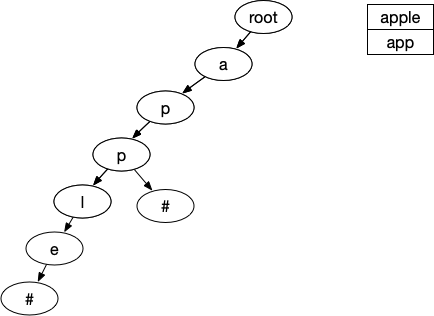
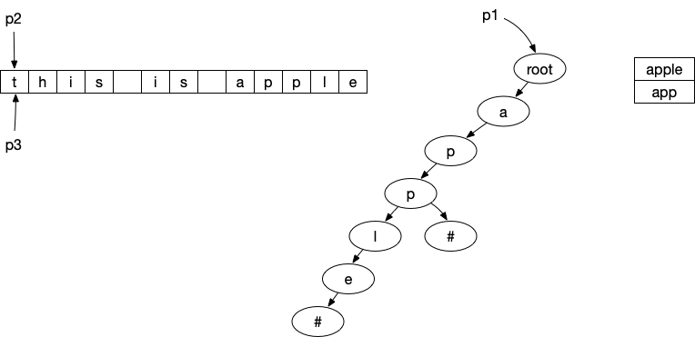

# 敏感词算法和实现

很早之前就打算做这一块，刚好最近有时间研究一下。网上一般都能找到很多资料，这里简单说一下我的理解吧。

敏感词可以做的很复杂，比如针对一个“微信”进行屏蔽，很快就能想到以下几种情况：

1. 微信
2. 带特殊符号。如微 信，微*信
3. 变体。如VX，vx，WX
4. 谐音。如威信
5. 等等……

变化和组合太多了，所以我们在实现的时候需要有所取舍，我这边只考虑第1种、第3种和第4种情况，那要怎么处理呢？我第一反应就是用string自带的contians()函数，有多少个敏感词做多少次的contains检测，不用想，性能肯定是个问题（被打脸了，后面有测试）。

看一下trie树是如何解决这个问题的。

## Trie树

Trie树，即字典树或前缀树，是一种树形结构。广泛应用于统计和排序大量的字符串（但不仅限于字符串），所以经常被搜索引擎系统用于文本词频统计。它的优点是最大限度地减少无谓的字符串比较，查询效率比较高。

Trie的核心思想是空间换时间，利用字符串的公共前缀来降低查询时间的开销以达到提高效率的目的。


**Trie树的基本性质**：

1. 根节点不包含字符，除根节点外每一个节点都只包含一个字符；

2. 从根节点到某一节点，路径上经过的字符连接起来，为该节点对应的字符串；

3. 每个节点的所有子节点包含的字符都不相同
4. 从第一字符开始有连续重复的字符只占用一个节点，比如上面的 to 和 ten，中重复的单词 t 只占用了一个节点。

所以每个节点都应该有2个字段：

1. end_flag标志：是否结束，即为叶子节点。
2. map<key, value>：存放当前节点的值和子节点的值。

## 入门

### 题目

先来看一个题目：

 [LeetCode 208. 实现 Trie (前缀树)](https://leetcode-cn.com/problems/implement-trie-prefix-tree/)

 实现一个 Trie (前缀树)，包含 `insert`, `search`, 和 `startsWith` 这三个操作。

示例:

```c++
Trie trie = new Trie();

trie.insert("apple");
trie.search("apple");   // 返回 true
trie.search("app");     // 返回 false
trie.startsWith("app"); // 返回 true
trie.insert("app");   
trie.search("app");     // 返回 true
```

说明:

- 你可以假设所有的输入都是由小写字母 a-z 构成的。
- 保证所有输入均为非空字符串。

### 实现

我们先来画一个trie树：



通过2次insert（apple和app），根据trie树的特性，构建了上面的一个trie树。在这里，我们为了区分节点是否结束，使用了一个额外的"#"节点。这样我们就能判断是startsWith还是equal，也比较好实现。

因为root不包含字符，所以可以分别定义一个TrieNode代表节点，Trie代表树。

TrieNode：

```c++
#include <string>
#include <unordered_map>

// 代表一个节点
class TrieNode {
public:
  // 添加子节点
  void addSubNode(const char &c, TrieNode *subNode) { subNodes_[c] = subNode; }

  // 获取子节点
  TrieNode *getSubNode(const char &c) { return subNodes_[c]; }

private:
  // 子节点字典(key是下级字符，value是下级节点)
  std::unordered_map<char, TrieNode *> subNodes_;
};
```


Trie：

```c++
// 代表一颗Trie树
class Trie {
public:
  // Inserts a word into the trie.
  void insert(std::string word);

  // Returns if the word is in the trie.
  bool search(std::string word);

  // Returns if there is any word in the trie that starts with the given prefix.
  bool startsWith(std::string prefix);
  
private:
  TrieNode *root_; // root节点，不存储字符
};
```

里面有一个root字段，代表根节点，再看一下insert操作：

```c++
void Trie::insert(std::string word) {
  TrieNode *curNode = root_;
  // 遍历字符串，通过字符作为key
  for (int i = 0; i < word.length(); i++) {
    char c = word[i];
    TrieNode *subNode = curNode->getSubNode(c);

    // 如果没有这个节点则新建
    if (subNode == nullptr) {
      subNode = new TrieNode();
      curNode->addSubNode(c, subNode);
    }
    // 指向子节点，进入下一循环
    curNode = subNode;
  }
  // 设置结束标识
  curNode->addSubNode(‘#’, new TrieNode());
}
```

search实现：

```c++
bool Trie::search(std::string word) {
  TrieNode *curNode = root_;
  for (int i = 0; i < word.length(); i++) {
    curNode = curNode->getSubNode(word[i]);
    if (curNode == nullptr)
      return false;
  }
  return curNode->getSubNode('#') != nullptr;
}
```

startsWith实现：

```c++
bool Trie::startsWith(std::string prefix) {
  TrieNode *curNode = root_;
  for (int i = 0; i < prefix.length(); i++) {
    curNode = curNode->getSubNode(prefix[i]);
    if (curNode == nullptr)
      return false;
  }
  // 和search的区别就在于这里，不判断下一个节点是否是结束节点
  return true;
}
```

如果运行，会输出如下结果：

```c++
int main() {
  Trie t;
  t.insert("apple");
  printf("%d \n", t.search("apple"));   // 返回 true
  printf("%d \n", t.search("app"));     // 返回 false
  printf("%d \n", t.startsWith("app")); // 返回 true
  t.insert("app");
  printf("%d \n", t.search("app"));     // 返回 true
  printf("%d \n", t.search("this is apple")); // 返回 false，为什么？
}
```

```base
$ ./main 
1 
0 
1 
1 
0 
```

所以，我们会发现一个问题，最后一个“this is apple”明明包含“apple”，为什么还是返回false？

其实很简单，上面都是默认敏感词在整个字符串开始位置，我们只需要增加一个指针，不断往后搜索即可。

### 算法概述



思路：

1. 首先 p1 指针指向 root，指针 p2 和 p3 指向字符串中的第一个字符。
2. 算法从字符 t 开始，检测有没有以 t 作为前缀的敏感词，在这里就直接判断 root 中有没有 t 这个子节点即可。这里没有，所以将 p2 和 p3 同时右移。
3. 一直移动p2和p3，发现存在以 a 作为前缀的敏感词，那么就只右移 p3 继续判断 p2 和 p3 之间的这个字符串是否是敏感词（当然要判断是否完整）。如果在字符串中找到敏感词，那么可以用其他字符串如 *** 代替。接下来不断循环直到整个字符串遍历完成就可以了。


代码实现如下：

```c++
bool Trie::search(std::string word) {
  // TrieNode *curNode = root_;
  // for (int i = 0; i < word.length(); i++) {
  //   curNode = curNode->getSubNode(word[i]);
  //   if (curNode == nullptr)
  //     return false;
  // }
  // return curNode->getSubNode(kEndFlag) != nullptr;

  // 转换成小写
  transform(word.begin(), word.end(), word.begin(), ::tolower);
  bool is_contain = false;
  for (int p2 = 0; p2 < word.length(); ++p2) {
    int wordLen = getSensitiveLength(word, p2);
    if (wordLen > 0) {
      is_contain = true;
      break;
    }
  }
  return is_contain;
}

// 这里增加一个函数，返回敏感词的位置和长度，便于替换或者检测逻辑
int Trie::getSensitiveLength(std::string word, int startIndex) {
  TrieNode *p1 = root_;
  int wordLen = 0;
  bool endFlag = false;

  for (int p3 = startIndex; p3 < word.length(); ++p3) {
    const char &cur = word[p3];
    auto subNode = p1->getSubNode(cur);
    if (subNode == nullptr) {
      break;
    } else {
      ++wordLen;
      // 直到找到尾巴的位置，才认为完整包含敏感词
      if (subNode->getSubNode(kEndFlag)) {
        endFlag = true;
        break;
      } else {
        p1 = subNode;
      }
    }
  }

  // 注意，处理一下没找到尾巴的情况
  if (!endFlag) {
    wordLen = 0;
  }
  return wordLen;
}
```

关于时间复杂度：

- 构建敏感词的时间复杂度是可以忽略不计的，因为构建完成后我们是可以无数次使用的。
- 如果字符串的长度为 n，而每个敏感词查找的时间复杂度是 O(m)，我们需要对字符串遍历 n 遍，所以查找敏感词的这个过程的时间复杂度为 O(m * n)，即 **2个for循环** 。

### 性能测试

为了方便显示，我们再增加一个函数：

```c++
std::set<SensitiveWord> Trie::getSensitive(std::string word) {
  // 转换成小写
  transform(word.begin(), word.end(), word.begin(), ::tolower);
  std::set<SensitiveWord> sensitiveSet;

  for (int i = 0; i < word.length(); ++i) {
    int wordLen = getSensitiveLength(word, i);
    if (wordLen > 0) {
      // 记录找到的敏感词的索引和长度
      std::string sensitiveWord = word.substr(i, wordLen);
      SensitiveWord wordObj;
      wordObj.word = sensitiveWord;
      wordObj.startIndex = i;
      wordObj.len = wordLen;

      // 插入到set集合中返回
      sensitiveSet.insert(wordObj);
      i = i + wordLen - 1;
    }
  }

  return sensitiveSet;
}
```

测试代码如下：

```c++
void test_time(Trie &t) {
  auto t1 = std::chrono::steady_clock::now();
  auto r = t.getSensitive("SHit，你你你你是傻逼啊你，说你呢，你个大笨蛋。");
  for (auto &&i : r) {
    std::cout << "[index=" << i.startIndex << ",len=" << i.len
              << ",word=" << i.word << "],";
  }
  std::cout << std::endl;

  // run code
  auto t2 = std::chrono::steady_clock::now();
  //毫秒级
  double dr_ms = std::chrono::duration<double, std::milli>(t2 - t1).count();
  std::cout << "耗时（毫秒）: " << dr_ms << std::endl;
}

int main() {
  Trie t;

  t.insert("你是傻逼");
  t.insert("你是傻逼啊");
  t.insert("你是坏蛋");
  t.insert("你个大笨蛋");
  t.insert("我去年买了个表");
  t.insert("shit");

  test_time(t);
}
```

输出：

```bash
$ ./main 
[index=0,len=4,word=shit],[index=16,len=12,word=你是傻逼],[index=49,len=15,word=你个大笨蛋],
耗时（毫秒）: 0.093765
```


我这边比较好奇，看一下string自带的find函数实现的版本：

```c++
void test_time_by_find() {
  auto t1 = std::chrono::steady_clock::now();
  std::string origin = "SHit，你你你你是傻逼啊你，说你呢，你个大笨蛋。";
  std::vector<std::string> words;
  words.push_back("你是傻逼");
  words.push_back("你是傻逼啊");
  words.push_back("你是坏蛋");
  words.push_back("你个大笨蛋");
  words.push_back("我去年买了个表");
  words.push_back("shit");

  for (auto &&i : words) {
    size_t n = origin.find(i);
    if (n != std::string::npos) {
      std::cout << "[index=" << n << ",len=" << i.length() << ",word=" << i
                << "],";
    }
  }
  std::cout << std::endl;

  // run code
  auto t2 = std::chrono::steady_clock::now();
  //毫秒级
  double dr_ms = std::chrono::duration<double, std::milli>(t2 - t1).count();
  std::cout << "耗时（毫秒）: " << dr_ms << std::endl;
}
```

输出：

```bash
$ $ ./main 
[index=0,len=4,word=shit],[index=16,len=12,word=你是傻逼],[index=49,len=15,word=你个大笨蛋],
耗时（毫秒）: 0.113505
[index=16,len=12,word=你是傻逼],[index=16,len=15,word=你是傻逼啊],[index=49,len=15,word=你个大笨蛋],[index=0,len=4,word=shit],
耗时（毫秒）: 0.021829
```

上面那个是trie算法实现的，耗时0.113505毫秒，下面是string的find版本，耗时0.021829毫秒，还快了5倍？这是为什么？