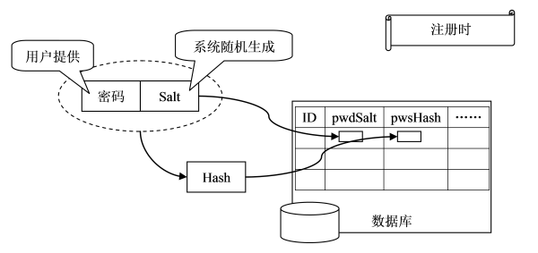
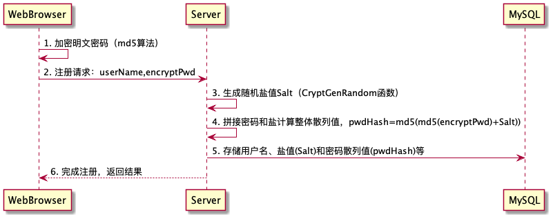
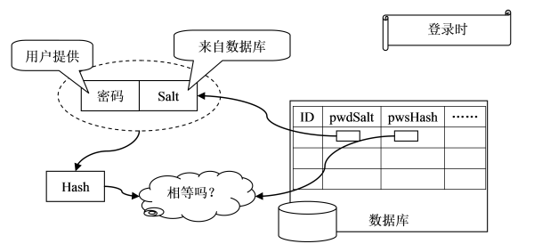
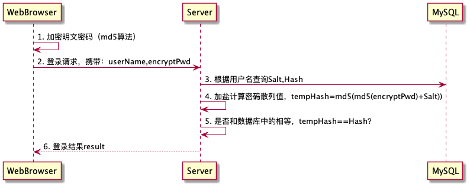

[TOC]

# IM实践——设计安全的账号系统

声明：本文是根据[Salted Password Hashing - Doing it Right](https://crackstation.net/hashing-security.htm)、[用户密码加密机制之加盐散列](https://www.cnblogs.com/zhangming-blog/articles/6018204.html)等文章结合自己的理解和需求改编而成。

## 背景

最近要对登录机制进行改造，使用userName+passwor登录。改造前，为了考虑和其他系统对接，是通过userId+token登录的。因为本身token会经过其他业务系统（比如User服务）动态生成，所以明文传递token没啥大问题。但是用户名+密码形式，就需要考虑密码安全的问题了，主要有2个方面：**传输安全（TCP）**和**存储安全（MySQL）**。

**传输安全**：如果你使用过wireshark等抓包工具，你应该明白一个道理，从客户端到服务端，中间不知经过了多少个网络设备，只要有心人在中间的某个节点（比如路由器）进行抓包，你所有的东西都相当于是公开的。如果是TCP+自定义结构体，对方只要猜到结构体的内存布局，就可以轻而易举解析出明文内容。如果是TCP+Protobuf，则Protubuf会做一层压缩编码，但如果你用wireshak抓过包，你会发现Protobuf里面存放的是字符串直接能看到内容。HTTP就更不用说了，GET直接就是明文，POST还稍微麻烦点，需要从BODY里面取。解决这个问题，有2种方式；

- 传输加密：HTTP升级到HTTPS（SSL+HTTP），TCP则需要结合OpenSSL，对传输链路进行加密，里面流的内容都是明文，一定程度上能缓解这个问题。但是有个原则：**不要在网络上传输明文密码**，所以我们得再找找有没有更好的方案。
- 内容加密：如果通道是TCP，我们对内容进行加密其实也可以。主要有对称加密（如AES、DES）和非对称加密（如RSA）2大类。对称加密性能好，但是密钥放在那里是个问题，据说微信对内容进行加密了，使用了AES128算法。非对称加密因为不太熟悉，所以暂且不谈。内容加密是对整个数据部进行加密，如果对方拿到密钥，也能解析出明文密码，所以还是得找到**单独对密码进行加密**的方法。

**存储安全**：拿用户密码举例，上大学的时候，我们很大可能性会用一个password存储用户的明文密码，然后和用户输入的判等就完成了用户名和密码的校验。但在实际的项目中，特别是很多互联网大公司，都有专业的运维DBA来管数据库。也会实现环境隔离，比如有些公司有MIT（联调）、TEST（测试）、UAT（验收）和PROD（生产）等环境。非生产环境你随意查看修改，而生产环境管理都非常严格，只允许读不允许修改。你设想如果把用户密码明文存储，那所有的研发都能直接看到用户密码，岂不是存在非常多的安全隐患？所以大家肯定都不会直接存储明文，就算是存储MD5也要强很多对吧。

所以，总结一下，不管是传输安全还是存储安全，肯定都不能用明文密码。接下来，我们看一下现在主流的基于随机salt（盐值）和hash算法的加密方案。

## 基础：哈希加密

本节来自于（有删减）：[Salted Password Hashing - Doing it Right](https://crackstation.net/hashing-security.htm)（[翻译：加盐密码哈希：如何正确使用](https://www.cnblogs.com/walkerwang/p/3612110.html)）

### 为什么密码需要进行哈希？

```c++
hash("hello") = 2cf24dba5fb0a30e26e83b2ac5b9e29e1b161e5c1fa7425e73043362938b9824
hash("hbllo") = 58756879c05c68dfac9866712fad6a93f8146f337a69afe7dd238f3364946366
hash("waltz") = c0e81794384491161f1777c232bc6bd9ec38f616560b120fda8e90f383853542
```

哈希算法是一个单向函数。它可以将任何大小的数据转化为定长的“指纹”，并且无法被反向计算。另外，即使数据源只改动了一丁点，哈希的结果也会完全不同（参考上面的例子）。这样的特性使得它非常适合用于保存密码，因为我们需要加密后的密码无法被解密，同时也能保证正确校验每个用户的密码。

在基于哈希加密的账户系统中，通常用户注册和认证的流程是这样的：

1. 用户注册一个帐号
2. 密码经过哈希加密储存在数据库中。只要密码被写入磁盘，任何时候都不允许是明文
3. 当用户登录的时候，从数据库取出已经加密的密码，和经过哈希的用户输入进行对比
4. 如果哈希值相同，用户获得登入授权，否则，会被告知输入了无效的登录信息
5. 每当有用户尝试登录，以上两步都会重复

**在第4步中，永远不要告诉用户到底是用户名错了，还是密码错了**。只需要给出一个大概的提示，比如“无效的用户名或密码”。这可以防止攻击者在不知道密码的情况下，枚举出有效的用户名。

需要提到的是，用于保护密码的哈希函数和你在数据结构中学到的哈希函数是不同的。比如用于实现哈希表这之类数据结构的哈希函数，它们的目标是快速查找，而不是高安全性。只有**加密哈希函数才能用于保护密码，例如SHA256，SHA512，RipeMD和WHIRLPOOL**。

也许你很容易就认为只需要简单地执行一遍加密哈希函数，密码就能安全，那么你大错特错了。有太多的办法可以快速地把密码从简单哈希值中恢复出来，但也有很多比较容易实现的技术能使攻击者的效率大大降低。黑客的进步也在激励着这些技术的进步，比如这样一个网站：你可以提交一系列待破解的哈希值，并且在不到1秒的时间内得到了结果。显然，简单哈希加密并不能满足我们对安全性的需求。

那么下一节会讲到几种常用的破解简单哈希加密的办法。

### 如何破解哈希加密

#### 字典攻击和暴力攻击

```
Dictionary Attack
Trying apple : failed
Trying blueberry : failed
Trying justinbeiber : failed
...
Trying letmein : failed
Trying s3cr3t : success!
Brute Force Attack
Trying aaaa : failed
Trying aaab : failed
Trying aaac : failed
...
Trying acdb : failed
Trying acdc : success!
```

破解哈希加密最简单的办法，就是去猜，将每个猜测值哈希之后的结果和目标值比对，如果相同则破解成功。

两种最常见的猜密码的办法是**字典攻击**和**暴力攻击**:
- **字典攻击**：需要使用一个字典文件，它包含单词、短语、常用密码以及其他可能用作密码的字符串。其中每个词都是进过哈希后储存的，用它们和密码哈希比对，如果相同，这个词就是密码。字典文件的构成是从大段文本中分解出的单词，甚至还包括一些数据库中真实的密码。然后还可以对字典文件进行更进一步的处理使它更有效，比如把单词中的字母替换为它们的“形近字”（hello变为h3110）。

- **暴力攻击**：会尝试每一个在给定长度下各种字符的组合。这种攻击会消耗大量的计算，也通常是破解哈希加密中效率最低的办法，但是它最终会找到正确的密码。因此密码需要足够长，以至于遍历所有可能的字符串组合将耗费太长时间，从而不值得去破解它。

我们没有办法阻止字典攻击和暴击攻击，尽管可以降低它们的效率，但那也不是完全阻止。如果你的密码哈希系统足够安全，唯一的破解办法就是进行字典攻击或者暴力遍历每一个哈希值。

#### 查表法

```
Searching: 5f4dcc3b5aa765d61d8327deb882cf99: FOUND: password5
Searching: 6cbe615c106f422d23669b610b564800: not in database
Searching: 630bf032efe4507f2c57b280995925a9: FOUND: letMEin12
Searching: 386f43fab5d096a7a66d67c8f213e5ec: FOUND: mcd0nalds
Searching: d5ec75d5fe70d428685510fae36492d9: FOUND: p@ssw0rd!
```

查表法对于破解一系列算法相同的哈希值有着无与伦比的效率。主要的思想就是预计算密码字典中的每个密码，然后把哈希值和对应的密码储存到一个用于快速查询的数据结构中。**一个良好的查表实现可以每秒进行数百次**哈希查询，即使表中储存了几十亿个哈希值。

如果你想更好地体验查表法的速度，尝试使用CrackStation的[free hash cracker](https://crackstation.net/)来破解下图中四个SHA256加密的哈希值吧。

```
c11083b4b0a7743af748c85d343dfee9fbb8b2576c05f3a7f0d632b0926aadfc
08eac03b80adc33dc7d8fbe44b7c7b05d3a2c511166bdb43fcb710b03ba919e7
e4ba5cbd251c98e6cd1c23f126a3b81d8d8328abc95387229850952b3ef9f904
5206b8b8a996cf5320cb12ca91c7b790fba9f030408efe83ebb83548dc3007bd
```

#### 反向查表法

```
Searching for hash(apple) in users' hash list... : Matches [alice3, 0bob0, charles8]
Searching for hash(blueberry) in users' hash list... : Matches [usr10101, timmy, john91]
Searching for hash(letmein) in users' hash list... : Matches [wilson10, dragonslayerX, joe1984]
Searching for hash(s3cr3t) in users' hash list... : Matches [bruce19, knuth1337, john87]
Searching for hash(z@29hjja) in users' hash list... : No users used this password
```

这种方法可以使攻击者**同时对多个哈希值发起字典攻击或暴力攻击**，而不需要预先计算出一个查询表。

首先攻击者构造一个基于密码-用户名的一对多的表，当然数据需要从某个已经被入侵的数据库获得，然后猜测一系列哈希值并且从表中查找拥有此密码的用户。**通常许多用户可能有着相同的密码，因此这种攻击方式也显得尤为有效**。

#### 彩虹表

彩虹表是**一种在时间和空间的消耗上找寻平衡的破解技术**。它和**查表法很类似**，但是为了使查询表占用的空间更小而牺牲了破解速度。因为它更小，于是我们可以在一定的空间内存储更多的哈希值，从而使攻击更加有效。能够**破解任何8位及以下长度MD5值的彩虹表已经出现了**。

下面我们会讲到一种让查表法和彩虹表都失去作用的技术，叫做加盐。

### 解决之道：加盐

```c++
hash("hello") = 2cf24dba5fb0a30e26e83b2ac5b9e29e1b161e5c1fa7425e73043362938b9824
hash("hello" + "QxLUF1bgIAdeQX") = 9e209040c863f84a31e719795b2577523954739fe5ed3b58a75cff2127075ed1
hash("hello" + "bv5PehSMfV11Cd") = d1d3ec2e6f20fd420d50e2642992841d8338a314b8ea157c9e18477aaef226ab
hash("hello" + "YYLmfY6IehjZMQ") = a49670c3c18b9e079b9cfaf51634f563dc8ae3070db2c4a8544305df1b60f007
```

**查表法和彩虹表**只有在所有密码都以相同方式进行哈希加密时才有效。如果**两个用户密码相同，那么他们密码的哈希值也是相同的**。我们可以**通过“随机化”哈希**来阻止这类攻击，于是当相同的密码被哈希两次之后，得到的值就不相同了。

**比如可以在密码中混入一段“随机”的字符串再进行哈希加密，这个被字符串被称作盐值**。如同上面例子所展示的，这使得同一个密码每次都被加密为完全不同的字符串。为了校验密码是否正确，我们需要储存盐值。*通常和密码哈希值一起存放在账户数据库中，或者直接存为哈希字符串的一部分*。

**盐值并不需要保密，由于随机化了哈希值，查表法、反向查表法和彩虹表都不再有效**。攻击者无法确知盐值，于是就不能预先计算出一个查询表或者彩虹表。这样每个用户的密码都混入不同的盐值后再进行哈希，因此反向查表法也变得难以实施。

下面讲讲我们在实现加盐哈希的过程中通常会犯哪些错误。

### 错误的使用方式

最常见的错误就是在多次哈希加密中**使用相同的盐值**或者**太短的盐值**。

##### 盐值重复

每次哈希加密都使用相同的盐值是很容易犯的一个错误，这个盐值要么被硬编码到程序里，要么只在第一次使用时随机获得。这样加盐的方式是做无用功，**因为两个相同的密码依然会得到相同的哈希值**。攻击者仍然可以使用反向查表法对每个值进行字典攻击，只需要把盐值应用到每个猜测的密码上再进行哈希即可。如果盐值被硬编码到某个流行的软件里，可以专门为这个软件制作查询表和彩虹表，那么破解它生成的哈希值就变得很简单了。

**用户创建账户或每次修改密码时，都应该重新生成新的盐值进行加密**。

#### 盐值太短

如果盐值太短，攻击者可以构造一个查询表包含所有可能的盐值。以只有3个ASCII字符的盐值为例，一共有95x95x95=857,375种可能。这看起来很多，但是如果对于每个盐值查询表只包含1MB最常见的密码，那么总共只需要837GB的储存空间。一个不到100美元的1000GB硬盘就能解决问题。

为了使攻击者无法构造包含所有可能盐值的查询表，**盐值必须足够长。一个好的做法是使用和哈希函数输出的字符串等长的盐值，比如SHA256算法的输出是256bits(32 bytes)**，那么盐值也至少应该是32个随机字节。

#### 使用用户名作为盐值

同样地，用户名也不应该被用作盐值。尽管在一个网站中用户名是唯一的，但是它们是可预测的，并且经常重复用于其他服务中。**攻击者可以针对常见用户名构建查询表**，然后对用户名盐值哈希发起进攻。

#### 两次哈希或自创组合哈希

这节讲述了另一种对密码哈希的误解：使用组合哈希函数。人们经常不由自主地认为将不同的哈希函数组合起来，结果会更加安全。实际上这样做几乎没有好处，仅仅造成了函数之间互相影响的问题，甚至有时候会变得更加不安全。**永远不要尝试发明自己的加密方法，只需只用已经被设计好的标准算法**。有的人会说使用多种哈希函数会使计算更慢，从而破解也更慢，但是还有其他的办法能更好地减缓破解速度，后面会提到的。

这里有些低端的组合哈希函数，我在网上某些论坛看到它们被推荐使用：
```c++
md5(sha1(password))
md5(md5(salt) + md5(password))
sha1(sha1(password))
sha1(str_rot13(password + salt))
md5(sha1(md5(md5(password) + sha1(password)) + md5(password)))
```

不要使用其中任何一种。

[原文作者Defuse Security](https://defuse.ca/)提醒：
> 
> 注意：这节内容是有争议的。我已经收到的大量的邮件，为组合哈希函数而辩护。他们的理由是如果攻击者不知道系统使用的哪种哈希函数，那么也就很难预先为这种组合构造出彩虹表，于是破解起来会花费更多的时间。
> 
> 诚然，攻击者在不知道加密算法的时候是无法发动攻击的，但是不要忘了Kerckhoffs’s principle，攻击者通常很容易就能拿到源码（尤其是那些免费或开源的软件）。通过系统中取出的一些密码-哈希值对应关系，很容易反向推导出加密算法。破解组合哈希函数确实需要更多时间，但也只是受了一点可以确知的因素影响。更好的办法是使用一个很难被并行计算出结果的迭代算法，然后增加适当的盐值防止彩虹表攻击。
> 
> 当然你实在想用“标准的”组合哈希函数，比如HMAC，也是可以的。但如果只是为了使破解起来更慢，那么先读读下面讲到的密钥扩展。
> 
> 创造新的哈希函数可能带来安全问题，构造哈希函数的组合又可能带来函数间互相影响的问题，它们带来的一丁点好处和这些比起来真是微不足道。显然最好的做法是使用标准的、经过完整测试的算法。
> 

#### 使用过时的哈希函数

哈希函数将任意大小的数据转化为定长的字符串，因此其中一定有些输入经过哈希计算之后得到了相同的结果。加密哈希函数的设计就是为了使这样的碰撞尽可能难以被发现。随着时间流逝，密码学家发现攻击者越来越容易找到碰撞了，最近的例子就是**MD5算法的碰撞已经确定被发现了**。

碰撞攻击的出现表明很可能**有一个和用户密码不同的字符串却和它有着相同的哈希值**。然而，即使在MD5这样脆弱的哈希函数中找到碰撞也需要耗费大量的计算，因此这样的碰撞“意外地”在实际中出现的可能性是很低的。于是站在实用性的角度上可以这么说，加盐MD5和加盐SHA256的安全性是一样的。不过可能的话，使用本身更安全的哈希函数总是好的，比如SHA256、SHA512、RipeMD或者WHIRLPOOL。

### 正确的做法

#### 基于加密的伪随机数生成器生成盐值

盐值应该使用**基于加密的伪随机数生成器**（Cryptographically Secure Pseudo-Random Number Generator – CSPRNG）来生成。CSPRNG和普通的随机数生成器有很大不同，如C语言中的rand()函数。物如其名，CSPRNG专门被设计成用于加密，它能提供高度随机和无法预测的随机数。我们显然不希望自己的盐值被猜测到，所以一定要使用CSPRNG。下面的表格列出了当前主流编程语言中的CSPRNG方法：

|Platform|CSPRNG
|-|-|
|PHP|	mcrypt_create_iv, openssl_random_pseudo_bytes
|Java	|java.security.SecureRandom
|Dot NET (C#, VB)	|System.Security.Cryptography.RNGCryptoServiceProvider
|Ruby	|SecureRandom
|Python	|os.urandom
|Perl	|Math::Random::Secure
|C/C++ (Windows API)|	CryptGenRandom
|Any language on GNU/Linux or Unix	| Read from /dev/random or /dev/urandom

#### 当用户修改密码时，更新盐值

对于每个用户的每个密码，盐值都应该是独一无二的。每当有新用户注册或者修改密码，都应该使用新的盐值进行加密。并且这个盐值也应该足够长，使得有足够多的盐值以供加密。一个好的标准的是：盐值至少和哈希函数的输出一样长；

#### 盐值和密码哈希要一起存储在数据库表

为什么要存储盐值？前面罗列了各种错误的使用方式，其中有一条就是要避免硬编码盐值，这是一个原因。最主要的原因是：当用户登录时，需要拿出当时生成密码哈希的盐值进行登录密码哈希计算，完成登录校验，这一块在后文的实战一节有具体的流程。

#### 永远在服务器端进行哈希加密

如果你正在开发一个Web程序，你可能会疑惑到底在哪进行加密。是使用JavaScript在用户的浏览器上操作呢，还是将密码“裸体”传送到服务器再进行加密？

即使浏览器端用JavaScript加密了，你仍然需要在服务端再次进行加密。试想有个网站在浏览器将密码经过哈希后传送到服务器，那么在认证用户的时候，网站收到哈希值和数据库中的值进行比对就可以了。这看起来比只在服务器端加密安全得多，因为至始至终没有将用户的密码明文传输，但实际上不是这样。

问题在于，从客户端来看，经过哈希的密码逻辑上成为用户真正的密码。为了通过服务器认证，用户只需要发送密码的哈希值即可。如果有坏小子获取了这个哈希值，他甚至可以在不知道用户密码的情况通过认证。更进一步，如果他用某种手段入侵了网站的数据库，那么不需要去猜解任何人的密码，就可以随意使用每个人的帐号登录。

**这并不是说你不应该在浏览器端进行加密，但是如果你这么做了，一定要在服务端再次加密**。在浏览器中进行哈希加密是个好想法，不过实现的时候注意下面几点：

- 客户端密码哈希并不能代替HTTPS（SSL/TLS）。如果浏览器和服务器之间的连接是不安全的，那么中间人攻击可以修改JavaScript代码，**删除加密函数，从而获取用户密码**。

- **有些浏览器不支持JavaScript**，也有的用户禁用了浏览器的JavaScript功能。为了最好的兼容性，你的程序应该检测JavaScript是否可用，如果答案为否，需要在服务端模拟客户端的加密。

- 客户端哈希同样需要加盐，很显然的办法就是向服务器请求用户的盐值，但是不要这么做。因为这给了坏蛋一个机会，能够在不知道密码的情况下检测用户名是否有效。既然你已经在服务端对密码进行了加盐哈希，**那么在客户端把用户名（或邮箱）加上网站特有的字符串（如域名）作为盐值是可行的**。

#### 让密码更难破解：慢哈希函数

加盐使攻击者无法采用特定的查询表和彩虹表快速破解大量哈希值，但是却不能阻止他们使用字典攻击或暴力攻击。高端的显卡（GPU）和定制的硬件可以每秒进行数十亿次哈希计算，因此这类攻击依然可以很高效。为了降低攻击者的效率，我们可以使用一种叫做**密钥扩展**的技术。

这种技术的思想就是把哈希函数变得很慢，于是即使有着超高性能的GPU或定制硬件，字典攻击和暴力攻击也会慢得让攻击者无法接受。最终的目标是把哈希函数的速度降到足以让攻击者望而却步，但造成的延迟又不至于引起用户的注意。

密钥扩展的实现是依靠一种CPU密集型哈希函数。不要尝试自己发明简单的迭代哈希加密，如果迭代不够多，是可以被高效的硬件快速并行计算出来的，就和普通哈希一样。应该使用标准的算法，比如[PBKDF2](https://en.wikipedia.org/wiki/PBKDF2)或者[bcrypt](https://www.cnblogs.com/walkerwang/p/3612110.html)。[这里](https://defuse.ca/php-pbkdf2.htm)可以找到PBKDF2在PHP上的一种实现。

这类算法使用一个安全因子或迭代次数作为参数，这个值决定了哈希函数会有多慢。对于桌面软件或者手机软件，获取参数最好的办法就是执行一个简短的性能基准测试，找到使哈希函数大约耗费0.5秒的值。这样，你的程序就可以尽可能保证安全，而又不影响到用户体验。

如果你在一个Web程序中使用密钥扩展，记得你需要额外的资源处理大量认证请求，并且密钥扩展也使得网站更容易遭受拒绝服务攻击（DoS）。但我依然推荐使用密钥扩展，不过把迭代次数设定得低一点，你应该基于认证请求最高峰时的剩余硬件资源来计算迭代次数。要求用户每次登录时输入验证码可以消除拒绝服务的威胁。另外，一定要把你的系统设计为迭代次数可随时调整的。

如果你担心计算量带来的负载，但又想在Web程序中使用密钥扩展，可以考虑在浏览器中用JavaScript完成。[Stanford JavaScript Crypto Library](https://crypto.stanford.edu/sjcl/)里包含了PBKDF2的实现。迭代次数应该被设置到足够低，以适应速度较慢的客户端，比如移动设备。同时当客户端不支持JavaScript的时候，服务端应该接手计算。客户端的密钥扩展并不能免除服务端进行哈希加密的职责，你必须对客户端传来的哈希值再次进行哈希加密，就像对付一个普通密码一样。

#### 无法破解的哈希加密：密钥哈希和密码哈希设备

只要攻击者可以检测对一个密码的猜测是否正确，那么他们就可以进行字典攻击或暴力攻击。因此下一步就是向哈希计算中增加一个**密钥**，只有知道这个密钥的人才能校验密码。**有两种办法可以实现：将哈希值加密，比如使用AES算法；将密钥包含到哈希字符串中，比如使用密钥哈希算法HMAC**。

听起来很简单，做起来就不一样了。这个密钥需要在任何情况下都不被攻击者获取，即使系统因为漏洞被攻破了。如果攻击者获取了进入系统的最高权限，那么不论密钥被储存在哪，他们都可以窃取到。因此密钥需要储存在外部系统中，比如另一个用于密码校验的物理服务器，或者一个关联到服务器的特制硬件，如**YubiHSM**。

我强烈推荐大型服务（10万用户以上）使用这类办法，因为我认为面对如此多的用户是有必要的。

如果你难以负担多个服务器或专用的硬件，仍然有办法在一个普通Web服务器上利用密钥哈希技术。大部分针对数据库的入侵都是由于**SQL注入攻击**，因此不要给攻击者进入本地文件系统的权限（禁止数据库服务访问本地文件系统，如果它有这个功能的话）。这样一来，当你随机生成一个密钥存到通过Web程序无法访问的文件中，然后混入加盐哈希，得到的哈希值就不再那么脆弱了，即便这时数据库遭受了注入攻击。不要把将密钥硬编码到代码里，应该在安装时随机生成。这当然不如独立的硬件系统安全，因为如果Web程序存在SQL注入点，那么可能还存在其他一些问题，比如本地文件包含漏洞（Local File Inclusion），攻击者可以利用它读取本地密钥文件。无论如何，这个措施比没有好。

请注意密钥哈希不代表无需进行加盐。高明的攻击者迟早会找到办法窃取密钥，因此依然对密码哈希进行加盐和密钥扩展很重要。

#### 其他安全措施

哈希加密可以在系统发生入侵时保护密码，但这并不能使整个程序更加安全。首先还有很多事情需要做，来保证密码哈希（和其他用户数据）不被窃取。

即使经验丰富的开发者也需要额外学习安全知识，才能写出安全的程序。这里有个关于Web程序漏洞的资源：[The Open Web Application Security Project (OWASP)](https://owasp.org)，还有一个很好的介绍：[OWASP Top Ten Vulnerability List](https://owasp.org/images/7/72/OWASP_Top_10-2017_(en).pdf.pdf)。除非你了解列表中所有的漏洞，才能尝试编写一个处理敏感数据的Web程序。雇主也有责任保证他所有的开发人员都有资质编写安全的程序。

对你的程序进行第三方“渗透测试”是一个不错的选择。最好的程序员也可能犯错，因此有一个安全专家审查你的代码寻找潜在的漏洞是有意义的。找寻值得信赖的机构（或招聘人员）来对你的代码进行审查。安全审查应该从编码的初期就着手进行，一直贯穿整个开发过程。

监控你的网站来发现入侵行为也是很重要的，我推荐至少雇佣一个人全职负责监测和处理安全隐患。如果有个漏洞没被发现，攻击者可能通过网站利用恶意软件感染访问者，因此检测漏洞并且及时应对是十分重要的。

### 总结

盐值的错误使用方式：

1. **代码中硬编码造成盐值重复**。试想2个用户密码和盐值都一样，那么hash值也必然一样，则一个用户密码泄露，相等于一批用户密码泄露。
2. **盐值过短**，3位字符的随机盐值几百块钱的1TB硬盘就可以使用查表法暴力破解。
3. **使用用户名作为盐值**，攻击者可以针对常见用户名构建查询表，然后对用户名盐值哈希发起进攻。
4. **发明自己的加密方法，而不是使用已经设计好的算法**，通常是把各种算法进行组合嵌套，如md5(sha1(password))、md5(md5(salt) + md5(password))、sha1(sha1(password))等等，不要使用其中任何一种。
5. **使用过时（MD5或SHA1）的哈希函数**，MD5算法的碰撞已经确定被发现了（有一个和用户密码不同的字符串却和它有着相同的哈希值），且常见密码的MD5值很容易的能从一些在线网站中查到。


正确的使用方式：

1. **应使用随机的盐值，而不是在代码中硬编码**。试想2个用户密码和盐值都一样，那么hash值也必然一样，则一个用户密码泄露，相等于一批用户密码泄露
2. **用户创建账户或每次修改密码时，都应该重新生成新的盐值进行加密**。这样当密码泄露后，用户可通过更改密码的方式更新自己的hash值，则老的hash值将失效，常见的暴力破解方法失去用武之地。
3. **应使用长盐值**，最好和生成的hash字符串等长，过短或者使用用户名作为盐值都不好。比如SHA256算法输出256bit（32Byte），则盐值也最好是32字符。
4. **使用标准加密算法，不要发明轮子，通过组合嵌套各种哈希函数对密码进行哈希**。
5. **使用更安全的加密函数版本，如SHA256、SHA512、RipeMD、WHIRLPOOL、SHA3**。
6. 盐值应该使用**基于加密的伪随机数生成器（Cryptographically Secure Pseudo-Random Number Generator – CSPRNG）**来生成， Java中使用java.security.SecureRandom，Windows C++中使用CryptGenRandom，Go使用crypto/rand包下的Reader.Read。
7. **永远在服务端进行哈希加密**。

## 实战：加盐密码哈希机制

### 时序图

在基于哈希加密的账户系统中，通常用户注册和认证的流程是这样的：

1. 用户注册一个帐号
2. 密码经过哈希加密储存在数据库中。只要密码被写入磁盘，任何时候都不允许是明文
3. 当用户登录的时候，从数据库取出已经加密的密码，和经过哈希的用户输入进行对比
4. 如果哈希值相同，用户获得登入授权，否则，会被告知输入了无效的登录信息
5. 每当有用户尝试登录，以上两步都会重复

> PS：在第4步中，永远不要告诉用户到底是用户名错了，还是密码错了。只需要给出一个大概的提示，比如“无效的用户名或密码”。这可以防止攻击者在不知道密码的情况下，枚举出有效的用户名。

下面来看一下具体的流程。

#### 用户注册



1. 在客户端（这里是浏览器）先对密码做一次加密。
2. 发送HTTPS请求，提交用户注册信息到后端（很多网站都是传的明文），携带用户名、加密的密码还有其他信息等
3. 后端随机生成一个Salt值，这样A和B2个不同的用户输入相同的密码时，在数据库中盐值和散列值也不一样。注意：应当使用**基于加密的伪随机数生成器CSPRNG（Cryptographically Secure Pseudo-Random Number Generator）**
- Java中使用java.security.SecureRandom
- Windows C++中使用CryptGenRandom
- Go使用crypto/rand包下的Reader.Read生成，各个平台使用具体的算法不一样，如下：
```go
// On Linux and FreeBSD, Reader uses getrandom(2) if available, /dev/urandom otherwise.
// On OpenBSD, Reader uses getentropy(2).
// On other Unix-like systems, Reader reads from /dev/urandom.
// On Windows systems, Reader uses the CryptGenRandom API.
```
> PS: CSPRNG和普通的随机数生成器有很大不同，如C语言中的rand()函数。物如其名，CSPRNG专门被设计成用于加密，它能提供高度随机和无法预测的随机数。我们显然不希望自己的盐值被猜测到，所以一定要使用CSPRNG
4. 拼接加密的密码和Salt，使用md5嵌套计算密码hash
5. 插入用户注册信息到数据库，包括用户名、密码Hash（注意不是密码）和Salt等
6. 注册完成，返回结果

#### 用户登录



整体上和注册类似：
1. 同样在客户端（这里是浏览器）先对密码进行加密
2. 然后发起登录认证请求，携带用户名和加密的密码
3. 根据用户名向数据库查询对应的盐值(Salt)和密码散列值(Hash)。
4. 先计算用户输入密码的散列值，注意：这里不要返回到底是用户名错误还是密码错误，避免泄漏用户账号信息。
5. 再加盐计算
6. 如果计算出来的密码散列值和数据中库的相等，表示密码正确，否则表示密码错误。
7. 返回登录结果。

### 数据库表设计

```sql
CREATE TABLE `im_user` (
  `id` int(11) unsigned NOT NULL AUTO_INCREMENT,
  `user_id` bigint(20) unsigned NOT NULL,
  `user_name` varchar(64) NOT NULL COMMENT '用户名',
  `user_pwd_salt` varchar(64) NOT NULL COMMENT '随机盐值',
  `user_pwd_hash` varchar(64) NOT NULL COMMENT '用户密码hash值',
  `user_nick_name` varchar(32) NOT NULL COMMENT '昵称',
  `user_attach` varchar(1024) NOT NULL COMMENT '附加信息（预留）',
  `created` int(11) NOT NULL,
  `updated` int(11) NOT NULL,
  PRIMARY KEY (`id`)
) ENGINE=InnoDB DEFAULT CHARSET=utf8mb4;
```

根据前面的时序图，数据库中的用户信息表，至少需要用户名、盐值和密码Hash值三个字段。当用户注册的时候，进行插入。当用户登录时，根据数据库中存储的盐值和密码Hash值校验密码正确性。密码的hash值好理解，为什么盐值也需要存储下来？
- 思考一个问题：如果只用1个字段，当2个用户的密码一样时，数据库中的hash值岂不是一样？

## 

## 进阶：Telegram的P2P加密

### Diffie-Hellman key exchange

to do...

see:
- [telegram: MTProto Mobile Protocol](https://core.telegram.org/mtproto)
- [telegram: Security Guidelines for Client Developers](https://core.telegram.org/mtproto/security_guidelines)

## 参考

- [设计安全的账号系统的正确姿势](https://blog.coderzh.com/2016/01/03/security-design/)
- [即使被拖库，也可以保证密码不泄露](https://blog.coderzh.com/2016/01/10/a-password-security-design-example/)
- [Salted Password Hashing - Doing it Right](https://crackstation.net/hashing-security.htm)（[翻译：加盐密码哈希：如何正确使用](https://www.cnblogs.com/walkerwang/p/3612110.html)）
- [用户密码加密机制之加盐散列](https://www.cnblogs.com/zhangming-blog/articles/6018204.html)