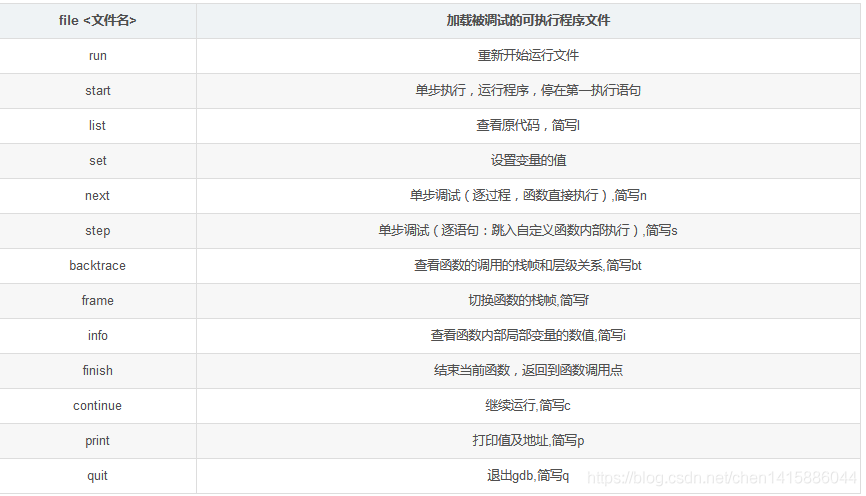

# GDB调试指南：如何调试生产环境的程序？

## 引言

 对于后端开发而言，不管是java还是c++/go等程序员，都会遇到线上程序崩溃的问题，此时，我们有2种方式进行排查：

- 通过log确定问题范围，比如有没有error级别的log，或者根据最后一行log大概确定出问题的模块
- 如果启用了linux的coredump功能，则在程序崩溃时，会把当时的所有堆栈信息按照指定格式转存到文件中，我们可以通过gdb加载这个文件，还原崩溃时程序运行的情况，找到错误具体原因。

除了生产环境中出现问题，平时的调试中我们可能也会使用GDB，但是目前因为VS Code、Clion等IDE集成了gdb调试，故实际开发环境中用的还相对偏少一些。

本文主要从线上程序故障，该如何使用GDB排查来介绍GDB的调试功能。其他方面，推荐**《软件调试的艺术》和GDB官方的手册《Debugging with GDB》深入理解GDB**。

针对生产环境（线上），我们使用gdb主要有2个场景：

- 调试coredump文件
- 调试正在运行的程序

## GDB With CoreDump

先来介绍coredump如何调试。

### 编译选项增加-g

为了能是gdb看到具体的堆栈源码行数，在g++编译时，我们需要增加-g选项：

```c++
# -g：添加gdb调试选项。
ADD_DEFINITIONS(-g -W -Wall -D_REENTRANT -D_FILE_OFFSET_BITS=64 -DAC_HAS_INFO
        -DAC_HAS_WARNING -DAC_HAS_ERROR -DAC_HAS_CRITICAL -DTIXML_USE_STL
        -DAC_HAS_DEBUG -DLINUX_DAEMON -std=c++11)
```

### 启用Linux CoreDump转储Core文件功能

具体的启用方法，可参考：[第9节 故障排查：CoreDump配置](../chapter4/9-coredump.md)

### 拷贝程序和core文件到编译机器上

为了防止出现堆栈不正确（很少或者带有?号），我们需要把程序和core文件都拷贝到带有源码的编译机器上，可以是任意位置，比如 **/data/** 下面。

这里为了方面演示，故可以省略该步骤。

### 测试程序

如果没有core文件，我们也可以自己构造一个。为了方便介绍，我们拿以下代码来讲解：

1. 创建一个test.cpp程序文件

```bash
$ vim test.cpp
```

```c++
//#include <stdio.h>
// 这段代码会造成数组越界，使用gdb调试的时候，全部是?号，看不到具体的代码行数，请注意不要使用
//int main( int argc, char * argv[] ) { 
//  char a[1]; 
//  scanf( "%s", a );
//  return 0;
//}

#include <string>
#include <stdio.h>

struct Student {
    std::string name;
};

void printStudent(Student *s) {
    printf(s->name.c_str());
}

int main(){
    Student *s ; // = new Student(); 这里故意不初始化，好让printInfo报空指针错误
    printStudent(s);

    return 0;
}
```

```bash
$ ls # 保存之后，我们是这样的
coredump.sh  imcorefile  test.cpp
```


2. 编译，注意别忘记 -g 选项（这篇文章里有个对比：[gcc编译为什么要加-g选项](https://blog.csdn.net/luhaowei0066/article/details/79717972)）

```bash
$ g++ -g test.cpp -o test # c++程序使用g++编译
$ ls                      # 多了一个test程序文件
coredump.sh  imcorefile  test  test.cpp
```


3. 执行程序

```bash
$ ./ test
# Segmentation fault             # 情况1：崩溃，这个是没有转储core文件的，说明没启用coredump功能
Segmentation fault (core dumped) # 情况2：这个才是转储了core文件，记住得提前启用linux的coredump功能
```


4. 查看下是否生产了core文件

```bash
$ pwd
/data
$ ls imcorefile/
core-test-11-0-0-4198-1621495311
```

为什么是 /data/imcorefile？这个是 [第9节 故障排查：CoreDump配置](../chapter4/9-coredump.md) 配置core文件的存储路径，所有的core文件都会存储在这里。

### 加载core文件

```bash
$ gdb test imcorefile/core-test-11-0-0-4317-1621496766

GNU gdb (GDB) Red Hat Enterprise Linux 7.6.1-119.el7
Copyright (C) 2013 Free Software Foundation, Inc.
License GPLv3+: GNU GPL version 3 or later <http://gnu.org/licenses/gpl.html>
This is free software: you are free to change and redistribute it.
There is NO WARRANTY, to the extent permitted by law.  Type "show copying"
and "show warranty" for details.
This GDB was configured as "x86_64-redhat-linux-gnu".
For bug reporting instructions, please see:
<http://www.gnu.org/software/gdb/bugs/>...
Reading symbols from /data/test...done.
[New LWP 4317]
Core was generated by `./test'.
Program terminated with signal 11, Segmentation fault.
#0  0x00007f16eda60ef0 in std::string::c_str() const () from /lib64/libstdc++.so.6
Missing separate debuginfos, use: debuginfo-install glibc-2.17-157.el7_3.1.x86_64 libgcc-4.8.5-11.el7.x86_64 libstdc++-4.8.5-11.el7.x86_64
```

### 打印堆栈

此时，我们直接输入 **bt命令** 打印当前线程的堆栈（如果是多线程程序，可以使用 thread apply all bt 打印所有线程的堆栈）：

```bash
(gdb) bt
#0  0x00007f16eda60ef0 in std::string::c_str() const () from /lib64/libstdc++.so.6
#1  0x0000000000400688 in printStudent (s=0x0) at test.cpp:9
#2  0x00000000004006ab in main () at test.cpp:14
```


我们看到出错在printStudent()函数，可以通过frame命令，看堆栈详细信息

```bash
(gdb) f 2
#2  0x00000000004006ab in main () at test.cpp:14
14          printStudent(s);
(gdb) f 1
#1  0x0000000000400688 in printStudent (s=0x0) at test.cpp:9
9           printf(s->name.c_str());
```

然后，通过 **p** 命令，查看 s 变量的值，看看是什么问题：

```bash
(gdb) p s
$1 = (Student *) 0x0 # 0x0，这一看就是空指针，这里只是为了演示p命令，可以查看变量的值
(gdb) p s->name      # 不够明显，在打印
Cannot access memory at address 0x0
```


### 总结

至此，GDB 调试core文件就结束了，其实比较简单。就记住4个命令即可：

- gdb <application> <corefile>
- bt：打印堆栈
- f：查看某一个栈的信息
- p：查看变量的值


## GDB附加调试

除了调试coredump文件，分析崩溃原因之外，还有一种情况：**程序没崩溃，但是变成了僵尸进程，要怎么找原因？**

这个时候，就需要用到gdb附加调试的功能了（好像还可以远程调试，没用过）。

### 附加

启动附加调试的语法也很简单：

```bash
$ gdb attach <pid>
```

第2个参数是进程ID，使用ps 查看一下即可：

```bash
$ ps aux|grep server
root      4362  0.0  0.3 119444 12220 ?        Sl   16:04   0:00 ./msg_server
```

附加后，程序将暂停运行，如下：

```bash
$ gdb attach 4362
# ... 这里会输出一大段信息，省略
```

### 查看所有线程的堆栈

通过bt命令可以看到主线程的堆栈：

```bash
(gdb) bt
#0  0x00007fc62e6c1d13 in epoll_wait () from /lib64/libc.so.6
#1  0x00000000006372fd in CEventDispatch::StartDispatch (this=0x2938000, wait_timeout=100)
    at /home/online.base.newteamtalk.service/server/src/base/EventDispatch.cpp:535
#2  0x000000000055a2ae in netlib_eventloop (wait_timeout=100) at /home/online.base.newteamtalk.service/server/src/base/netlib.cpp:188
#3  0x000000000053db44 in main (argc=1, argv=0x7ffe7fa10608)
    at /home/online.base.newteamtalk.service/server/src/msg_server/msg_server.cpp:263
```

看到所有线程的堆栈需要使用：thread apply all bt

```bash
(gdb) thread apply all bt

Thread 2 (Thread 0x7fc62a06c700 (LWP 4363)):
#0  0x00007fc62e6b8ba3 in select () from /lib64/libc.so.6
#1  0x00007fc62c5d3625 in apr_sleep () from /usr/lib64/libapr-1.so.0
#2  0x00007fc62e2e62e9 in ?? ()
#3  0x000000000000110b in ?? ()
#4  0x000000000290a100 in ?? ()
#5  0x00007fc62a06bce0 in ?? ()
#6  0x00007fc62e34416e in ?? ()
#7  0x00000000028f4050 in ?? ()
#8  0x0000000000000018 in ?? ()
#9  0x00007fc62a06bd30 in ?? ()
#10 0x0000000000000000 in ?? ()

Thread 1 (Thread 0x7fc630297940 (LWP 4362)):
#0  0x00007fc62e6c1d13 in epoll_wait () from /lib64/libc.so.6
#1  0x00000000006372fd in CEventDispatch::StartDispatch (this=0x2938000, wait_timeout=100)
    at /home/online.base.newteamtalk.service/server/src/base/EventDispatch.cpp:535
#2  0x000000000055a2ae in netlib_eventloop (wait_timeout=100) at /home/online.base.newteamtalk.service/server/src/base/netlib.cpp:188
#3  0x000000000053db44 in main (argc=1, argv=0x7ffe7fa10608)
    at /home/online.base.newteamtalk.service/server/src/msg_server/msg_server.cpp:263
```

这里示例的程序是tcp网关，基于epoll实现的，所以程序在epoll_wait()处挂起是正常的。

### 继续

为了使程序能运行，我们需要输入continue（或者简写c）：

```bast
(gdb) c
Continuing.
```

### 查看源代码，下断点

按住 Ctrl + C，进入gdb 命令模式

```bash
^C
Program received signal SIGINT, Interrupt.
0x00007fc62e6c1d13 in epoll_wait () from /lib64/libc.so.6
(gdb) 
```

通过 **list** 命令查看源码，**b** 命令打断点，然后输入 **c** 让程序运行，这里就不贴代码了。

### 单步调试

程序断下后，我们就可以单步来调试，通过p看变量的值来排查问题了。主要通过下面几个命令：

```bash
$ next   # 单步跟踪，如果有函数调用，他不会进入该函数
$ step   # 单步跟踪，如果有函数调用，他会进入该函数
$ finish # 运行程序，直到当前函数完成返回
```

### 调用函数

最后一块要提一下，p 不仅仅可以打印变量的值，也可以调用函数。比如在上面的msg_server的例子中，现象是tcp服务不接受新的tcp连接，“卡死”在哪里。此时我们就可以通过 p命令 调用 epoll_ctl() 来判断是不是和I/O复用有关系，语法如下：

c++代码：

```c++
strucht epoll_event ev{};
ev.events = EPOLLIN | EPOLLET;
ev.data.fd = listenFd;
ret = ::epoll_ctl(epFd, EPOLL_CTL_ADD, listenFd, &ev);
```

gdb命令：

```bash
# 5: epoll的句柄
# 2: EPOLL_CTL_DEL
# 6: socket句柄
$ p (int)(::epoll_ctl(5,2,6,0))
```


## 附录：GDB常用命令




### 启动调试

#### 从CoreDump文件

```bash
# 举例 gdb msg_server ../imcorefile/core-db_proxy_server-11-1999-1999-19388-1597307792
$ gdb [application_file] [core_dump]
```


#### 附加正在运行的进程

1. 附加
```bash
$ gdb attach pid   # 附加调试
```

2. 观察
```bash
$ bt                 # 打印当前堆栈
$ thread apply all b # 打印当前所有线程的堆栈
```

### 显示源码

```bash 
$ list <linenum>    # 行号
$ list <function>   # 函数名
$ list <filename:function>  # 文件加函数名
$ list <filename:linenum>   # 文件加行号
```

### 断点

#### 添加

```bash
$ b src/main.cpp:127            # 普通断点
$ b src/main.cpp:127 if cnt==10 # 条件断点
$ b *0x400522          # 数据断点（当该地址上的内容发生改变时就会触发断点）
$ b &变量名             # 数据断点
$ b funcName           # 函数断点
$ info break           # 断点列表
```

ps: b 是 break的简写，也可以直接使用break打断点

#### 删除

```bash
$ d break <数字>  # 删除某个断点      
$ d              # 删除所有断点
```

ps: d 是 delete的简写，也可以直接使用delte

#### 单步

```bash
$ next   # 单步跟踪，如果有函数调用，他不会进入该函数
$ step   # 单步跟踪，如果有函数调用，他会进入该函数
$ finish # 运行程序，直到当前函数完成返回
```

#### 继续

```bash
$ continue  # 简写c，恢复程序运行，直到程序结束，或是下一个断点到来
$ Command+C # 退出，可以输入其他命令
```

#### 打印值

```bash
$ p 变量
```

### 调用函数

利用p打印的功能。

语法为：

```bash
$ p function() # 如果有返回值，需要适当转换成gdb能识别的基本类型，否则gdb会报错
```


#### 举例：删除epoll事件

C++代码
```cpp
// 5: epoll的句柄
// 6: socket句柄
::epoll_ctl(5,EPOLL_CTL_DEL,6,nullptr);
```

翻译成gdb 命令如下：
```bash
# 5: epoll的句柄
# 2: EPOLL_CTL_DEL
# 6: socket句柄
$ p (int)(::epoll_ctl(5,2,6,0))
```

#### 举例：添加epoll事件

C++代码
```cpp
strucht epoll_event ev{};
ev.events = EPOLLIN | EPOLLET;
ev.data.fd = listenFd;
ret = ::epoll_ctl(epFd, EPOLL_CTL_ADD, listenFd, &ev);
```

翻译成gdb命令如下：
```bash
$ p (int)(::epoll_ctl(5, 1, 6, (epoll_event *) ({(char)01, (char)00, (char)00, (char)0x80, (char)06, (char)00, (char)00, (char)00, (char)00, (char)00, (char)00, (char)00})))
```

PS: epoll_event*后面的是C++11的写法，可以在内存中构建一个字节数组，按照epoll_event结构依次存放，这样就可以传递一个结构体给epoll_ctl()函数。

## 参考

- 《Debugging with GDB中文手册》
- 《软件调试的艺术》
- [GDB调试指南入门](https://blog.csdn.net/chen1415886044/article/details/105094688/)