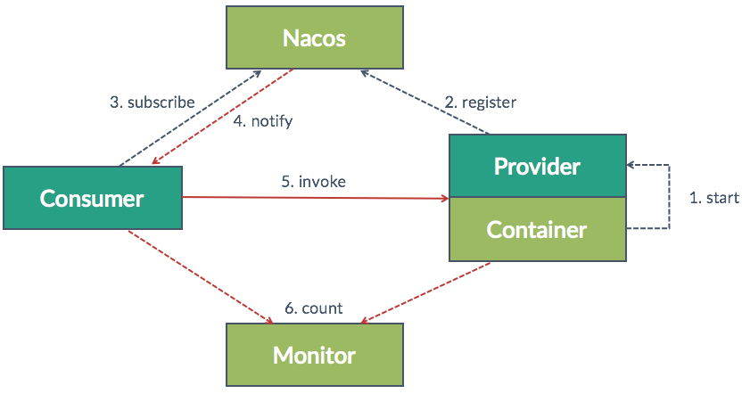
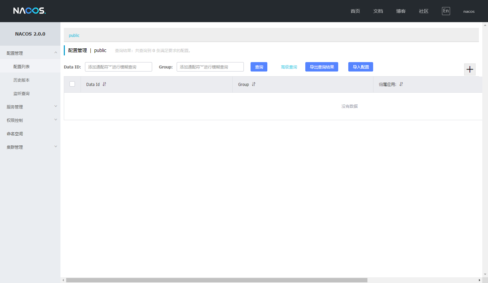

# 分布式配置

## 为什么需要分布式配置

通常，互联网服务为了考虑高可用，都会使用服务集群方式部署服务。每一个服务，都至少会有2台机器实例互相冗余备份，不仅仅是为了提高性能，当其中一台服务故障后，还有另外一台继续服务。

这里拿开源项目TeamTalk举例，他包含了：
- login_server
- msg_server
- db_proxy_server
- route_server
- ...

每一个服务部署2台机器，每个机器上存在xxx.conf的配置文件，当服务数量不断增多，我们修改配置文件的成本越来越高。

那有没有一种方式，可以统一配置，每到配置文件修改或者新增机器都能很快速的同步呢？这个时候配置中心就出现了。如XXL-CONF、Spring Cloud Config、Disconf、Apollo和Nacos等等。

这里大家可以根据实际情况灵活选择，在笔者所在公司，业务开发主要以Java + Spring框架为主，相比Spring自带的Config，**Nacos 可以与 Spring, Spring Boot, Spring Cloud 集成，并能代替 Spring Cloud Eureka, Spring Cloud Config**，成为了他的优势。且在SDK方面，同时支持C++\Go\Python，算是目前比较主流的框架。

## 什么是 Nacos？

来自于：[什么是 Nacos](https://nacos.io/zh-cn/docs/what-is-nacos.html)  

Nacos 致力于帮助您发现、配置和管理微服务。Nacos 提供了一组简单易用的特性集，帮助您快速实现动态服务发现、服务配置、服务元数据及流量管理。

Nacos 帮助您更敏捷和容易地构建、交付和管理微服务平台。 Nacos 是构建以“服务”为中心的现代应用架构 (例如微服务范式、云原生范式) 的服务基础设施。

他的关键特性包括：
- 服务发现和服务健康监测
- 动态配置服务
- 动态 DNS 服务
- 服务及其元数据管理

配置文件支持的格式包括：
- TEXT
- JSON
- XML
- YAML
- HTML
- Properties

## Nacos构成

## 使用

安装部分，请参见官网的帮助手册：[https://nacos.io/zh-cn/docs/what-is-nacos.html](https://nacos.io/zh-cn/docs/what-is-nacos.html)

安装好之后，界面长这样：
