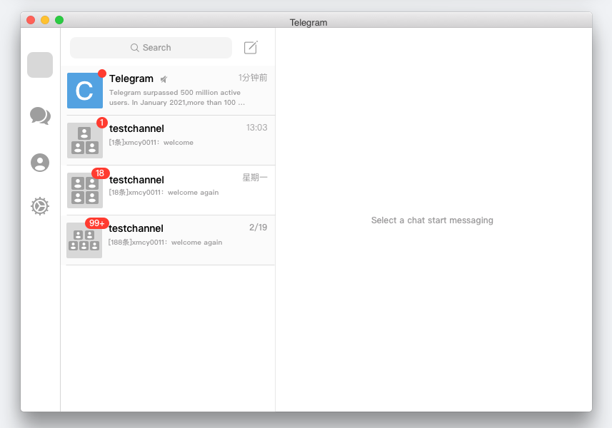
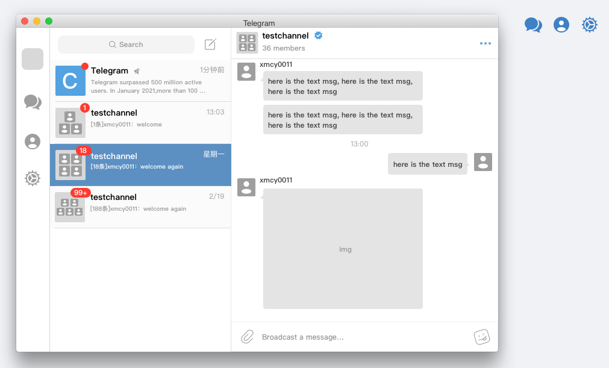
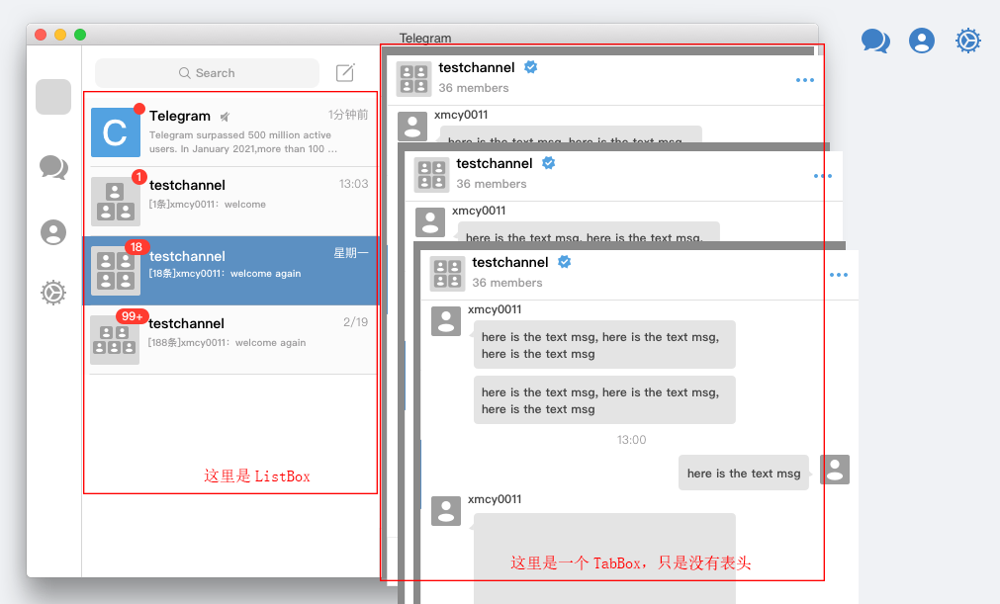
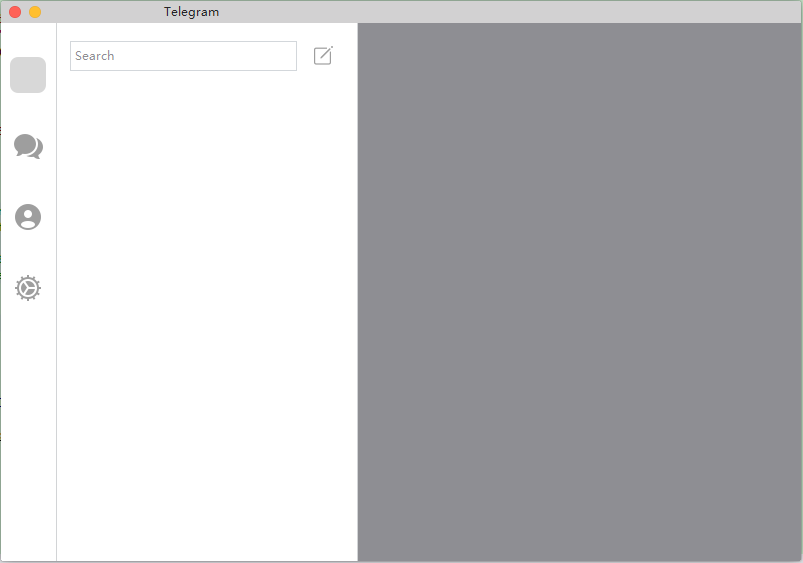
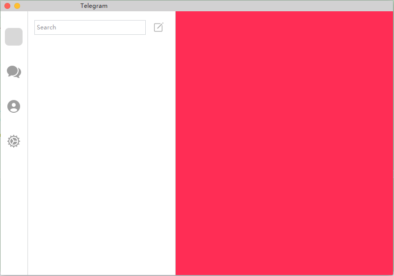
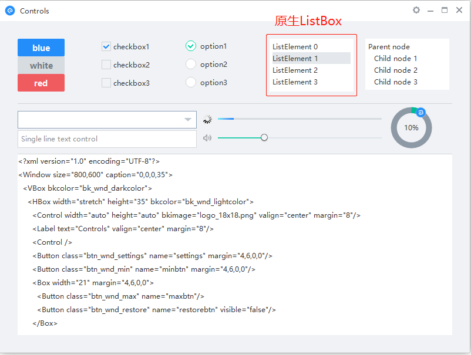

# DuiLib实现聊天界面

特别说明，这里是基于 [网易的修改版DuiLib](https://github.com/netease-im/NIM_Duilib_Framework) 演示，非原生，请特别注意！下文中为了和DuiLib有所区别，称其为NimDuiLib。

## 界面分析

利用好 [蓝湖](https://lanhuapp.com) 和 [Sketch](http://www.sketchcn.com/) 工具，可以大大提高我们的开发效率，Sketch是Mac下面的一款界面设计工具，而蓝湖是一个网站，可以把Sketch设计好的作品进行切图和标注，再也不用通过截图工具算PX了。

这里以（作者参考Telegram和其他聊天产品使用Sketch设计的）下图为例：





我们可以看到，整个界面主要分成2块：

- 左侧会话界面：主要是显示单聊、群聊和其他的一些比如微信里面有公众号、新闻、订阅号等一下列表。
- 右侧聊天输入框和消息界面。

我们先来看一下，会话列表通过DuiLib如何实现。

## 整体结构

### 思路

如果有过DuiLib开发经验的人，可能一眼就能知道左侧是1个ListBox，右侧是1个TabBox，那对于我们初学者而言怎么办？

有个很好的思路：去Github上搜一搜（duilib），或者使用搜索引擎搜索关键字（duilib、duilib仿微信），看看别人是怎么实现的。这里我们就找到了 [网易云IM的WindowsDemo](https://github.com/netease-im/NIM_PC_Demo) ，通过运行和研究它的代码，了解了聊天界面的实现原理，有时间的朋友，推荐去看一看。



### 布局和代码

分析出了界面构成，这个时候就好办了，我们先把布局实现出来。

```xml
<?xml version="1.0" encoding="UTF-8"?>
<Window size="800,560" caption="0,0,0,35">
	<VBox>
		<!-- 标题 -->
		<HBox class="caption">
			<Button class="btn_wnd_close" name="closebtn" float="true" margin="8,5,0,0" />
			<Button class="btn_wnd_min" name="minbtn" float="true" margin="28,5,0,0" />
			<Label text="Telegram" margin="51,2,51,0" align="center" width="277">
			</Label>
		</HBox>
		<HBox>
			<!-- 左侧菜单栏 -->
			<VBox width="55" bkcolor="white">
				<Control bkimage="../public/headmask/icon_headimage_mask_50x50_normal.png" width="36" height="36" margin="9,34,10,0" />
				<Control bkimage="msg_normal.png" width="36" height="36" margin="9,35,10,0" />
				<Control bkimage="contact_normal.png" width="36" height="36" margin="9,35,10,0" />
				<Control bkimage="setting_normal.png" width="36" height="36" margin="9,35,10,0" />
			</VBox>
			<Control class="splitline_ver_level1" width="1" mouse="false" />
			<!-- 好友列表 -->
			<VBox width="300" bkcolor="white">
				<HBox height="53">
					<RichEdit class="simple input" rich="false" padding="5,6,5,0" margin="13,13,0,0" multiline="false" name="re_username" width="227" height="30" valign="center" font="system_12" promptmode="true" prompttext="Search" promptcolor="gray" />
					<Button class="btn_session_edit" name="btn_session_add" margin="14,21,0,0" />
				</HBox>
				<VListBox class="list" name="list_session" vscrollunit="100">
				</VListBox>
			</VBox>
			<!-- 默认提示 -->
			<Control class="splitline_ver_level1" width="1" mouse="false" />
			<VBox name="box_default_tips" bkcolor="white" visible="false">
				<Control />
				<HBox height="20">
					<Control />
					<Label text="Select a chat start messaging" width="auto" />
					<Control />
				</HBox>
				<Control />
			</VBox>
			<!-- 聊天区域 -->
			<TabBox name="tab_session_box" visible="true" bkcolor="white" selectedid="0">
                <VBox bkcolor="gray"></VBox>
			    <VBox bkcolor="pink"></VBox>
			</TabBox>
		</HBox>
	</VBox>
</Window>
```


关键部分：

```xml
<!-- 好友列表 -->
<VListBox class="list" name="list_session" vscrollunit="100">
</VListBox>
```

```xml
<!-- 聊天区域 -->
<TabBox name="tab_session_box" visible="false" bkcolor="white" selectedid="1">
    <!-- 这里有2个预置的元素通过selectedid来控制谁显示，实际中VBox是动态创建并且填充进来的 -->
    <!-- 注意，因为没有表头，搜索只能手动改selectedid的值，来看效果 -->
    <VBox bkcolor="gray"></VBox>
    <VBox bkcolor="pink"></VBox>
</TabBox>
```

步骤：

1. 当左侧ListBox选中某一个Item时，显示TabBox。
2. 我们通过字典 Map\<std::string,ui::Box> 来判断某个会话是否曾经打开过。如果没有打开，则创建一个Box，加载到TabBox下且设置为当前选中项。否则，直接切换选中项即可。


selectedid=0时效果如下：




selectedid=1时效果如下：



## 会话列表实现

再介绍会话列表如何实现之前，先简单介绍一下ListBox控件。

### ListBox

在 NimDuiLib 自带的例子 controls 工程中，ListBox是长这样的：



使用步骤如下：

1. 在xml中先定义一个VListBox控件

   ```xml
   <VListBox class="list" name="list" padding="5,3,5,3">
   </VListBox>
   ```

2. 然后再代码里面增加元素

   ```c++
   /* Initialize ListBox data */
   ui::ListBox* list = dynamic_cast<ui::ListBox*>(FindControl(L"list"));
   for (auto i = 0; i < 30; i++)
   {
       ui::ListContainerElement* element = new ui::ListContainerElement;
       element->SetText(nbase::StringPrintf(L"ListElement %d", i));
       // 这里可以设置元素的样式
       element->SetClass(L"listitem");
       element->SetFixedHeight(20);
       list->Add(element);
   }
   ```


我们看到，ListBox的元素其实时可以自定义样式的，那不就好办了？

### 自定义元素样式

NimDuiLib中，提供给了一个API，可以从指定XML创建控件的实例：

```c++
// 创建ListBox的元素
ui::ListContainerElement* item = new ui::ListContainerElement();
// 使用xml来填充元素，即：实现自定义控件
ui::GlobalManager::FillBoxWithCache(item, L"home_form/session_item.xml", nullptr);
// 添加进ListBox中
lb_session_->Add(item);
```

**ui::GlobalManager::FillBoxWithCache()** 这个API是我们实现自定义控件的关键所在，我们看一下这个xml的内容：

```xml
<?xml version="1.0" encoding="UTF-8"?>
<Window>
	<ListContainerElement class="listitem" height="70" normalcolor="white">
		<HBox padding="5,0,10,0" childmargin="5" mouse="false">
            <!-- 会话名称 -->
            <Label name="item_msg" singleline="false" endellipsis="true" width="stretch" margin="9,1,0,0" font="system_12" mouse="false" height="32" />
        </HBox>
	</ListContainerElement>
</Window>
```

这个xml最顶级的节点是Window，然后接着必须是 **ListContainerElement** 代表这是一个ListBox元素的控件，我们看到里面可以自定义放自己的任何东西。假设里面有一个Label，我需要动态改变文本怎么办呢？我们可以使用 **item->FindSubControl((L"item_msg")** 来动态查找，然后调用其SetText() 函数设置文本即可。

### 完整实现

为了缩减篇幅，完整代码请移步 [github](https://github.com/xmcy0011/CoffeeChat-Win/tree/master/win/src/client/gui/session) 


## 聊天界面实现

聊天界面的实现方式有2种主流方式：

1. 通过内嵌浏览器（libcef），html+css来实现界面，通过C++控制逻辑，JS回调C++来实现交互。
2. 通过原生界面实现，比如NimDuiLib。

第一种方式会相对占用内存一些，但是布局和调试很方便（TeamTalk中就是这样做的），在古老的Win32或者MFC时代，这样做可能会比较好。第二种方式是因为DirectUI（比如DuiLib）的出现，界面拥有更高的灵活度，故可能是现在比较常用的方式了吧，**我们这里也主要是以介绍第二种方式为主**。

### 分析


因为每一行只能同时出现一个人的消息，所以我们也完全可以使用ListBox来实现（如上图）。每一个气泡，就是一个ListContainerElement，只是根据是否是自己发送的消息来动态决定显示在左侧还是右侧。

### 布局实现

右侧聊天消息界面布局如下：

```xml
<?xml version="1.0" encoding="UTF-8"?>
<Window>
	<VBox bkcolor="white">
		<!-- 顶部标题栏 -->
		<VBox height="51">
			<HBox height="50">
				<Control margin="10,2,0,0" bkimage="../public/headmask/icon_headimage_mask_50x50_normal.png" width="36" height="36" />
				<VBox height="42">
					<!-- 会话名字 -->
					<Label name="lab_session_name" margin="7,3,0,0" text="testchannel" height="20" font="system_14" />
					<Label margin="7,2,0,0" text="36 members" height="17" font="system_12" />
				</VBox>
				<Button name="btn_more" margin="0,14,9,0" normalimage="../session/icon_more_normal.png" width="24" height="24" />
			</HBox>
			<Control class="splitline_hor_level1" mouse="false" />
		</VBox>
        
		<!-- 内容区域 -->
		<VListBox class="list" name="list_msg" vscrollunit="100">
		</VListBox>

		<!-- 底部输入框 -->
		<HBox height="50">
			<Button normalimage="../session/icon_file_normal.png" margin="10,7,0,7" width="36" height="36" />
			<VBox width="stretch">
				<Control />
				<RichEdit promptmode="true" prompttext="Broadcast a message…" promptcolor="gray" align="vcenter" vscrollbar="true" height="40" margin="0,2,0,2" />
				<Control />
			</VBox>
			<Button normalimage="../session/icon_emotion_normal.png" margin="0,7,9,7" width="36" height="36" />
		</HBox>
	</VBox>
</Window>
```

消息部分是使用的ListBox，针对ListContainerElement自定义元素的xml结构如下：

```bash
|-bubble_left.xml  # 左气泡，容器box
  |--text_left.xml   # 左消息气泡里面的内容，这个代表文本
|-bubble_right.xml # 有气泡，容器box
  |--text_right.xml  # 同理
```

bubble_left.xml 和 bubble_right.xml 是外层的气泡，text_left.xml 和 text_right.xml 是文本消息，将来可以增加表情、文件、图片等更多的内容。

bubble_left.xml内容示例：

```xml
<?xml version="1.0" encoding="UTF-8"?>
<Window>
	<ListContainerElement class="listitem" height="auto">
		<HBox height="auto" margin="10,3,0,3">
			<!-- 左侧头像 -->
			<Box name="header_panel" width="auto" height="auto" margin="0,5,0,0">
			</Box>
			<VBox height="auto">
				<!-- 发送人名称 -->
				<RichEdit name="sender_name" margin="6,0,0,0" text="bob" height="20" width="100" font="system_12" normaltextcolor="black" readonly="true" multiline="true" vscrollbar="false" autovscroll="false" />
				<HBox height="auto" margin="6,0,0,0">
					<!-- 气泡左角标 -->
					<Control bkimage="file='../session/bubble_left.png'" width="auto" height="auto" margin="0,8,0,0"/>
					<!-- 发送的内容，根据消息类型，动态渲染 -->
					<Box name="BubbleBox" width="auto" height="auto"/>
				</HBox>
			</VBox>
		</HBox>
	</ListContainerElement>
</Window>

```

其中内置了一个 **Box（BubbleBox）** 来动态的创建气泡里面的内容，比如文本（text_left/right.xml），以后可能会有图片（image_left/right.xml），方便扩展。

text_left.xml示例内容如下：

```xml
<?xml version="1.0" encoding="UTF-8"?>
<Window>
	<Box bordersize="1" borderround="2,2" bkcolor="bk_msg_bubble_color" height="30" width="82" padding="8,8,7,7">
        <!-- 文本消息内容 -->
		<RichEdit name="text" font="system_12" normaltextcolor="black" menu="true" readonly="true" multiline="true" vscrollbar="false" autovscroll="false" />
	</Box>
</Window>
```

使用时，可以对外提供一个函数，来新增一条消息，比如：

```c++
void SessionBox::AddMsg(const cim::MessageModel& msg) {
    if (msg.msg_type != kCIM_MSG_TYPE_TEXT) {
        LogInfo("unknown msg type");
        return;
    }

    // ListBox的元素
    ui::ListContainerElement* element = new ui::ListContainerElement();

    if (msg.IsSystemMsg()) {
        ui::GlobalManager::FillBoxWithCache(element, L"session/bubble_row.xml", nullptr);

    } else {
        // 根据是否是自己发送的消息，来动态加载左右布局
        if (msg.IsMyMsg()) {
            ui::GlobalManager::FillBoxWithCache(element, L"session/bubble_right.xml", nullptr);

        } else {
            ui::GlobalManager::FillBoxWithCache(element, L"session/bubble_left.xml", nullptr);
        }
    }

    // 找到气泡所在的Box，来动态创建具体的内容
    auto box = dynamic_cast<ui::Box*>(element->FindSubControl(L"BubbleBox"));
    assert(box != nullptr);

    if (box != nullptr) {
        switch (msg.msg_type) {
                // 文本消息，创建文本内容
            case kCIM_MSG_TYPE_TEXT: {
                // 用一个Box来显示
                ui::Box* subBox = new ui::Box();
                ui::GlobalManager::FillBoxWithCache(subBox, msg.IsMyMsg() ? L"session/text_right.xml" : L"session/text_left.xml");
                // 动态设置里面的文本，直接使用其FindSubControl()函数查找
                auto richEdit = dynamic_cast<ui::RichEdit*>(subBox->FindSubControl(L"text"));
                assert(richEdit != nullptr);

                if (richEdit != nullptr) {
                    richEdit->SetText(nbase::UTF8ToUTF16(msg.msg_data));
                }

                box->Add(subBox);
            }
                break;

            default:
                break;
        }
    }

    // 加入，显示
    this->listbox_msg->Add(element);
}
```


### 完整代码

详细代码参考 [github](https://github.com/xmcy0011/CoffeeChat-Win/blob/master/win/src/client/gui/session/session_box.cpp)