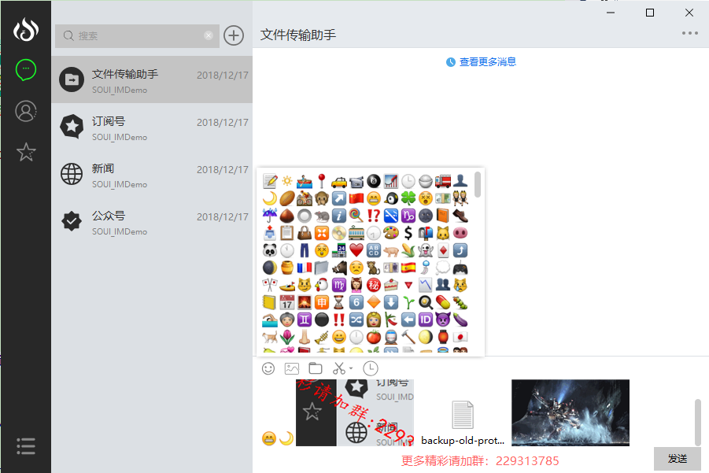
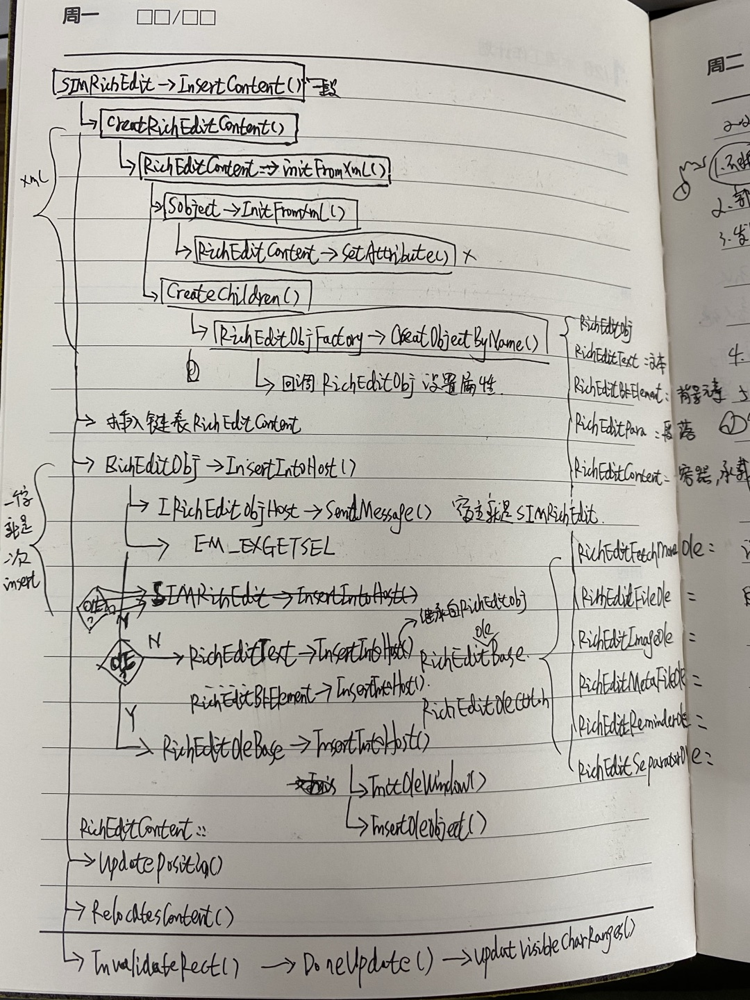

#  终结Win32难点：RichEdit中显示GIF和图片

## RichEdit基础

### 4个版本

| Rich Edit version | DLL          | Window Class   |
| :---------------- | :----------- | :------------- |
| 1.0               | Riched32.dll | RICHEDIT_CLASS |
| 2.0               | Riched20.dll | RICHEDIT_CLASS |
| 3.0               | Riched20.dll | RICHEDIT_CLASS |
| 4.1               | Msftedit.dll | MSFTEDIT_CLASS |

RichEdit经历这么多年的迭代，根据官方《[About Rich Edit Controls](https://docs.microsoft.com/en-us/windows/win32/controls/about-rich-edit-controls)》中的介绍，目前在Win32下最新的是4.1版本。根据《[RichEdit 各个版本介绍](https://blog.csdn.net/jhfyuf/article/details/84059014)》一文中说所，现在的Win7/8/10应该都是支持4.1版本的。也正式因为有这么多的版本，在初始化RichEdit的时候，我们需要调用 **LoadLibrary()** 来显示指定使用那个版本。如网易开源的Duilib的RichEdit.cpp::Init()中：

```c++
        //解决32位系统下跨窗口间拖拽文字在win7及win7以下系统上会出现重复的问题（64位暂不修复）
#if defined(_M_X64) || defined(__x86_64__)
        edit_dll = L"msftedit.dll";
#else
        edit_dll = nbase::win32::GetCurrentModuleDirectory() + L"msftedit50.dll";

        if (!(::GetFileAttributesW(edit_dll.c_str()) != INVALID_FILE_ATTRIBUTES))
            edit_dll = L"msftedit.dll";

#endif
        // 使用RichEdit 4.1
        hmod = LoadLibraryW(edit_dll.c_str()); //msftedit.dll

        if (hmod) {
            // 获取CreateTextServices()函数的地址
            TextServicesProc = (PCreateTextServices)GetProcAddress(hmod, "CreateTextServices");
        }

        if (TextServicesProc) {
            // 初始化4.1 RichEdit的实例，即调用CreateTextServices()
            TextServicesProc(NULL, this, &pUnk);
        }
```

各个版本的区别可以参考：

- 《[About Rich Edit Controls](https://docs.microsoft.com/en-us/windows/win32/controls/about-rich-edit-controls)》
- 《[RichEdit 各个版本介绍](https://blog.csdn.net/jhfyuf/article/details/84059014)》

### Windowless

为了在无句柄的界面中使用，**RichEdit自2.0开始，还提供了Windowless支持**，主要通过以下2个接口：

- [ITextHost](https://docs.microsoft.com/en-us/windows/win32/api/textserv/nl-textserv-itexthost)
- [ITextServices](https://docs.microsoft.com/en-us/windows/win32/api/textserv/nl-textserv-itextservices)

在Win32中，每一个控件都是有句柄的（可以使用QQ自定的截图工具，如果移动上去自动识别了，说明这个就是一个句柄），在复杂的软件中，界面往往有大量的控件，造成了性能问题。

后面新出的Direct UI技术（子控件在父控件句柄中绘图）解决了该问题，比如DuiLib就是这种技术的实现，现在也成为了主流。在网易开源的DuiLib的RichEdit.cpp中，我们查看其源码，就是使用上面2个接口的实现的：

```c++
class CTxtWinHost;
class UILIB_API RichEdit : public ScrollableBox {
    public:
    friend class CTxtWinHost; // 使用ITextHost
    // ...
    ITextHost* GetTextHost();
    ITextServices* GetTextServices();
    // ...
}

// 实现ITextHost接口
class CTxtWinHost : public ITextHost {
    public:
    CTxtWinHost();
    BOOL Init(RichEdit* re, const CREATESTRUCT* pcs);
    virtual ~CTxtWinHost();

    ITextServices* GetTextServices(void) {
        return pserv;
    }
    // ...
}
```


### IRichEditOle

在2005年代左右，QQ的聊天框支持Gif、图片和文本混排的功能而风靡世界，其背后就是使用RichEdit自1.0起就支持的2个接口（基于COM技术）：

- [IRichEditOle](https://docs.microsoft.com/en-us/windows/win32/api/richole/nn-richole-iricheditole)
- [IRichEditOleCallback](https://docs.microsoft.com/en-us/windows/win32/api/richole/nn-richole-iricheditolecallback)

后续有人模仿，基于QQ自带的 **ImageOle.dll** 也实现了图文混排的功能（飞鸽传书还是飞秋也提供了类似的DLL？记不得了）。


### WIC技术

在 [MFC richedit,可进行插入图片、表情，有聊天气泡，与QQ非常类似](https://download.csdn.net/download/jianhua1208/10040880?utm_medium=distribute.pc_relevant.none-task-download-2~default~BlogCommendFromBaidu~default-5.baidujs&dist_request_id=1332048.21280.16195081369797045&depth_1-utm_source=distribute.pc_relevant.none-task-download-2~default~BlogCommendFromBaidu~default-5.baidujs) 下载的程序中，其Release目录下包含了imgdecoder-png.dll、imgdecoder-gdip.dll等一系列的动态库，**归根结底是为了实现PNG等场景图片的解码**，除了自带解码器之外，还可以使用Windows自带GDI+技术，QQ以前就是这么干的。针对Gif方面，还需要自己针对每一帧进行处理和播放。Gif多了，还会涉及性能问题。现在，可能有了更好的方案。

[Windows Imaging Component](https://docs.microsoft.com/en-us/windows/win32/wic/-wic-lh?redirectedfrom=MSDN)(WIC)：是Windows Vista中引入的基于COM的图像编解码器框架，微软官方提供了几个例子可以更深入的了解一下：

- [Simple imaging sample](https://docs.microsoft.com/en-us/samples/microsoft/windows-universal-samples/simpleimaging/)：显示png图片。
- [WIC Animated Gif Sample](https://docs.microsoft.com/en-us/windows/win32/wic/-wic-sample-animated-gif)：显示gif图片的例子。
- [WIC Progressive Decoding Sample](https://docs.microsoft.com/en-us/windows/win32/wic/-wic-sample-progressive-decoding)：可以设置图片显示的质量，比如一些网页中高清图片的显示，一开始都是模糊的，然后慢慢变得清晰。

这个技术后续我们可能会用到，在这里简单介绍下。


## 文本编辑器学习路径

原文：[纯文本编辑器制作基本教程-参考](http://www.cppblog.com/megax/archive/2012/03/22/168601.html)

正好有个网友发信询问编辑器制作的基本问题，借此机会和大家share一下相关的资料：

1. the craft of text editor, 这本书有电子版，搜搜即可。找不到的话，可以联系我。这本书深入浅出的描述了制作编辑器所要知道的基础知识，还有一些基本的数据结构。

2. http://www.catch22.net/tuts/neatpad。这个用实例和图文的方式彻底描述了到底如何去实现一个编辑器，推荐大家去阅读！写的浅显易懂。

上面两个介绍了如何实现一个简单编辑器，但是高效编辑器的制作是非常复杂的。入门的话，上面两个是必读！
不过，LotusEdit使用的技术是比较特殊的，不做详细介绍了，但一些基本原理是差不多的！

除此之外，还有一些比较好的source：

1. 大名鼎鼎的scintilla,我是比较恨这个编辑控件的。直接导致严重的同质化，技术停滞不前。http://www.scintilla.org。

2. crystal edit, winmerge用的就是这个代码http://www.codeproject.com/Articles/272/Crystal-Edit-syntax-coloring-text-editor。
3. Brainchild, A syntax coloring edit control，http://www.codeproject.com/Articles/3201/Brainchild-A-syntax-coloring-edit-control。


除此之外，还有其它的，就不提了！上面都好好看一下的话，制作一个超出notepad的编辑器还是很easy的！


作者的编辑器：[LotusEdit](http://www.lotusedit.com/)

## 参考

- [不再需要ImageOle或DynamicGifCtl，.NET实现IM编辑控件](https://www.cnblogs.com/Starts_2000/p/4815915.html)
- 万大侠的系列文章地址：[致力于richedit应用于IM解决方案](http://www.cppblog.com/wlwlxj/category/19335.html)。
- [Design & Implementation of a Win32 Text Editor](http://www.catch22.net/tuts/neatpad#)
- [Embedding .PNG Images into a RichEdit Document](https://www.codeproject.com/Articles/1360569/Embedding-PNG-Images-into-a-RichEdit-Document)
- [Microsoft RichEdit 8.0 Image Support](https://docs.microsoft.com/en-us/archive/blogs/murrays/richedit-8-0-image-support)
- [About Rich Edit Controls](https://docs.microsoft.com/en-us/windows/win32/controls/about-rich-edit-controls?redirectedfrom=MSDN)
- [Using Rich Edit Controls](https://docs.microsoft.com/en-us/windows/win32/controls/using-rich-edit-controls)
- [RichEdit Animated GIFs](https://docs.microsoft.com/en-us/archive/blogs/murrays/richedit-animated-gifs)
- [msftedit.dll是richedit4.0的动态库](http://www.360doc.com/content/13/0304/20/9200790_269309113.shtml)
- [Windows Imaging Component](https://docs.microsoft.com/en-us/windows/win32/wic/-wic-lh?redirectedfrom=MSDN)
- [MFC richedit,可进行插入图片、表情，有聊天气泡，与QQ非常类似](https://download.csdn.net/download/jianhua1208/10040880?utm_medium=distribute.pc_relevant.none-task-download-2~default~BlogCommendFromBaidu~default-5.baidujs&dist_request_id=1332048.21280.16195081369797045&depth_1-utm_source=distribute.pc_relevant.none-task-download-2~default~BlogCommendFromBaidu~default-5.baidujs)


# SOUI_IMDemo源码分析

[Github](https://github.com/JeanPenty/SOUI_IMDemo)

截图如下：



这个Demo是意外之喜，相比 [MFC richedit,可进行插入图片、表情，有聊天气泡，与QQ非常类似](https://download.csdn.net/download/jianhua1208/10040880?utm_medium=distribute.pc_relevant.none-task-download-2~default~BlogCommendFromBaidu~default-5.baidujs&dist_request_id=1332048.21280.16195081369797045&depth_1-utm_source=distribute.pc_relevant.none-task-download-2~default~BlogCommendFromBaidu~default-5.baidujs) 有更高的完成度，其基于Soui2实现的IMRichEdit支持图片、截图、文件和GIF等，功能非常完善。

## 编译

1. 先编译soui2

```bash
$ git clone https://github.com/SOUI2/soui.git
# 进入 soui/wizard，双击wizard.setup.exe，勾选VS2017后点击安装
# 此时，在soui目录下生成soui.sln，使用VS2017打开，先手动编译试一下（win10下需要更改SDK版本）
$ ./Build.bat 
# 根据提示编译成功。
$ # 最后，还需要设置2个环境变量。
SOUILIB: D:\repo\github\01_richedit\soui\bin
SOUIPATH: D:\repo\github\01_richedit\soui
```


2. 编译soui_imdemo

```bash
$ git clone https://github.com/JeanPenty/SOUI_IMDemo.git # 必须和soui在同一个目录下
$ # 打开SOUI_IMDemo.sln编译
$ # 把soui2编译好的Debug下的dll全部复制到本程序的Debug目录下覆盖。直接执行即可。
```

## 目录结构

- extend.ctrls：对于RichEdit的再次封装（**SImRichEdit.h、SImRichedit.cpp**）的代码全部在这个文件夹。
- EmojiDlg.h、EmojiDlg.cpp：表情展示和选择界面。
- MainDlg.h、MainDlg.cpp：程序逻辑所在，所有的主逻辑都在这里。比如表情的插入和图片的插入等等。

## 插入表情分析

CEmojiDlg负责表情的显示，且当用户选择表情后回调到CMainDlg处理：

```c++
void CMainDlg::EmotionTileViewItemClick(const std::string& strID)
{
    // 隐藏表情选择界面
	if (m_bEmotionShow)
	{
		m_pEmojiDlg->ShowWindow(SW_HIDE);
		m_bEmotionShow = false;
	}
	else
	{
		m_pEmojiDlg->ShowWindow(SW_SHOW);
		m_pEmojiDlg->SetNoSel();
		m_bEmotionShow = true;
	}

	std::map<std::string, std::string>::iterator iter = CGlobalUnits::GetInstance()->m_mapEmojisIndex.find(strID);
	if (iter != CGlobalUnits::GetInstance()->m_mapEmojisIndex.end())
	{
        // 表情的名字和文件路径
		std::string strEmotionName = iter->second;
		std::string strPath = "emojis\\" + strEmotionName;

        // 特殊的格式，应该是一段富文本代码
		SStringW sstrPath = S_CA2W(strPath.c_str());
		SStringW sstrEmotion;
		sstrEmotion.Format(L"<RichEditContent>"
			L"<para break=\"0\" disable-layout=\"1\">"
			L""
			L"</para>"
			L"</RichEditContent>", sstrPath);

        // 一系列查找，最终是为了找到RichEdit
		STabCtrl* pChatTab = FindChildByName2<STabCtrl>(L"chattab");
		SASSERT(pChatTab);
		SStringW sstrID = S_CA2W(m_LasttalkCurSel.m_strID.c_str());
		SWindow* pPage = pChatTab->GetPage(sstrID, TRUE);
		SASSERT(pPage);
		SImRichEdit* pSendRichedit = pPage->FindChildByName2<SImRichEdit>(L"send_richedit");
		SASSERT(pSendRichedit);
        
        // 插入表情，RECONTENT_CARET：内容插入到光标处，还可以指定插入到结尾位置。
		pSendRichedit->InsertContent(sstrEmotion, RECONTENT_CARET);
	}
}
```

## 插入图片函数调用逻辑



我们可以看到，图片的插入逻辑主要在 **RichEditOleBase.h** 和 **RichEditOleCtrl.h** 中，但是如何移植到NIMDuiLib中呢？这是个问题。

# 网易云IM Demo

网易云IM SDK Demo中，也实现了RichEdit的图文混排，只不过有2个限制：

- 不支持GIF
- RichEdit图片插入的核心部分通过提供image_ole.dll提供，没有源码


通过研究，其RichEdit的图片插入代码在 **richedit_util.h** 中，主要函数如下：

```c++
/**
* 向RichEdit插入一个表情
* @param[in] text_service RichEdit控件内部ITextServices*指针
* @param[in] callback 插入错误的回调通知函数
* @param[in] file 图片文件路径
* @param[in] face_tag 图片对应的标签
* @return bool true 成功，false 失败
*/
bool Re_InsertFace(ITextServices *text_service, const std::wstring& file, const std::wstring& face_tag);

/**
* 向RichEdit插入一个石头剪刀布表情
* @param[in] text_service RichEdit控件内部ITextServices*指针
* @param[in] callback 插入错误的回调通知函数
* @param[in] file 图片文件路径
* @param[in] face_tag 图片对应的标签
* @return bool true 成功，false 失败
*/
bool Re_InsertJsb(ITextServices *text_service, const std::wstring& file, const std::wstring& face_tag);

/**
* 向RichEdit插入一个图片
* @param[in] text_service RichEdit控件内部ITextServices*指针
* @param[in] callback 插入错误的回调通知函数
* @param[in] file 图片文件路径
* @param[in] file_tag 图片对应的标签
* @param[in] loading 是否插入正在加载中的图片
* @param[in] cp 图片在RichEdit中插入的位置
* @return bool true 成功，false 失败
*/
bool Re_InsertImage(ITextServices *text_service, InsertCustomItemErrorCallback callback, bool total_count_limit, const std::wstring& file, const std::wstring& file_tag = L"", bool loading = false, LONG cp = REO_CP_SELECTION);

/**
* 向RichEdit插入一个文件图片
* @param[in] text_service RichEdit控件内部ITextServices*指针
* @param[in] callback 插入错误的回调通知函数
* @param[in] file 图片文件路径
* @return bool true 成功，false 失败
*/
bool Re_InsertFile(ITextServices *text_service, InsertCustomItemErrorCallback callback, const std::wstring& file);

/**
* 获取RichEdit中的文字，会自动把控件中的ole对象转换为对应的文字标签
* @param[in] text_service RichEdit控件内部ITextServices*指针
* @param[out] text 获取到的文字
* @return void 无返回值
*/
void Re_GetText(ITextServices * text_service, std::wstring& text);

/**
* 获取RichEdit中包括ole和文本在内的所有内容的详细信息
* @param[in] text_service RichEdit控件内部ITextServices*指针
* @param[out] content_list 获取到的内容
* @return void 无返回值
*/
void Re_GetTextEx(ITextServices * text_service, std::vector<RE_OLE_ITEM_CONTENT>& content_list);
```

上述 Re_InsertFace() , Re_InsertJsb() , Re_InsertImage() 等内部都会调用 Re_InsertCustomItem() ：

```c++
bool Re_InsertCustomItem(ITextServices *text_service, InsertCustomItemErrorCallback callback, bool total_count_limit, const std::wstring& file, const std::wstring& face_tag, int ole_type
					, int face_id, bool scale, int scale_width, int scale_height, LONG cp)
{
	if (total_count_limit && ole_type >= RE_OLE_TYPE_CUSTOM && Re_GetCustomImageOleCount(text_service) >= MAX_CUSTOM_ITEM_NUM)
	{
		if( callback )
		{
			Post2UI(callback);
		}
		return false;
	}
	if (text_service == NULL)
		return false;

	//m_RichEdit为您的RichEdit对象
	IRichEditOle* lpRichEditOle = Re_GetOleInterface(text_service);

	if (lpRichEditOle == NULL)
		return false;

	//OLE对象
	IOleObject*  lpOleObject = NULL;
	IOleClientSite* lpOleClientSite = NULL; 
	CComPtr<IImageOle> image_ole;
	CLSID   clsid;
	REOBJECT  reobject;
	HRESULT   hr = S_FALSE;
	do 
	{
		{
			if (!CreateImageObject((LPVOID*)&image_ole))
				break;
		}

		//获得数据对象接口
		hr = image_ole->QueryInterface(IID_IOleObject, (void**)&lpOleObject);
		if (hr != S_OK)
			break;

		hr = lpOleObject->GetUserClassID(&clsid);
		if (hr != S_OK)
			break;

		hr = lpRichEditOle->GetClientSite(&lpOleClientSite);
		if (hr != S_OK)
			break;

		//初始化一个对象
		ZeroMemory(&reobject, sizeof(REOBJECT));
		reobject.cbStruct = sizeof(REOBJECT);
		reobject.clsid = clsid;
		reobject.cp = cp;
		reobject.dvaspect = DVASPECT_CONTENT;
		reobject.dwFlags = REO_BELOWBASELINE;
		reobject.poleobj = lpOleObject;
		reobject.polesite = lpOleClientSite;
		reobject.pstg = NULL;// lpStorage;

		lpOleObject->SetClientSite(lpOleClientSite);
		std::wstring image_path = file;
		image_ole->SetFaceTag((BSTR)(face_tag.c_str()));
		image_ole->SetFaceIndex(ole_type);
		image_ole->SetFaceId(face_id);
		if (ole_type == RE_OLE_TYPE_FILE)
		{
			OSVERSIONINFO os = { sizeof(OSVERSIONINFO) };
			::GetVersionEx(&os);
			std::wstring fontName = os.dwMajorVersion >= 6 ?
				ui::MutiLanSupport::GetInstance()->GetStringViaID(L"STRING_GLOBALMANAGER_FONT_MSYH")
				:
				ui::MutiLanSupport::GetInstance()->GetStringViaID(L"STRING_GLOBALMANAGER_FONT_DEFXP");
			image_ole->SetFont((BSTR)(fontName.c_str()), 20, RGB(0x1a, 0x30, 0x47));
			if (image_path.size() == 0)
			{
				image_path = GetIconByFile(face_tag);
			}
			image_ole->SetBgColor(RGB(255, 255, 255));
		}
		else if (ole_type == RE_OLE_TYPE_IMAGELOADING)
		{
			if (image_path.size() == 0)
			{
				image_path = QPath::GetAppPath();
				image_path.append(L"res\\icons\\loading.gif");
			}
		}
		image_ole->SetScaleSize(scale, scale_width, scale_height);
		image_ole->LoadFromFile((BSTR)(image_path.c_str()));
		std::wstring guid = nbase::UTF8ToUTF16(QString::GetGUID());
		image_ole->SetGUID((BSTR)guid.c_str());
		OleSetContainedObject(lpOleObject, TRUE);

		hr = lpRichEditOle->InsertObject(&reobject);
	} while (0);

	if( lpOleObject  != NULL )
		lpOleObject->Release();
	if( lpOleClientSite != NULL )
		lpOleClientSite->Release();

	lpRichEditOle->Release();

	return hr == S_OK;
}
```

我们看到有2个关键接口：IRichEditOle 和 REOBJECT，因此，我们先来研究一下这2个接口的作用，以方便后续移植SOUI_IMDemo中的代码到网易开源的NIMDuiLib中。

> PS：NIMDuiLib中Duilib的源码没有开放，RichEditOle部分更没有开放，所以为什么需要我们自己扩展NimDuiLib了。就算开放了，其不支持GIF，也需要自己增加。

# MFC中RichEdit如何插入图片

