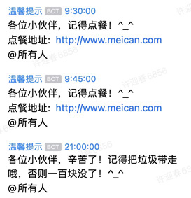
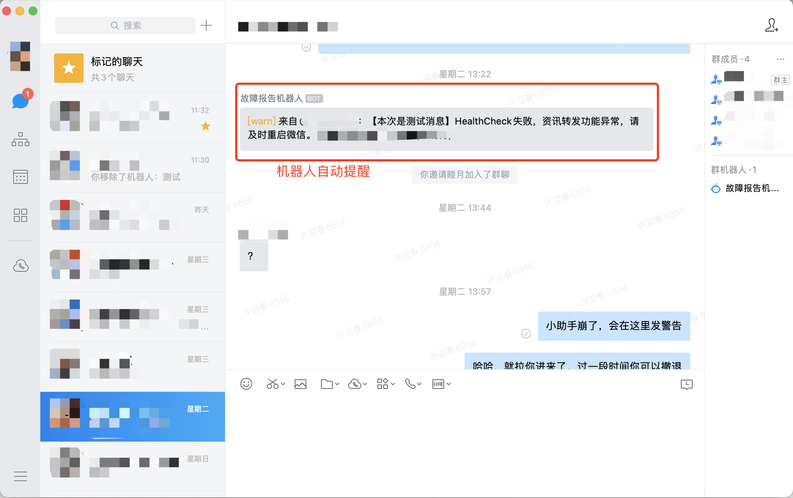
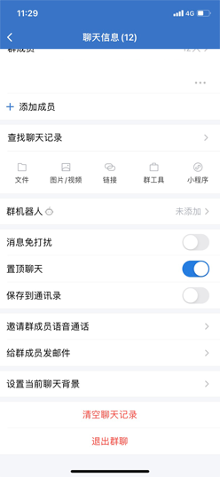
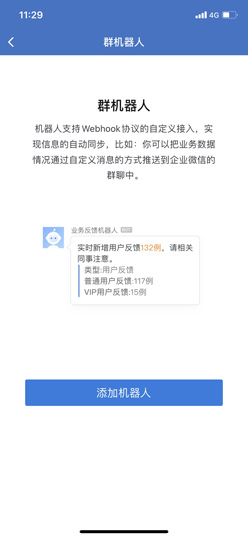
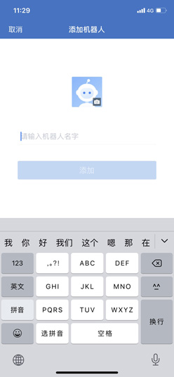
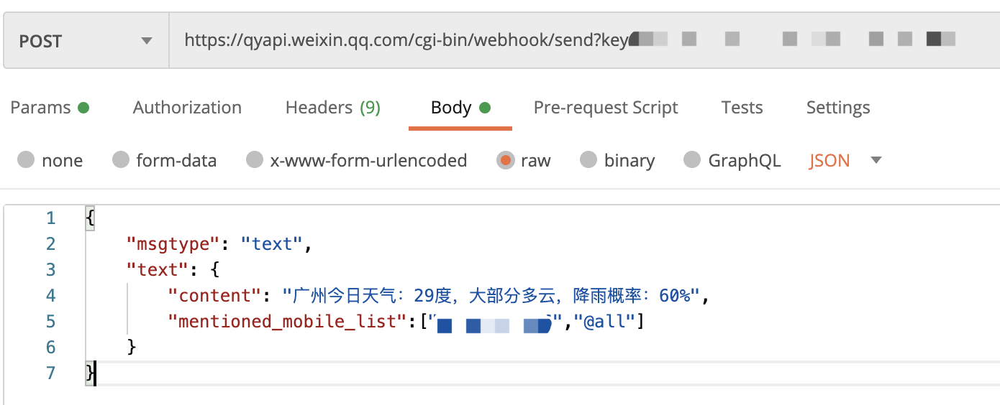
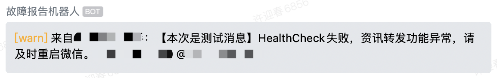

# 业务监控

## Zabbix系统级监控

### 内存

### CPU

### 带宽

### 端口

## Promethus图形
### 数据采集
### Grafana图形界面

## 报警

### 邮件

### 企业微信

#### 概述

很多公司内部都会使用企业微信进行通讯，恰恰企业微信又对我们开放了API，我们可以很方便的使用它提供的API实现一些自动化的功能。

比如在我们公司内部，定加班餐都需要在美餐页面点，并且只能是当天且在16:30以前。忙的时候，可能有人就会忘记，于是有人起了一个16:00的定时任务，通过企业微信的API，定时在群里发送订餐提醒。  



由此，我们得到启发，是不是可以创建一个线上故障群，如果监控到故障，就发送一条报告到该群内。相比邮件，这种提醒方式更及时，并且不受电脑的限制，只需要在手机上把企业微信的通知打开，随时随地都能收到预警，快速处理，再也不用担心从用户发现到通知到我们已经过去了几个小时的这种问题了。


#### 企业微信群机器人API简介

> PS：如果找不到了，可以通过：搜素引擎 -> 企业微信API -> 企业内部开发 -> 客户端API -> 群机器人 -> 群机器人配置说明 

在开始前，建议看一下官方的说明文档：[https://work.weixin.qq.com/api/doc/90000/90136/91770](https://work.weixin.qq.com/api/doc/90000/90136/91770)，大概包含如下内容：
- 如何使用群机器人
- 消息类型及数据格式
    - 文本类型
    - markdown类型
    - 图片类型
    - 图文类型
    - 文件类型
- 消息发送频率限制
- 文件上传接口

看完之后，我们大概知道群机器人能什么了，那怎么创建群机器人呢？

#### 创建群机器人

1. 先创建一个群聊，不能包含微信的联系人。
2. 点击群详情->群机器人->点击  

3. 点击添加机器人  

4. 取个名字  

4. 完成，复制Webhook  


至此，群机器人创建成功。Webhook地址非常重要，切勿泄漏或公开，否则别人可以通过这个地方给群里推送一些垃圾信息，造成不好的影响。

#### 测试群机器人

通过上述步骤完成机器人的创建后，我们可以打开postman工具进行API测试。

选择POST请求，粘贴机器人的Webhook地址，在Body界面选择raw->Json，把以下内容粘贴进去：
```json
{
    "msgtype": "text",
    "text": {
        "content": "广州今日天气：29度，大部分多云，降雨概率：60%"
    }
}
```


点击Send，应该就会在群里收到一条机器人发过来的消息了。

下图是作者markdown格式发的消息，相比text更醒目，关于markdown格式可以参考[官方的API手册](https://work.weixin.qq.com/api/doc/90000/90136/91770)。


上面是推送的markdown格式，所以我们可以看到[warn]是橙色的字体，具体可以参考官方的API手册。

当然还可以指定@某人，只需要在“mentioned_mobile_list”中写上对应的手机号即可。注意当msgType=markdown的时候，@功能是不生效的哦。

> PS：机器人创建后，还可以添加到其他群聊中。

如果要删除机器人，点击机器人详情的“...”按钮即可。
